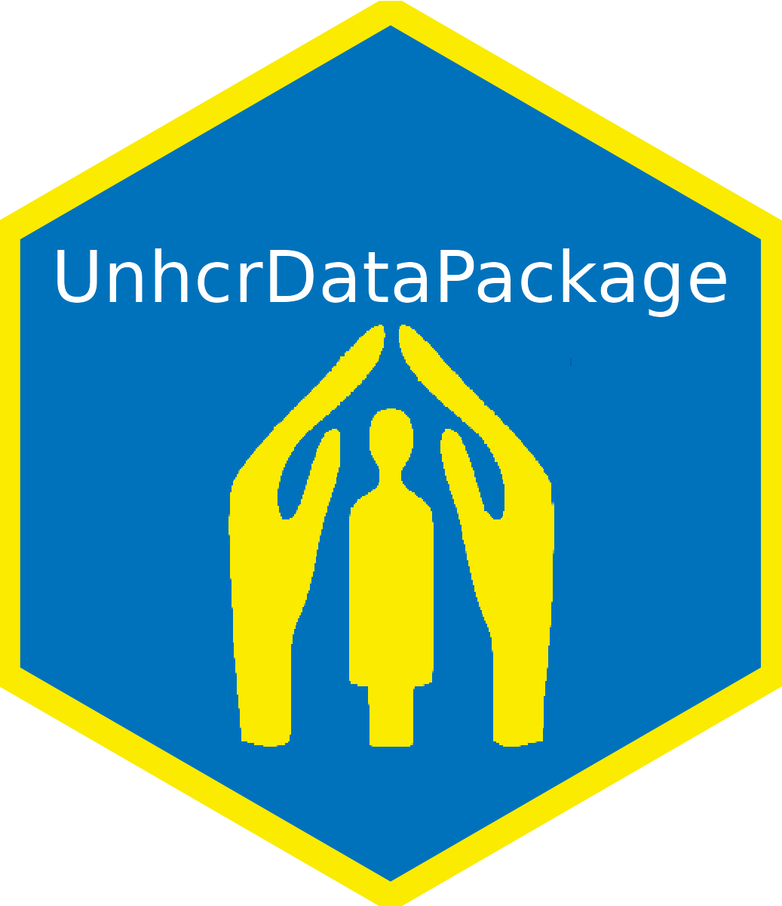

# [`{UnhcrDataPackage}`](https://edouard-legoupil.github.io/unhcrdatapackage): A Chart Library on Forced Displacement 


> “__Numbers have an important story to tell. They rely on YOU to give them a voice!__”

> -- Stephen Few

The package conveniently bring together a series of predefined plots in order to improve data literacy and facilitate the creation of __[persuasive data stories](https://edouard-legoupil.github.io/unhcrdatapackage/tuto/tutorial.html)__. 
You can also consult directly the [Data Storytelling App](https://rstudio.unhcr.org/Data_Literacy/) created from this package. 

Each plot is created through a function that provides a __recipe__ that creates a re-usable chart in line with a [Divisible Content Strategy](https://www.columnfivemedia.com/divisible-content-strategy-gives-brand-less/). Those functions are then rendered through predefined Report templates for Countries or Regions, generated either as html, PDF or PowerPoint presentations. You may [enhance the charts story-telling ability](https://edouard-legoupil.github.io/unhcrdatapackage/articles/library.html) by adjusting the message in the title, highlighting specific parts of the data or adding annotation to ease interpretation or provide more contextual background.

You can consult the default [Factsheets for the Americas through that link](https://edouard-legoupil.github.io/unhcrdatapackage/factsheet/factsheet.html). 

Note, that if only need the data you can use directly [`{ForcedDisplacementStat}`](https://edouard-legoupil.github.io/ForcedDisplacementStat/). You can also explore data through  [Refugee Data Finder](https://www.unhcr.org/refugee-statistics/).

This package promotes [reproducible approaches](https://unhcr-americas.github.io/reproducibility).If you are UNHCR Staff and want to learn R, visit [UNHCR Learn & Connect- R training](https://unhcr.csod.com/ui/lms-learner-playlist/PlaylistDetails?playlistId=e90e2279-e3a4-4ef2-8b74-757f91d224b2).
For Designers, convenient versions of each plot in __svg__ format (usable with Illustrator/Inkscape or Indesign/Scribus) can be generated directly  with: `unhcrthemes::unhcr_save(plot, "plot.svg")`.


## Missing chart

You can submit __request for new charts__ [here](https://github.com/Edouard-Legoupil/unhcrdatapackage/issues/new)

__Contributions__, specifically creation of new functions for the chart library are welcome! Please [consult instructions here](https://edouard-legoupil.github.io/unhcrdatapackage/articles/adding-new-charts.html) 


## Install

The package comes with a shiny Interface available [Data Storytelling App](https://rstudio.unhcr.org/Data_Literacy/)

You can also install the package locally to use it. If you are on Windows, you will first need to install [Rtools](https://cran.r-project.org/bin/windows/Rtools/) on the top of [R](https://cran.r-project.org/bin/windows/base/) and [Rstudio](https://posit.co/download/rstudio-desktop/) in order to install the package locally.

Make sure to have your __JAVA_HOME__ environment variable set up as it will be used for the map generation functions

```
install.packages("pak")
pak::pkg_install("edouard-legoupil/unhcrdatapackage")
```

```
## you can then run the app locally with
unhcrdatapackage::run_app()
```
