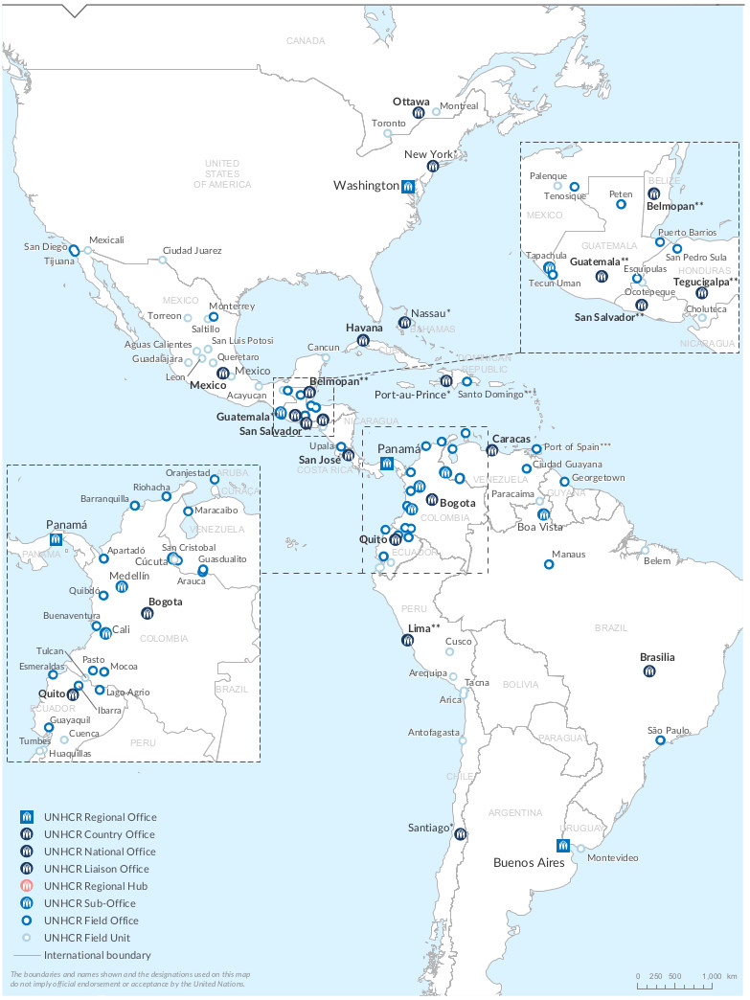
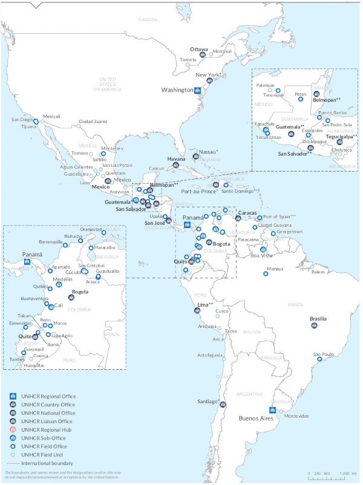
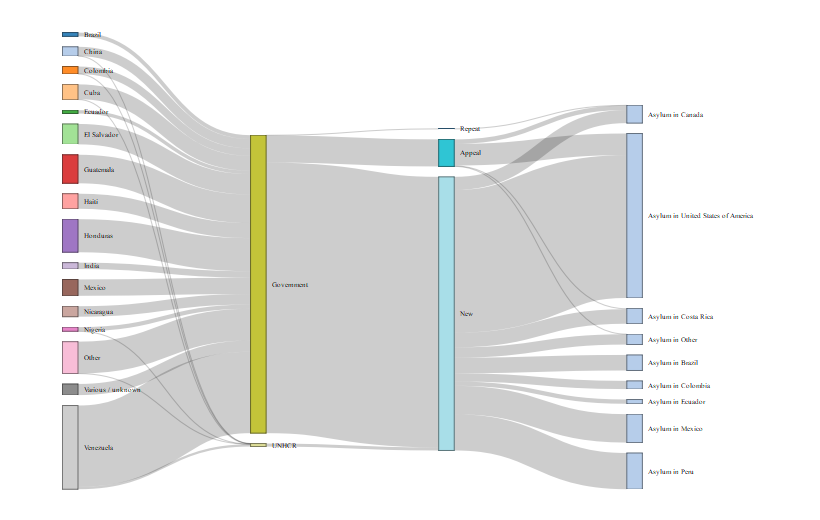
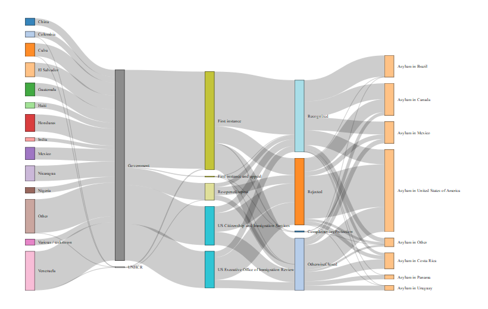
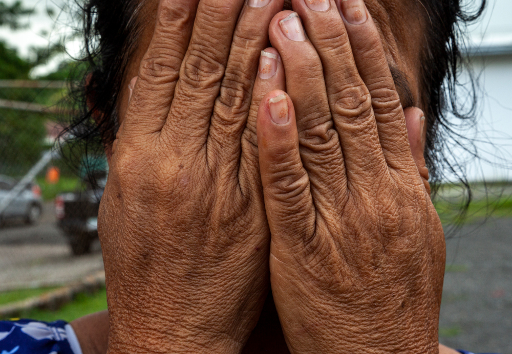
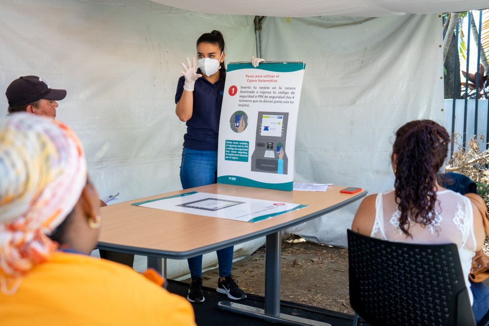

```{r setup, include=FALSE, message=FALSE, warning=FALSE}
knitr::opts_chunk$set(echo = FALSE)
```

```{r packages, include=FALSE, message=FALSE, warning=FALSE}

using <- function(...) {
    libs <- unlist(list(...))
    req <- unlist(lapply(libs,require,character.only = TRUE))
    need <- libs[req == FALSE]
    if (length(need) > 0) { 
        install.packages(need)
        lapply(need,require,character.only = TRUE)
    }
}

using('tidyverse', 'ggplot2', 'scales',  'wbstats', 'ragg', 'magick', 'acled.api', 'circlize',
      'viridis', 'treemap',
      'treemapify', 'patchwork', 'networkD3', 'webshot')

library(tidyverse)
library(ggplot2)
library(scales)
library(ragg)
library(magick)
library(circlize)
library(wbstats)
library(acled.api)

# Load required packages for charts with UNHCR style 
library(unhcRstyle)
library(unhcrdatapackage)
update_geom_font_defaults()


```

```{r  include=FALSE, message=FALSE, warning=FALSE}
## Loading the stat tables
end_year_population_totals <- unhcrdatapackage::end_year_population_totals
reference <- unhcrdatapackage::reference
end_year_population_totals_long <- unhcrdatapackage::end_year_population_totals_long
end_year_population_totals_long.asy <- dplyr::left_join( x= unhcrdatapackage::end_year_population_totals_long, 
                                                     y= unhcrdatapackage::reference, 
                                                     by = c("CountryAsylumCode" = "iso_3"))

end_year_population_totals_long.ori <- dplyr::left_join( x= unhcrdatapackage::end_year_population_totals_long, 
                                                     y= unhcrdatapackage::reference, 
                                                     by = c("CountryOriginCode" = "iso_3"))

demographics <- unhcrdatapackage::demographics
asylum_applications <- unhcrdatapackage::asylum_applications
asylum_decisions <- unhcrdatapackage::asylum_decisions
asylum_decisions_long <- unhcrdatapackage::asylum_decisions_long

solutions <- unhcrdatapackage::solutions
solutions_long <- unhcrdatapackage::solutions_long
solutions_long.asy <- dplyr::left_join( x=  solutions_long, 
                                                     y= unhcrdatapackage::reference, 
                                                     by = c("CountryAsylumCode" = "iso_3"))
```


```{r  include=FALSE, message=FALSE, warning=FALSE}
## Key Figures calculation

## Retrieve report parameter as defined in the report YAML
#thisbureau <- "Americas"
thisbureau <- params$bureau
#lastyear <- max(end_year_population_totals_long.asy$Year)
lastyear <- params$year

allpop <- format(round(sum(end_year_population_totals_long.asy[end_year_population_totals_long.asy$UNHCRBureau == thisbureau &      end_year_population_totals_long.asy$Year ==lastyear  , 
                                     c("Value")])
             , -3),  big.mark=",")

allpop.prop <- format(round( sum(end_year_population_totals_long.asy[end_year_population_totals_long.asy$UNHCRBureau == thisbureau &      end_year_population_totals_long.asy$Year ==lastyear  , 
                                     c("Value")]) /
                               sum(end_year_population_totals_long.asy[end_year_population_totals_long.asy$Year ==lastyear  , 
                                     c("Value")]) * 100
             , 1),  big.mark=",")


totaldis <- format(round(sum(end_year_population_totals_long.asy[end_year_population_totals_long.asy$UNHCRBureau == thisbureau &      end_year_population_totals_long.asy$Year ==lastyear &
                                       end_year_population_totals_long.asy$Population.type %in% c("REF","ASY","VDA") , 
                                     c("Value")])
             , -3),  big.mark=",")

totalref <- format(round(sum(end_year_population_totals_long.asy[end_year_population_totals_long.asy$UNHCRBureau == thisbureau &      end_year_population_totals_long.asy$Year ==lastyear &
                                       end_year_population_totals_long.asy$Population.type %in% c("REF") , 
                                     c("Value")])
             , -3),  big.mark=",")

totalasy <- format(round(sum(end_year_population_totals_long.asy[end_year_population_totals_long.asy$UNHCRBureau == thisbureau &      end_year_population_totals_long.asy$Year ==lastyear &
                                       end_year_population_totals_long.asy$Population.type %in% c("ASY") , 
                                     c("Value")])
             , -3),  big.mark=",")

totalvda <- format(round(sum(end_year_population_totals_long.asy[end_year_population_totals_long.asy$UNHCRBureau == thisbureau &      end_year_population_totals_long.asy$Year ==lastyear &
                                       end_year_population_totals_long.asy$Population.type %in% c("VDA") , 
                                     c("Value")])
             , -3),  big.mark=",")

totalIDP <- format(round(sum(end_year_population_totals_long.asy[end_year_population_totals_long.asy$UNHCRBureau == thisbureau &      end_year_population_totals_long.asy$Year ==lastyear &
                                       end_year_population_totals_long.asy$Population.type =="IDP" , 
                                     c("Value")])
             , -3),  big.mark=",")

totalooc <- format(round(sum(end_year_population_totals_long.asy[end_year_population_totals_long.asy$UNHCRBureau == thisbureau &      end_year_population_totals_long.asy$Year ==lastyear &
                                       end_year_population_totals_long.asy$Population.type =="OOC" , 
                                     c("Value")])
             , -3),  big.mark=",")

totalsta <- format(round(sum(end_year_population_totals_long.asy[end_year_population_totals_long.asy$UNHCRBureau == thisbureau &      end_year_population_totals_long.asy$Year ==lastyear &
                                       end_year_population_totals_long.asy$Population.type =="STA" , 
                                     c("Value")])
             , -3),  big.mark=",")

totalret <- format(round(sum(solutions_long.asy[solutions_long.asy$UNHCRBureau == thisbureau &
                                                    solutions_long.asy$Year ==lastyear &
                                                    solutions_long.asy$Solution.type =="RET" , 
                                     c("Value")])
             , -3),  big.mark=",")
 
totalretipd <- format(round(sum(solutions_long.asy[solutions_long.asy$UNHCRBureau == thisbureau &
                                                    solutions_long.asy$Year ==lastyear &
                                                    solutions_long.asy$Solution.type =="RDP" , 
                                     c("Value")])
             , -3),  big.mark=",")

totalrst <- format(round(sum(solutions_long.asy[solutions_long.asy$UNHCRBureau == thisbureau &
                                                    solutions_long.asy$Year ==lastyear &
                                                    solutions_long.asy$Solution.type =="RST" , 
                                     c("Value")])
             , -3),  big.mark=",")

totalnat <- format(round(sum(solutions_long.asy[solutions_long.asy$UNHCRBureau == thisbureau &
                                                    solutions_long.asy$Year ==lastyear &
                                                    solutions_long.asy$Solution.type =="NAT" , 
                                     c("Value")])
             , -3),  big.mark=",")

allsol <- format(round(sum(solutions_long.asy[solutions_long.asy$UNHCRBureau == thisbureau &      solutions_long.asy$Year ==lastyear  , 
                                     c("Value")])
             , -3),  big.mark=",")

allsol.prop <- format(round( 
  sum(solutions_long.asy[solutions_long.asy$UNHCRBureau == thisbureau &      solutions_long.asy$Year ==lastyear  , 
                                     c("Value")]) / 
    sum(end_year_population_totals_long.asy[end_year_population_totals_long.asy$UNHCRBureau == thisbureau &      end_year_population_totals_long.asy$Year ==lastyear  , 
                                     c("Value")]) *100
    
             , 3),  big.mark=",")

## Profiles

#Total children below 18

#Hosted in urban/peri-urban areas

```


```{r getdatawb, message=FALSE, warning=FALSE, echo = FALSE,  include=FALSE, cache = TRUE}
# Population, GDP & GNP per Capita from WorldBank

wb_data <- wbstats::wb( indicator = c("SP.POP.TOTL",  ## Population total https://data.worldbank.org/indicator/SP.POP.TOTL
                                      "NY.GDP.MKTP.CD", ## GDP current https://data.worldbank.org/indicator/NY.GDP.MKTP.CD
                                      "NY.GDP.PCAP.CD", ## GDP per capita https://data.worldbank.org/indicator/NY.GDP.PCAP.CD 
                                      "NY.GNP.PCAP.CD" ## GNI per capita, Atlas method (current US$) https://data.worldbank.org/indicator/NY.GNP.PCAP.CD
                                      ),
                startdate = 1951, enddate = lastyear, return_wide = TRUE)
# # Renaming variables for further matching
names(wb_data)[1] <- "CountryAsylumCode"
names(wb_data)[2] <- "Year"
# write.csv(wb_data, "wb_data.csv", row.names = FALSE)

## getting data from ACLED for events... 
acled.data <- acled.api::acled.api(email.address = Sys.getenv("EMAIL_ADDRESS"),  # see https://developer.acleddata.com/
                                   access.key = Sys.getenv("ACCESS_KEY"),
                                   start.date = "2017-01-01",
                        end.date = lubridate::today(),
                        country = c("Mexico", "Belize", "Honduras",  "Nicaragua", 
                              "Guatemala", "El Salvador", "Costa Rica","Panama" , 
                               "Colombia" , "Venezuela", "Guyana", "Suriname",
                                "Ecuador" , "Bolivia", "Peru" ,  "Brazil",  
                                "Chile", "Argentina", "Paraguay", "Uruguay"),
                        all.variables = TRUE) 

wb_data$yearctr <- paste0(wb_data$CountryAsylumCode, wb_data$Year)
acled.data$yearctr <- paste0(acled.data$iso3, acled.data$year)

```


:::{.page-break}
:::

#  Introduction: Key Figures 
## Forcible Displacement

Almost one in every five persons of concern to UNHCR globally (__`r allpop.prop` %__) live in the __`r thisbureau`__, one of the hardest-hit regions by the pandemic and its socio-economic downturn.

As per __`r lastyear`__ statistical reporting in the __`r thisbureau`__, the total population of concern is __`r allpop`__, this includes:          

 * Total Refugees __`r totalref`__, Asylum-seekers __`r totalasy`__ & Venezuelan Displaced Abroad __`r totalvda`__, accounting for a toal of __`r totaldis`__  
 * Total Internally Displaced Persons __`r totalIDP`__
 * Total Statelessness __`r totalsta`__ 
 * Total Other of Concerns __`r totalooc`__ 


The total number of persons of concern by end of 2020 stood at  __`r allpop`__, an increase of more than 20 per cent from 2019.

 


```{r, message=FALSE, warning=FALSE, fig.cap = "**| Population of Concern in 2020 in the Americas**"}

# Create data
group <- c("IDPs",
           "Venezuelan Abroad",
           "Asylum Seekers",
           "Refugees",
           "Other of Concerns",
           "Stateless")
valuelastyear <- c(as.integer(sum(end_year_population_totals_long.asy[end_year_population_totals_long.asy$UNHCRBureau == thisbureau &  end_year_population_totals_long.asy$Year ==lastyear &  end_year_population_totals_long.asy$Population.type =="IDP" , 
                                     c("Value")])),
           as.integer(sum(end_year_population_totals_long.asy[end_year_population_totals_long.asy$UNHCRBureau == thisbureau &  end_year_population_totals_long.asy$Year ==lastyear &  end_year_population_totals_long.asy$Population.type =="VDA" , 
                                     c("Value")])),
           as.integer(sum(end_year_population_totals_long.asy[end_year_population_totals_long.asy$UNHCRBureau == thisbureau &  end_year_population_totals_long.asy$Year ==lastyear &  end_year_population_totals_long.asy$Population.type =="ASY" , 
                                     c("Value")])),
           as.integer(sum(end_year_population_totals_long.asy[end_year_population_totals_long.asy$UNHCRBureau == thisbureau &  end_year_population_totals_long.asy$Year ==lastyear &  end_year_population_totals_long.asy$Population.type =="REF" , 
                                     c("Value")])),
           as.integer(sum(end_year_population_totals_long.asy[end_year_population_totals_long.asy$UNHCRBureau == thisbureau &  end_year_population_totals_long.asy$Year ==lastyear &  end_year_population_totals_long.asy$Population.type =="OOC" , 
                                     c("Value")])),
           as.integer(sum(end_year_population_totals_long.asy[end_year_population_totals_long.asy$UNHCRBureau == thisbureau &  end_year_population_totals_long.asy$Year ==lastyear &  end_year_population_totals_long.asy$Population.type =="STA" , 
                                     c("Value")]))       )


value2019 <- c(as.integer(sum(end_year_population_totals_long.asy[end_year_population_totals_long.asy$UNHCRBureau == thisbureau &  end_year_population_totals_long.asy$Year ==2019 &  end_year_population_totals_long.asy$Population.type =="IDP" , 
                                     c("Value")])),
           as.integer(sum(end_year_population_totals_long.asy[end_year_population_totals_long.asy$UNHCRBureau == thisbureau &  end_year_population_totals_long.asy$Year ==2019 &  end_year_population_totals_long.asy$Population.type =="VDA" , 
                                     c("Value")])),
           as.integer(sum(end_year_population_totals_long.asy[end_year_population_totals_long.asy$UNHCRBureau == thisbureau &  end_year_population_totals_long.asy$Year ==2019 &  end_year_population_totals_long.asy$Population.type =="ASY" , 
                                     c("Value")])),
           as.integer(sum(end_year_population_totals_long.asy[end_year_population_totals_long.asy$UNHCRBureau == thisbureau &  end_year_population_totals_long.asy$Year ==2019 &  end_year_population_totals_long.asy$Population.type =="REF" , 
                                     c("Value")])),
           as.integer(sum(end_year_population_totals_long.asy[end_year_population_totals_long.asy$UNHCRBureau == thisbureau &  end_year_population_totals_long.asy$Year ==2019 &  end_year_population_totals_long.asy$Population.type =="OOC" , 
                                     c("Value")])),
           as.integer(sum(end_year_population_totals_long.asy[end_year_population_totals_long.asy$UNHCRBureau == thisbureau &  end_year_population_totals_long.asy$Year ==2019 &  end_year_population_totals_long.asy$Population.type =="STA" , 
                                     c("Value")]))       )

colorPopType <- c("#01b399", # IDP 
           "#000000", # VDA
           "#f9ec00", # ASY
           "#0171ba", # REF
           "#153764",# OOC
           "#f04a60") #STA


datatree <- data.frame(group,
                   valuelastyear,
                   value2019,
                   colorPopType)
 
# treemap
# treemap(datatree,
#             index="group",
#             vSize="value",
#             type="index",
#             vColor="color",
#             #type="manual", 
#             #palette = colorPopType,
#             border.col= "white" ,
#             )

## Treemapify
plastyear <- ggplot(datatree, 
       aes(area = valuelastyear, 
           fill = group, 
           label = group)) +
  geom_treemap() +
  geom_treemap_text(colour = "white",
                    place = "centre", size = 15) +
 # scale_fill_viridis_c() +
  scale_fill_manual( values = c(   "IDPs" = "#01b399",
                                     "Venezuelan Abroad"="#000000",
                                     "Asylum Seekers" = "#f9ec00",
                                     "Refugees" = "#0171ba",
                                     "Other of Concerns" ="#153764",
                                     "Stateless"="#f04a60")) +
  unhcRstyle::unhcr_theme() + ## Insert UNHCR Style
  theme(legend.position = "none") +
  ## and the chart labels
  labs(#title = "Population of Concerns in the Americas ",
        subtitle = paste0( lastyear, ", a total of ", format(round(sum(datatree$valuelastyear), -3),  big.mark=","), " "),
       x = "",
       y = "",
       caption = " ")


p2019 <- ggplot(datatree, 
       aes(area = value2019, 
           fill = group, 
           label = group)) +
  geom_treemap() +
  geom_treemap_text(colour = "white",
                    place = "centre", size = 15) +
 # scale_fill_viridis_c() +
  scale_fill_manual( values = c(   "IDPs" = "#01b399",
                                     "Venezuelan Abroad"="#000000",
                                     "Asylum Seekers" = "#f9ec00",
                                     "Refugees" = "#0171ba",
                                     "Other of Concerns" ="#153764",
                                     "Stateless"="#f04a60")) +
  unhcRstyle::unhcr_theme() + ## Insert UNHCR Style
  theme(legend.position = "none") +
  ## and the chart labels
  labs(#title = "Population of Concerns in the Americas ",
       subtitle = paste0("2019, a total of ", format(round(sum(datatree$value2019), -3),  big.mark=","), " "),
       x = "",
       y = "",
       caption = " ")

library(patchwork)
patchwork <- p2019 + plastyear
patchwork +
  unhcRstyle::unhcr_theme() +  ## Insert UNHCR Style
  theme(legend.position = "none") +
  plot_annotation(
    title = 'Significant increase in Key Figures',
    subtitle = 'The percentage of Other of concerns (OOC) and Venezuelans Displaced Abroad (VDA) \n increased in comparison to the 2019',
    caption = 'Source: UNHCR.org/refugee-statistics '
  )

```

 

## Solutions 

Finding solutions that enable refugees and other forcibly displaced people to live their lives in dignity and peace is a core part of UNHCR work. They can include voluntary repatriation (aka "_Return_"), resettlement and integration (aka "_Naturalisation_").

 * Total Returned Refugees __`r totalret`__ 
 * Total Returned IDP __`r totalretipd`__
 * Total Resettlement __`r totalrst `__
 * Total Naturalisation  __`r totalnat`__
 

In the region, the total recorded solutions account for about __`r allsol.prop` %__ of the total number of people of concern to UNHCR.
 


:::{.page-break}
:::

# Part I: Regional Analysis 

## Population Flow  over time

### Most movement remains south-to-south

The Americas hosts 20 per cent of the total persons of concern to UNHCR in the world. In more details, the 18 per cent of the world's Internally Displaced Persons population, more than 8 million in Colombia. More than 50 per cent of Asylum-seekers (pending cases) of the world are in Americas. 3 per cent of the refugees. 38 per cent of the world People in refugee-like situations and the 37 per cent Others of concern to UNHCR worldwide. Venezuelans displaced abroad are only reported in Americas.

There were more than 6.7 million (__`r totaldis`__) refugees, asylum-seekers and Venezuelan displaced abroad  (a new category), more than 8 million internally displaced persons (__`r totalIDP`__) in the region. Persons under UNHCR's statelessness mandate in the region by end of __`r lastyear`__ stood at __`r totalsta`__. 

The following chart visualizes population movements between source and destination countries in the region. Countries that account for less than ????1% of the population of concern were lumped together as "Other".

```{r pop-flows, message=FALSE, warning=FALSE, fig.cap = "**| Population origin-destination in the region**"}
chords <- end_year_population_totals %>%
  dplyr::left_join( unhcrdatapackage::reference %>% 
                      select(coa_region = `UNHCRBureau`, iso_3),  by = c("CountryAsylumCode" = "iso_3")) %>% 
  filter(coa_region == thisbureau & Year == lastyear) %>% 
  mutate(across(REF:VDA, ~replace_na(as.numeric(.), 0)),
         total = REF + ASY + VDA + IDP  + STA + OOC,
         # Lump together factor levels into "other"
         CountryAsylumName = forcats::fct_lump_prop(CountryAsylumName, prop = .01, w = total),
         CountryOriginName = forcats::fct_lump_prop(CountryOriginName, prop = .01, w = total)) %>% 
   group_by(CountryOriginName, CountryAsylumName) %>%
   summarize(total = sum(total), .groups = "drop")  %>%
# CountryOriginName = fct_recode(CountryOriginName, "Other" = "China")
  mutate(CountryOriginName = str_replace(CountryOriginName, " \\(Bolivarian Republic of\\)", ""),
        CountryAsylumName = str_replace(CountryAsylumName, " \\(Bolivarian Republic of\\)", ""),
        CountryOriginName = str_replace(CountryOriginName, " \\(Plurinational State of\\)", ""),
        CountryAsylumName = str_replace(CountryAsylumName, " \\(Plurinational State of\\)", ""),
        CountryOriginName = str_replace(CountryOriginName, "United States of America", "USA"),
        CountryAsylumName = str_replace(CountryAsylumName, "United States of America", "USA"))

circlize::chordDiagram(chords,
             self.link = 1,
             #grid.col = colorRampPalette(RColorBrewer::brewer.pal(11, "Paired"))(14),
             annotationTrack = "grid") #,
            # preAllocateTracks = list(track.height = max(strwidth(unlist(dimnames(chords))))))

circos.track(track.index = 1,
             panel.fun = function(x, y) {
              circos.text(CELL_META$xcenter,
                          CELL_META$ylim[1],
                          CELL_META$sector.index,
                          facing = "clockwise",
                          niceFacing = TRUE,
                          adj = c(0, 0.5))
                },
            bg.border = NA) # here set bg.border to NA is important
```


### A new statistical category


Venezuelan Displaced Abroad is relatively new category for UNHCR.

:::{.bg-blue}
According to interviews and protection monitoring exercises conducted by UNHCR and partners, Venezuelans claim that they are leaving the country for a variety of reasons, including persecution on account of their individual profiles, insecurity and violence, lack of access to food, medicine and essential services, as well as loss of income as a result of the current human rights, political and socioeconomic situation in Venezuela. Based on these reports, as well as reliable information in the public domain from a wide range of sources about the situation in Venezuela, UNHCR considers that for a number of profiles, international protection considerations are likely to arise under the 1951 Convention/1967 Protocol relating to the Status of Refugees depending on the circumstances of the individual case. While individual circumstances and reasons for departure from Venezuela vary, UNHCR considers that the majority of Venezuelan nationals, or stateless persons who were habitually resident in Venezuela, are in need of international protection under the criteria contained in the Cartagena Declaration on the basis of threats to their lives, security or freedom resulting from the events that are currently seriously disturbing public order in Venezuela.
:::

```{r ,message = FALSE, warning = FALSE, fig.cap = "**| Evolution over time of the different Population of Concern**"}

#Prepare data
multiple_line_df <- end_year_population_totals_long.asy %>%
  filter(UNHCRBureau  == thisbureau &
           !(is.na(UNHCRBureau))) %>%
  group_by(Year, Population.type, Population.type.label ) %>%
  summarise(Value2 = sum(Value) ) 

#Make plot
ggplot(multiple_line_df, aes(x = Year, y = Value2, 
                                              colour = Population.type)) + # Adding reference to color
  geom_line(size = 1) + # Here we mention that it will be a line chart
  geom_hline(yintercept = 0, size = 1, colour = "#333333") +
  scale_y_continuous( label = format_si()) + ## Format axis number
  
  xlim(c(2000, lastyear + 8)) +
  
  #scale_colour_viridis_d() + ## Add color for each lines based on color-blind friendly palette
  scale_colour_manual( values = c( "REF" = "#a6cee3",
                                                      "ASY"  = "#1f78b4",
                                                     "IDP" = "#b2df8a",
                                                     "STA" = "#33a02c",
                                                      "OOC" = "#fb9a99",
                                                      "VDA" = "#e31a1c")) +
  geom_label(aes(x = lastyear + .5 ,
                 y = as.numeric(multiple_line_df[multiple_line_df$Population.type == "REF" & multiple_line_df$Year == lastyear , c("Value2")]),
                 label = "Refugees"),
                             hjust = 0,
                             vjust = 0.5,
                             colour = "#a6cee3",
                             fill = "white",
                             label.size = NA,
                             family = "Lato",
                             size = 4) +
   geom_label(aes(x = lastyear +.5,
                  y = as.numeric(multiple_line_df[multiple_line_df$Population.type == "ASY" & multiple_line_df$Year == lastyear , c("Value2")]),
                  label = "Asylum Seekers"),
                             hjust = 0,
                             vjust = 0.5,
                             colour = "#1f78b4",
                             fill = "white",
                             label.size = NA,
                             family = "Lato",
                             size = 4) +
   geom_label(aes(x = lastyear + .5,
                  y = as.numeric(multiple_line_df[multiple_line_df$Population.type == "IDP" & multiple_line_df$Year == lastyear , c("Value2")]),
                   label = "Internally Displaced \n Persons"),
                             hjust = 0,
                             vjust = 0.5,
                             colour = "#b2df8a",
                             fill = "white",
                             label.size = NA,
                             family = "Lato",
                             size = 4) +
    geom_label(aes(x = lastyear + .5,
                  y = as.numeric(multiple_line_df[multiple_line_df$Population.type == "STA" & multiple_line_df$Year == lastyear , c("Value2")]),
                    label = "Statelessness"),
                             hjust = 0,
                             vjust = 0.5,
                             colour = "#33a02c",
                             fill = "white",
                             label.size = NA,
                             family = "Lato",
                             size = 4) +
    geom_label(aes(x = lastyear + .5,
                  y = as.numeric(multiple_line_df[multiple_line_df$Population.type == "OOC" & multiple_line_df$Year == lastyear , c("Value2")]),
                    label = "Other of Concerns"),
                             hjust = 0,
                             vjust = 0.5,
                             colour = "#fb9a99",
                             fill = "white",
                             label.size = NA,
                             family = "Lato",
                             size = 4) +
    geom_label(aes(x = lastyear + .5,
                  y = as.numeric(multiple_line_df[multiple_line_df$Population.type == "VDA" & multiple_line_df$Year == lastyear , c("Value2")]),
                    label = "Venezuelan Displaced \n Abroad"),
                             hjust = 0,
                             vjust = 0.5,
                             colour = "#e31a1c",
                             fill = "white",
                             label.size = NA,
                             family = "Lato",
                             size = 4) +
  
  unhcRstyle::unhcr_theme() + ## Insert UNHCR Style
  theme(legend.position = "none") +
  ## and the chart labels
  labs(title = "Forcible Displacement in the Americas ",
       subtitle = "Evolution in the past 20 years",
       x = "",
       y = "",
       caption = "Source: UNHCR.org/refugee-statistics ")

```

The evolution in the last 20 years shows a significant increase in Internally Displaced Persons, specifically in Colombia (8,252,788 over __`r totalIDP`__). In the last five years, Asylum-seekers increased substantially. Recently a new category were introduced  Venezuelan Displaced Abroad. Refugees are stationary over the time. It is registered an important increase over the last two years of Other of Concerns (in __`r lastyear`__, __`r totalooc`__). 


```{r message = FALSE, warning = FALSE, fig.cap = "**| Bar Evolution over time of the different Population of Concern**"}
# # Plot
# ggplot(multiple_line_df, aes(x = Year, y = Value2, fill=Population.type.label)) + 
#     #geom_area(alpha=0.6 , size=.5, colour="white") +
#     geom_bar(position="stack", stat="identity") + 
#     viridis::scale_fill_viridis(discrete = T) + 
#   geom_hline(yintercept = 0, size = 1, colour = "#333333") +
#   scale_y_continuous( label = format_si()) + ## Format axis number
#   unhcRstyle::unhcr_theme() + ## Insert UNHCR Style
#   
#   ## and the chart labels
#   labs(title = "Forcible Displacement in the Americas ",
#        subtitle = "Evolution in the past 20 years",
#        x = "",
#        y = "",
#        caption = "Source: UNHCR.org/refugee-statistics ")
```

## Violence  & Displacement

### Proportion of people who left their countries

```{r message=FALSE, warning=FALSE, fig.cap = "**| Proportion of the population who are refugees, by country of origin (SDG Indicator 10.7.4)**"}
end_year_population_totals_long.ori %>%
  filter(Population.type  %in% c("REF","ASY","VDA") & 
           Year == lastyear &
           UNHCRBureau  == thisbureau &
           !(is.na(UNHCRBureau))) %>%
  group_by(CountryOriginName, CountryOriginCode) %>%
  summarise(Value2 = sum(Value) )  %>%
  #mutate( value3 =  format_si(Value2)) %>%
  arrange(desc(Value2)) %>%
  head(10) %>% 
  mutate(CountryOriginName = str_replace(CountryOriginName, " \\(Bolivarian Republic of\\)", "")) %>%
  
    ## Now merge with WB Data 
  left_join(wb_data %>% select("SP.POP.TOTL","CountryAsylumCode", "Year") %>% filter(Year == lastyear), by = c(  CountryOriginCode = "CountryAsylumCode"    )) %>%  
  mutate(ref.part = round(Value2/(SP.POP.TOTL+Value2),4)  ) %>% 
  ggplot(aes( x= ref.part, fct_reorder(CountryOriginName, ref.part))) +
  geom_col(fill = "#0072BC") +
  geom_label(aes(label = scales::percent(ref.part, accuracy = .01)),
             color = "black", hjust = "inward") +
  scale_x_continuous(labels = scales::label_percent(accuracy = .01)) +
  labs(x = NULL, 
       y = NULL,
       title = paste0("Number of refugees, asylum seekers & displaced across borders by country of origin"),
       subtitle =     "As a proportion of the national population of that country of origin",
         caption = "Total count of population who have been recognized as refugees as a proportion of the total population of their country of origin, expressed per 100,000 population.  Refugees refers to persons recognized by the Government and/or UNHCR, or those in a refugee-like
situation.  Population refers to total resident population in a given country in a given year.") +
  geom_hline(yintercept = 0, size = 1.3, colour = "#333333") +
  unhcRstyle::unhcr_theme()+ ## Insert UNHCR Style
  theme(panel.grid.major.x = element_line(color = "#cbcbcb"), 
        panel.grid.major.y = element_blank()) ### changing grid line that should appear
```


:::{.bg-blue}
Forced displacement as a result of conflict, violence, and other causes undermine __sustainable development__ (Goal 10: Reduce inequality within and among countries ), and can increase the risk of regional instability, especially when refugees are hosted in neighboring countries, resulting in possible tensions with local populations. The United Nations General Assembly Resolution (A/Res/70/1) that adopted the 2030 Agenda for Sustainable Development recognizes the relevance of the Agenda to meet the needs of refugees, internally displaced persons and migrants on the basis that they are among the most vulnerable. It also explicitly states that Member States resolve to take further effective measures and actions, to “strengthen support and meet the special needs of people living in areas affected by complex humanitarian emergencies”.  The target 10.7 recognizes for the first time the contribution of migration to sustainable development by aiming to “_facilitate orderly, safe, and responsible migration and mobility of people, including through implementation of planned and well-managed migration policies_”.  
:::

### Incidence of violence per country

```{r  message=FALSE, warning=FALSE, fig.cap = "**| Conflict-related deaths per 100,000 population (SDG Indicator 16.1.2)**"}

acled.data %>% 
  filter(year == lastyear) %>% 
  group_by(yearctr,country ) %>% 
  count(country, wt = fatalities) %>% 
    left_join(wb_data %>% select("SP.POP.TOTL","yearctr"), by = c(  "yearctr"    )) %>%
  ## get fatalities Percentage
  mutate(fatalities_per_100k = round(  (n/as.numeric(SP.POP.TOTL)*100000) , 1)) %>% 
  top_n(10, fatalities_per_100k) %>% 
  ## Now the chart 
  ggplot(aes(fatalities_per_100k, fct_reorder(country, fatalities_per_100k))) +
  geom_col(fill = "#0072BC") +
  geom_text(aes(label = scales::label_comma()(fatalities_per_100k)), 
            hjust = "inward", 
            color = "black") +
  scale_x_continuous(labels = scales::label_comma()) +
  labs(x = "Fatalities per 100,000 population", 
       y = " ", 
       title = "Conflict-related deaths per 100,000 population",
       caption = "Source: Acled Data - https://acleddata.com") +
  unhcRstyle::unhcr_theme()  + ## Insert UNHCR Style
  theme(panel.grid.major.x = element_line(color = "#cbcbcb"), 
        panel.grid.major.y = element_blank()) ### changing grid line that should appear
```

This graph shows the 'Conflict-related deaths per 100,000 population'. The five most violent countries in Americas are from the central America: Belize, Honduras, Mexico, El Salvador and Guatemala. Central America is the most violence place of Americas and of the entire world. The violence seems concentrated in the big cities and Criminal gangs have territorial control in Central America, where poverty is rampant. In these areas, people experiment poverty and economic inequality according with mejor socio-ecomomic index. ACLED collects real-time data of all reported political violence.
 


```{r}
# 
#   
```
 
 
```{r message=FALSE, warning=FALSE,  fig.cap = "**| Largest Countries of Asylum**"}

# 1.  WE NEED DATA DISAGREGATED BY Total Refugees, Asylum-seekers & Venezuelan Displaced Abroad
# 2. tHE GRAPHS OF THE COUNTRIES ARE ON 5 YEARS BUT THE TITLE SAIS 20. IS THE EVOLUTION OF LAST 5 YEARS AND NOT 20. pLEASE CHECK THE TITLE

#Prepare data2
bar_df <- end_year_population_totals_long.asy %>%
  filter(Population.type  %in% c("REF","ASY","VDA") & 
           Year == lastyear &
           UNHCRBureau  == thisbureau &
           !(is.na(UNHCRBureau))) %>%
  group_by( CountryAsylumName#, Population.type
            ) %>%
  summarise(Value2 = sum(Value) )  %>%
  #mutate( value3 =  format_si(Value2)) %>%
  arrange(desc(Value2)) %>%
  head(10)    


#Make plot
ggplot(bar_df, aes(x = reorder(CountryAsylumName, Value2), ## Reordering country by Value
                   y = Value2)) +
  geom_bar(stat = "identity", 
           position = "identity", 
           fill = "#0072bc"
           ) + # here we configure that it will be bar chart+
  #facet_wrap( vars(Population.type), ncol = 3) +
  geom_text(#bar_df, 
             aes(x =reorder(CountryAsylumName, Value2), ## Reordering country by Value
                 y = Value2,
                label =  ifelse( Value2 < 0.2*max(Value2), "", paste0(format(round(Value2, -3),  big.mark=",")))),
             hjust=1 , colour = "white") +
  # geom_label(aes(x = CountryAsylumName, y = Value2, 
  #               label =  format(round(Value2, -3),  big.mark=","), 
  #            colour = ifelse(test = Value2 > 400000, "white", "black"), 
  #            hjust = ifelse(test = Value2 > 400000, -0.5, 0.5)), 
  #            #hjust = 1, 
  #            vjust = 0.5, 
  #            #colour = "white",
  #            fill = NA, 
  #            label.size = NA, 
  #            family = "Lato", 
  #            size = 6) +
  coord_flip() + # Add `coord_flip()` to make your vertical bars horizontal:
  ## and the chart labels
  labs(title = "Except for the US, most displacement in the region is linked to Venezuelan Abroad ",
       subtitle = paste0("Refugee, Asylum Seekers & Venezuelan Abroad in ",lastyear), 
       x = "",
       y = "",
       caption = "Top 10 Countries, Source: UNHCR.org/refugee-statistics/") +
  scale_y_continuous( label = format_si()) + ## Format axis number
  geom_hline(yintercept = 0, size = 1.3, colour = "#333333") +
  unhcRstyle::unhcr_theme() + ## Insert UNHCR Style
  theme(panel.grid.major.x = element_line(color = "#cbcbcb"), 
        panel.grid.major.y = element_blank()) ### changing grid line that should appear
```


Considering together Refugees, Asylum Seekers and Venezuelan Displaced Abroad, Colombia is the first country with more population, especially for the presence of Venezuelan Displaced Abroad (1,729,537). United States of America has the second largest host has a big component of Refugees (340,844) and Asylum Seekers (997,998). The third country, Peru has a great component of Venezuelan Displaced Abroad (515,039).

The evolution in the last 20 years shows a significant increased in Internally Displaced Persons, especially in Colombia (8,252,788 over __`r totalIDP`__). 

```{r message=FALSE, warning=FALSE,  fig.cap = "**| Other Displacement**"}
#Prepare data2
bar_df <- end_year_population_totals_long.asy %>%
  filter(Population.type  %in% c("IDP","OOC","STA") & 
           Year == lastyear &
           UNHCRBureau  == thisbureau &
           !(is.na(UNHCRBureau))) %>%
  group_by( CountryAsylumName, Population.type) %>%
  summarise(Value2 = sum(Value) )  %>%
  #mutate( value3 =  format_si(Value2)) %>%
  arrange(desc(Value2)) %>%
  mutate(CountryAsylumName = str_replace(CountryAsylumName, " \\(Bolivarian Republic of\\)", ""),
        CountryAsylumName = str_replace(CountryAsylumName, " \\(Plurinational State of\\)", ""),
        CountryAsylumName = str_replace(CountryAsylumName, "United States of America", "USA")) %>%
  head(10)


#Make plot
ggplot(bar_df, aes(x = reorder(paste0(CountryAsylumName,"-",Population.type), Value2),
                           y = Value2)) +
  geom_bar(stat = "identity", 
           position = "identity", 
           fill = "#0072bc") + # here we configure that it will be bar chart+
  
  # geom_text(#bar_df, 
  #            aes(x =reorder(paste0(CountryAsylumName,"-",Population.type), Value2), 
  #                y = Value2,
  #               label =  ifelse( Value2 < 0.05*max(Value2), "", paste0(format(round(Value2, -3),  big.mark=",")))),
  #            hjust=1 , colour = "white", family = "Lato", size = 2) +
  geom_label(aes(x = reorder(paste0(CountryAsylumName,"-",Population.type), Value2),
                 y = Value2,
                label =  format(round(Value2, -3),  big.mark=",")),
             hjust = 0,
             vjust = 0.5,
             colour = "black",
             fill = NA,
             label.size = NA,
             family = "Lato",
             size = 4) +
  
  
  geom_hline(yintercept = 0, size = 1.3, colour = "#333333") +
  coord_flip() + # Add `coord_flip()` to make your vertical bars horizontal:
  ## and the chart labels
  labs(title = "Countries with within borders concerns in the Americas",
       subtitle = paste0("IDPs, Statelessness & Other of Concern in ",lastyear), 
       x = "",
       y = "",
       caption = "Top 10 Countries, Source: UNHCR.org/refugee-statistics/") +
  scale_y_continuous( label = format_si(),
                      limits=c(0, 10000000))  + ## Format axis number
  unhcRstyle::unhcr_theme() + ## Insert UNHCR Style
  theme(panel.grid.major.x = element_line(color = "#cbcbcb"), 
        panel.grid.major.y = element_blank()) ### changing grid line that should appear
```


Colombia OOC is the sum of Other persons of concern (500,000) and Host Community (787,450). Normally, Other persons of concern are people out of their country, in the special case of Colombia Other persons of concern are mostly returnee Colombians from Venezuela.

## Refugee Status Determination (RSD) Processing 

### How is RSD application done?

```{r message=FALSE, warning=FALSE, fig.cap = "**| Asylum Application in 2020**"}
## Check rendering here - https://stackoverflow.com/questions/54987281/sankey-network-within-r-blogdown-wont-render-properly-on-firefox 

htmlwidgets::onStaticRenderComplete('$.each( document.getElementsByTagName("svg"), function( index, value ){value.setAttribute("viewBox", null);});')


linksApplication.Ori.Procedure <- asylum_applications %>%
                    ## Add reference for the filters
                    dplyr::left_join( unhcrdatapackage::reference %>% 
                                        select(coa_region = `UNHCRBureau`, iso_3),  by = c("CountryAsylumCode" = "iso_3")) %>% 
                    filter(coa_region == thisbureau & Year == lastyear) %>% 
                    ## Group small records under other
                    mutate(CountryOriginName = forcats::fct_lump_prop(CountryOriginName, prop = .01, w = NumberApplications)) %>% 
                    mutate(CountryOriginName = str_replace(CountryOriginName, " \\(Bolivarian Republic of\\)", ""))%>% 
                    ## Calculate grouped value for Origin to procedure..
                    group_by(CountryOriginName, ProcedureName ) %>%
                    summarise(value = sum(NumberApplications) ) %>%
                    ## Rename variable
                    rename(source = CountryOriginName) %>%
                    rename(target = ProcedureName) 

linksApplication.Procedure.Type <- asylum_applications %>%
  ## Add reference for the filters
  dplyr::left_join( unhcrdatapackage::reference %>% 
                      select(coa_region = `UNHCRBureau`, iso_3),  by = c("CountryAsylumCode" = "iso_3")) %>% 
  filter(coa_region == thisbureau & Year == lastyear) %>% 
  ## Group small records under other
  ## Calculate grouped value for Origin to procedure..
  group_by(ProcedureName, ApplicationType ) %>%
  summarise(value = sum(NumberApplications) ) %>%
  ## Rename variable
  rename(source = ProcedureName) %>%
  rename(target = ApplicationType) 

linksApplication.Type.Asylum <- asylum_applications %>%
  ## Add reference for the filters
  dplyr::left_join( unhcrdatapackage::reference %>% 
                      select(coa_region = `UNHCRBureau`, iso_3),  by = c("CountryAsylumCode" = "iso_3")) %>% 
  filter(coa_region == thisbureau & Year == lastyear) %>% 
  ## Group small records under other
  mutate(CountryAsylumName = forcats::fct_lump_prop(CountryAsylumName, prop = .01, w = NumberApplications)) %>% 
  mutate(CountryAsylumName = str_replace(CountryAsylumName, " \\(Bolivarian Republic of\\)", ""))%>% 
  
  mutate(CountryAsylumName = paste0("Asylum in ", CountryAsylumName)) %>% 
  ## Calculate grouped value for Origin to procedure..
  group_by(ApplicationType, CountryAsylumName) %>%
  summarise(value = sum(NumberApplications) ) %>%
  ## Rename variable
  rename(source = ApplicationType) %>%
  rename(target = CountryAsylumName) 

linksallApplication <- rbind(linksApplication.Ori.Procedure,
                  linksApplication.Procedure.Type,
                  linksApplication.Type.Asylum)


# From these flows we need to create a node data frame: it lists every entities involved in the flow
nodesApplication <- data.frame(
  name=c(as.character(linksallApplication$source), 
         as.character(linksallApplication$target)) %>% unique()
)

# With networkD3, connection must be provided using id, not using real name like in the links dataframe.. So we need to reformat it.
linksallApplication$IDsource <- match(linksallApplication$source, nodesApplication$name)-1 
linksallApplication$IDtarget <- match(linksallApplication$target, nodesApplication$name)-1

# Make the Network
p <- networkD3::sankeyNetwork(Links = linksallApplication, 
                              Nodes = nodesApplication,
                              Source = "IDsource", 
                              Target = "IDtarget",
                              Value = "value", 
                              NodeID = "name", 
                              # LinkGroup	 character string specifying the groups in the Links. Used to color the links in the network.
                              sinksRight=FALSE) ##  If TRUE, the last nodes are moved to the right border of the plot.
#p

# you save it as an html
networkD3::saveNetwork(p, "application.html")

# you convert it as png -- Need first webshot::install_phantomjs()
webshot::webshot(paste0(getwd(),"/application.html"),paste0(getwd(),"/graph/application.png"), vwidth = 800, vheight = 500)
#getwd()
# 

```

This chart shows the RSD procedures in Americas. Below the same graphs by country are reproduced.  From left to the right: The first line represent the nationalities of the RSD applications. The second vertical line represent the institution where the RSD people applies: in Americas people applied mostly to the government, and sometimes directly to UNHCR. The third line describes the stage of the RSD applications (the process is different in every country). The forth and last vertical line shows the results of the RSD applications.

Most RSD activities occurs in the US. Most RSD applications comes from Venezuelan. Other relevant country of origin are: Nicaragua, Mexico, Honduras, Haiti, Guatemala, El Salvador and Cuba. Again the Central America countries are the most relevant.


```{r echo=FALSE, warning=FALSE, cache=FALSE, tidy = TRUE, message=FALSE, comment = "", fig.height=5, size="small",  fig.cap = "**| Number of Status Determination Decision par Asylum Country in 2020**"}
topasyl <-  asylum_decisions %>%
  ## Add reference for the filters
  dplyr::left_join( unhcrdatapackage::reference %>% 
                      select(coa_region = `UNHCRBureau`, iso_3),  by = c("CountryAsylumCode" = "iso_3")) %>% 
  filter(coa_region == thisbureau & Year == lastyear) %>% 
 # select(region_asy, ctry_asy, year, recognizedConvMandate, recognizedOther, appliedDuringTheYear, meta_applicationAveragePersonsPerCase) %>%
  mutate(DecisionsAveragePersonsPerCase = map_dbl(DecisionsAveragePersonsPerCase, ~replace_na(max(as.numeric(.), 1), 1))) %>%
  group_by(CountryAsylumName) %>% 
  summarize(Recognized = sum(Recognized * DecisionsAveragePersonsPerCase, na.rm = TRUE),
            ComplementaryProtection = sum(ComplementaryProtection * DecisionsAveragePersonsPerCase, na.rm = TRUE),
            TotalDecided = sum(TotalDecided * DecisionsAveragePersonsPerCase, na.rm = TRUE)) %>%
  mutate(RefugeeRecognitionRate = (Recognized ) / TotalDecided,
         GlobalRecognitionRate = (Recognized + ComplementaryProtection) / TotalDecided ) %>%
  filter(TotalDecided  != 0) %>%
  filter(TotalDecided  > 1000)  
  
 
  ggplot(topasyl, aes(y = TotalDecided, 
             x = reorder(CountryAsylumName, TotalDecided))) + 
  scale_y_continuous(labels = format_si()) +
  #facet_grid(.~ ctry_asy) +  
  geom_bar( stat ="identity", fill = unhcRstyle::unhcr_blue) +
  coord_flip() +
  labs(title = "Number of RSD application per country of asylum in 2020",
       subtitle = "Only Countries of asylum with more than 1,000 application during 2020",
       x = " ", 
       y = " ",
       caption = "Source: UNHCR.org/refugee-statistics " ) +
  unhcRstyle::unhcr_theme(base_size = 11) +
  theme(#axis.text.x = element_blank(),
    # legend.position = "none",
    
    panel.grid.major.x = element_line(color = "#cbcbcb"), 
    panel.grid.major.y = element_blank()) +### changing grid line that should appear) +
  geom_hline(yintercept = 0, size = 0.7, colour = "#333333") 
```


 

Most RSD applications comes from Venezuelan

```{r echo=FALSE, warning=FALSE, cache=FALSE, tidy = TRUE, message=FALSE, comment = "", fig.height=5, size="small",  fig.cap = "**| Number of Status Determination Decision par Origin Country in 2020**"}
topOrigin <-  asylum_decisions %>%
  ## Add reference for the filters
  dplyr::left_join( unhcrdatapackage::reference %>% 
                      select(coa_region = `UNHCRBureau`, iso_3),  by = c("CountryOriginCode" = "iso_3")) %>% 
  filter(coa_region == thisbureau & Year == lastyear) %>% 
 # select(region_asy, ctry_asy, year, recognizedConvMandate, recognizedOther, appliedDuringTheYear, meta_applicationAveragePersonsPerCase) %>%
  mutate(DecisionsAveragePersonsPerCase = map_dbl(DecisionsAveragePersonsPerCase, ~replace_na(max(as.numeric(.), 1), 1))) %>%
  group_by(CountryOriginName) %>% 
  summarize(Recognized = sum(Recognized * DecisionsAveragePersonsPerCase, na.rm = TRUE),
            ComplementaryProtection = sum(ComplementaryProtection * DecisionsAveragePersonsPerCase, na.rm = TRUE),
            TotalDecided = sum(TotalDecided * DecisionsAveragePersonsPerCase, na.rm = TRUE)) %>%
  mutate(RefugeeRecognitionRate = (Recognized ) / TotalDecided,
         GlobalRecognitionRate = (Recognized + ComplementaryProtection) / TotalDecided) %>%
  filter(TotalDecided  != 0) %>%
  filter(TotalDecided  > 1000)  
  
 
ggplot(topOrigin, aes(y = TotalDecided, 
             x = reorder(CountryOriginName, TotalDecided))) + 
  scale_y_continuous(labels = format_si()) +
  #facet_grid(.~ ctry_asy) +  
  geom_bar( stat ="identity", fill = unhcRstyle::unhcr_blue) +
  coord_flip() +
  labs(title = "Number of RSD application per country of Origin in 2020",
       subtitle = "Only Countries of Origin with more than 1,000 application during 2020",
       x = " ", 
       y = " ",
       caption = "Source: UNHCR.org/refugee-statistics " ) +
  unhcRstyle::unhcr_theme(base_size = 11) +
  theme(#axis.text.x = element_blank(),
    # legend.position = "none",
    
    panel.grid.major.x = element_line(color = "#cbcbcb"), 
    panel.grid.major.y = element_blank()) +### changing grid line that should appear) +
  geom_hline(yintercept = 0, size = 0.7, colour = "#333333") 
```

### What are the levels of recognition rate?


:::{.bg-blue}
The __Refugee Recognition Rate (RRR)__ divides the number of asylum-seekers granted Convention refugee status by the total number of accepted (Convention and, where relevant, humanitarian status) and rejected cases. 
The __Total Recognition Rate (TRR)__ divides the number of asylum-seekers granted Convention refugee status and humanitarian status by the total number of accepted (Convention and, where relevant, humanitarian status) and rejected cases. Non-substantive decisions are, to the extent possible, excluded from both calculations. 

For the purpose of international comparability, UNHCR only uses these two recognition rates and does not report nationally calculated rates, for instance rates disaggregated by RSD stage (1st instance vs. appeal), and by internal processing agency within the country or specific calculations potentially skewing the perception such as recognized/(recognized+rejected) instead of recognized/decided.  
:::


Looking at the decision process, we can see that the level of recognition varies widely depending on the country of Asylum.


```{r echo=FALSE, warning=FALSE, cache=FALSE, tidy = TRUE, message=FALSE, comment = "", fig.height=5, size="small",  fig.cap = "**| Recognition rate by Country of Asylum in 2020**"}
ggplot(topasyl, aes(y = RefugeeRecognitionRate, 
             x = reorder(CountryAsylumName, RefugeeRecognitionRate))) + 
  scale_y_continuous(labels = scales::label_percent(accuracy = .01)) +
  #facet_grid(.~ ctry_asy) +  
  geom_bar( stat ="identity", fill = unhcRstyle::unhcr_blue) +
  coord_flip() +
  labs(title = "Recognition rate per country of asylum in 2020",
       subtitle = "Only Countries of asylum with more than 1,000 application during 2020",
       x = " ", 
       y = " ",
       caption = "Source: UNHCR.org/refugee-statistics " ) +
  unhcRstyle::unhcr_theme(base_size = 11) +
  theme(#axis.text.x = element_blank(),
    # legend.position = "none",
    
    panel.grid.major.x = element_line(color = "#cbcbcb"), 
    panel.grid.major.y = element_blank()) +### changing grid line that should appear) +
  geom_hline(yintercept = 0, size = 0.7, colour = "#333333") 
```

And for the minority of Venezuelan that can go through this process, the recognition rate is the actually the highest among other country of origin in the region. 

```{r echo=FALSE, warning=FALSE, cache=FALSE, tidy = TRUE, message=FALSE, comment = "", fig.height=7, size="small",  fig.cap = "**| Recognition rate by Country of Origin in 2020**"}
ggplot(topOrigin, aes(y = RefugeeRecognitionRate, 
             x = reorder(CountryOriginName, RefugeeRecognitionRate))) + 
  scale_y_continuous(labels = scales::label_percent(accuracy = .01)) +
  #facet_grid(.~ ctry_asy) +  
  geom_bar( stat ="identity", fill = unhcRstyle::unhcr_blue) +
  coord_flip() +
  labs(title = "Recognition rate per country of Origin in 2020",
       subtitle = "Only Countries of Origin with more than 1,000 application during 2020",
       x = " ", 
       y = " ",
       caption = "Source: UNHCR.org/refugee-statistics " ) +
  unhcRstyle::unhcr_theme(base_size = 11) +
  theme(#axis.text.x = element_blank(),
    # legend.position = "none",
    
    panel.grid.major.x = element_line(color = "#cbcbcb"), 
    panel.grid.major.y = element_blank()) +### changing grid line that should appear) +
  geom_hline(yintercept = 0, size = 0.7, colour = "#333333") 
```


### How RSD decisions are being issued?


```{r message=FALSE, warning=FALSE, fig.cap = "**| Asylum Decision in 2020**"}
linksDecision.Ori.Procedure <- asylum_decisions_long %>%
  ## Add reference for the filters
  dplyr::left_join( unhcrdatapackage::reference %>% 
                      select(coa_region = `UNHCRBureau`, iso_3),  by = c("CountryAsylumCode" = "iso_3")) %>% 
  filter(coa_region == thisbureau & Year == lastyear) %>% 
  ## Group small records under other
  mutate(CountryOriginName = forcats::fct_lump_prop(CountryOriginName, prop = .01, w = Value)) %>% 
  mutate(CountryOriginName = str_replace(CountryOriginName, " \\(Bolivarian Republic of\\)", "")) %>% 
  ## Calculate grouped value for Origin to procedure..
  group_by(CountryOriginName, ProcedureName ) %>%
  summarise(value = sum(Value) ) %>%
  ## Rename variable
  rename(source = CountryOriginName) %>%
  rename(target = ProcedureName) 

linksDecision.Procedure.Type <- asylum_decisions_long %>%
  ## Add reference for the filters
  dplyr::left_join( unhcrdatapackage::reference %>% 
                      select(coa_region = `UNHCRBureau`, iso_3),  by = c("CountryAsylumCode" = "iso_3")) %>% 
  filter(coa_region == thisbureau & Year == lastyear) %>% 
  ## Group small records under other
  ## Calculate grouped value for Origin to procedure..
  group_by(ProcedureName, DecisionTypeName ) %>%
  summarise(value = sum(Value) ) %>%
  ## Rename variable
  rename(source = ProcedureName) %>%
  rename(target = DecisionTypeName) 

linksDecision.Type.Output <- asylum_decisions_long %>%
  ## Add reference for the filters
  dplyr::left_join( unhcrdatapackage::reference %>% 
                      select(coa_region = `UNHCRBureau`, iso_3),  by = c("CountryAsylumCode" = "iso_3")) %>% 
  filter(coa_region == thisbureau & Year == lastyear) %>% 
  ## Group small records under other
  ## Calculate grouped value for Origin to procedure..
  group_by(DecisionTypeName,Decision.output ) %>%
  summarise(value = sum(Value) ) %>%
  ## Rename variable
  rename(source = DecisionTypeName) %>%
  rename(target = Decision.output)

linksDecision.output.Asylum <- asylum_decisions_long %>%
  ## Add reference for the filters
  dplyr::left_join( unhcrdatapackage::reference %>% 
                      select(coa_region = `UNHCRBureau`, iso_3),  by = c("CountryAsylumCode" = "iso_3")) %>% 
  filter(coa_region == thisbureau & Year == lastyear) %>% 
  ## Group small records under other
  mutate(CountryAsylumName = forcats::fct_lump_prop(CountryAsylumName, prop = .01, w = Value)) %>% 
  mutate(CountryAsylumName = str_replace(CountryAsylumName, " \\(Bolivarian Republic of\\)", ""))%>% 
  
  mutate(CountryAsylumName = paste0("Asylum in ", CountryAsylumName)) %>% 
  ## Calculate grouped value for Origin to procedure..
  group_by(Decision.output, CountryAsylumName) %>%
  summarise(value = sum(Value) ) %>%
  ## Rename variable
  rename(source = Decision.output) %>%
  rename(target = CountryAsylumName) 

linksallDecision <- rbind(linksDecision.Ori.Procedure,
                  linksDecision.Procedure.Type,
                  linksDecision.Type.Output,
                  linksDecision.output.Asylum)


# From these flows we need to create a node data frame: it lists every entities involved in the flow
nodesDecision <- data.frame(
  name=c(as.character(linksallDecision$source), 
         as.character(linksallDecision$target)) %>% unique()
)

# With networkD3, connection must be provided using id, not using real name like in the links dataframe.. So we need to reformat it.
linksallDecision$IDsource <- match(linksallDecision$source, nodesDecision$name)-1 
linksallDecision$IDtarget <- match(linksallDecision$target, nodesDecision$name)-1

# Make the Network
p <- networkD3::sankeyNetwork(Links = linksallDecision, 
                              Nodes = nodesDecision,
                              Source = "IDsource", 
                              Target = "IDtarget",
                              Value = "value", 
                              NodeID = "name", 
                              # LinkGroup	 character string specifying the groups in the Links. Used to color the links in the network.
                              sinksRight=FALSE) ##  If TRUE, the last nodes are moved to the right border of the plot.
# you save it as an html
networkD3::saveNetwork(p, "decision.html")

# you convert it as png -- Need first webshot::install_phantomjs()
webshot::webshot(paste0(getwd(),"/decision.html"),paste0(getwd(),"/graph/decision.png"), vwidth = 800, vheight = 500)
#getwd()
#

```

:::{.page-break}
:::

# Part II: Analysis of Situation 





## Impact of Covid-19, a dramatic drop of solutions 

Since the first case of COVID-19 was recorded in December 2019, more than 170 million people worldwide have contracted the virus. The Americas is among the most affected regions  

Durable solutions include voluntary repatriation, resettlement to a third country, local integration, naturalization and return to place of origin prior to displacement (for IDPs). However, a growing number of displaced populations have limited opportunities for a durable solution. The COVID-19 pandemic has only exacerbated these challenges.



The partial or full closure of borders, along with more general restrictions on movement aimed at limiting the pandemic's spread, has dramatically impacted opportunities for displaced people to return to their home countries or resettle to other countries.
 
```{r message=FALSE, warning=FALSE, fig.cap = "**| Trends for Solution**"}
multiple_line_df <- solutions_long.asy %>%
  filter(UNHCRBureau  == thisbureau &
           !(is.na(UNHCRBureau))) %>%
  group_by(Year, Solution.type ) %>%
  summarise(Value2 = sum(Value) ) 

#Make plot
ggplot(multiple_line_df, aes(x = Year, y = Value2, 
                                              colour = Solution.type)) + # Adding reference to color
  geom_line(size = 1) + # Here we mention that it will be a line chart
  geom_hline(yintercept = 0, size = 1, colour = "#333333") +
  scale_y_continuous( label = format_si()) + ## Format axis number
  
  xlim(c(2000, lastyear + 8)) +
  
  #scale_colour_viridis_d() + ## Add color for each lines based on color-blind friendly palette
  scale_colour_manual( values = c( "NAT" = "#a6cee3",
                                   "RST"  = "#1f78b4",
                                   "RET" = "#b2df8a")) +
  geom_label(aes(x = lastyear + .5 ,
                 y = as.numeric(multiple_line_df[multiple_line_df$Solution.type == "NAT" & multiple_line_df$Year == lastyear , c("Value2")]),
                 label = "Naturalisation"),
                             hjust = 0,
                             vjust = 0.5,
                             colour = "#a6cee3",
                             fill = "white",
                             label.size = NA,
                             family = "Lato",
                             size = 4) +
   geom_label(aes(x = lastyear +.5,
                  y = as.numeric(multiple_line_df[multiple_line_df$Solution.type == "RST" & multiple_line_df$Year == lastyear , c("Value2")] + 10000),
                  label = "Resettlement"),
                             hjust = 0,
                             vjust = 0.5,
                             colour = "#1f78b4",
                             fill = "white",
                             label.size = NA,
                             family = "Lato",
                             size = 4) +
   geom_label(aes(x = lastyear + .5,
                  y = as.numeric(multiple_line_df[multiple_line_df$Solution.type == "RET" & multiple_line_df$Year == lastyear , c("Value2")] - 10000),
                   label = "Return"),
                             hjust = 0,
                             vjust = 0.5,
                             colour = "#b2df8a",
                             fill = "white",
                             label.size = NA,
                             family = "Lato",
                             size = 4) +

    
  
  unhcRstyle::unhcr_theme() + ## Insert UNHCR Style
  theme(legend.position = "none") +
  ## and the chart labels
  labs(title = "Solution for Displacement in the Americas ",
       subtitle = "Evolution in the past 20 years",
       x = "",
       y = "",
       caption = "Source: UNHCR.org/refugee-statistics ")
```

 The Resettlement solution decreased in the last 5 years. 


## Venezuela Situation

As the second-largest displacement crisis in the world, refugees and migrants from Venezuela now total 5.7 million globally, of which more than 80 percent are hosted by countries in Latin America and the Caribbean. To date, more than 171,000 have been recognized as refugees and over 850,000 asylum claims have also been lodged worldwide. Across the region, just under 2.7 million have been granted some form of residency or regular stay permit.  

Inside Venezuela (Bolivarian Republic of), UNHCR protects and assists refugees and Venezuelan nationals. The latter is done in the framework of the Humanitarian Response Plan which targets 4.5 million persons in need. Primarily through the protection cluster and the cluster responsible for shelter, energy and non-food items, UNHCR’s coordination and operational efforts support people on-the-move, at risk of displacement, host communities, as well as limited numbers of spontaneous returns, especially in border areas and along key population movement routes.  

```{r}
## Map showing the venezuelan exodus
```


## Central America

```{r ,message = FALSE, warning = FALSE, cache = TRUE}

pobp_dict <- jsonlite::fromJSON("https://data.census.gov/api/search/metadata/item?id=ACSPUMS1Y2019.POBP")
pobp_dict <- pobp_dict$response$metadataContent$ACSPUMS1Y2019.POBP$values %>% as_tibble()

acs <- jsonlite::fromJSON("https://api.census.gov/data/2019/acs/acs1/pums?tabulate=weight(PWGTP)&col+YOEP&row+POBP")
acs <- acs[-1] %>% map_dfr(~set_names(., unlist(acs[[1]])))
acs <- acs %>% mutate(across(-POBP, as.numeric), POBP = set_names(pobp_dict$label, pobp_dict$value)[POBP])
acs <- 
  acs %>% 
  rename(coo = POBP) %>% 
  filter(coo == "Honduras" | coo == "Guatemala" | coo == "El Salvador") %>% 
  pivot_longer(-coo, names_to = "year", values_to = "pop")

acs_totals <- acs %>% count(coo, wt = pop)

popstats <- jsonlite::fromJSON("https://api.unhcr.org/population/v1/population/?limit=20&dataset=population&displayType=totals&columns%5B%5D=refugees&columns%5B%5D=asylum_seekers&year%5B%5D=2019&coo=HON%2CSAL%2CGUA&coa=USA")$items %>% as_tibble()

data <- 
  left_join(acs %>% count(coo, wt = pop),
                  popstats %>% transmute(coo = coo_name, poc = refugees + asylum_seekers)) %>% 
  mutate(p = poc/n)

data %>% 
  ggplot() +
  geom_col(aes(coo, n), fill = unhcRstyle::unhcr_grey ) +
  geom_col(aes(coo, poc), fill = unhcRstyle::unhcr_blue) +
  geom_hline(yintercept = 0, size = 0.7, colour = "#333333") +
  geom_text(aes(coo, n, label = scales::label_comma()(n)), hjust = 1, color = "white") +
  geom_label(aes(coo, poc/2, label = scales::label_percent()(p))) +
  scale_y_continuous(labels = scales::label_comma()) +
  labs(x = NULL, y = "# of individuals",
       title = "Proportion of People of Concerns to UNHCR ",
       subtitle = "Highlighting the situation of nationals from Northen Central Americas in the USA",
       caption = "Data sources: Overlay of US Census Bureau - American Community Survey 2019 & UNHCR Refugee Data Finder") +
  #theme_minimal() + 
  coord_flip() +
  unhcRstyle::unhcr_theme() +
  theme(axis.text = element_text(size = 6),
        legend.position = "none",
        panel.grid.major.x = element_line(color = "#cbcbcb"), 
        panel.grid.major.y = element_blank()) ### changing grid line that should appear) 
```


# Part III: Challenges on Refugee and IDP Statistics

## Using Survey to get demographic Breakdown


Often demographic data are not available in Americas. Available demographic data for persons of concern in the region for __`r lastyear`__ show a balance between sex. Of the total population, more than 30 per cent are children below the age of 18 and around the 5 per cent are elderly 60 years and above. More than 35 per cent are between 18-59 years.

```{r message=FALSE, warning=FALSE, fig.cap = "**| How far Demographic breakdown is available?**"}
## percentage of the total population within the country for which demographic breakdown is available

```

```{r message=FALSE, warning=FALSE, fig.cap = "**| Demographic breakdown**"}
demographics <- merge(x = demographics, by.x="CountryOriginCode", y = reference, by.y= "iso_3", all.x = TRUE)
#names(demographics)
pyramid <-  demographics[ demographics$Year == max(demographics$Year),
                          c("REGION_UN",
                          "Female04",
                              "Female511",
                              "Female1217",
                              "Female1859",
                              "Female60ormore",
                              "FemaleUnknown",
                             # "FemaleTotal",
                              "Male04",
                              "Male511",
                              "Male1217",
                              "Male1859",
                              "Male60ormore",
                              "MaleUnknown"#,
                             # "MaleTotal"       
                             )]  


pyramid2 <- data.frame(lapply(pyramid, function(x) { as.numeric( gsub("NA", "0", x)) })) %>%
  pivot_longer(
    cols = Female04:MaleUnknown,
    names_to = "Class",
    #names_to = c("Class","REGION_UN" ),
    #names_sep = "_",
     #names_repair = "unique",
    #names_prefix = "",
    values_to = "Sum",
    values_drop_na = TRUE
  ) 

pyramid3 <- as.data.frame(aggregate(pyramid2$Sum,
                                          by = list(pyramid2$Class#, pyramid2$REGION_UN
                                                    ),
                                          sum))
names(pyramid3)[1] <- "Class"
names(pyramid3)[2] <- "Count"

library(stringr)
pyramid3 <- pyramid3 %>% 
  mutate(gender = case_when(str_detect(Class, "Male") ~ "Male",
                            str_detect(Class, "Female") ~ "Female")) %>% 
  mutate(age = case_when(str_detect(Class, "04") ~ "0-4",
                         str_detect(Class, "511") ~ "5-11",
                         str_detect(Class, "1217") ~ "12-17",
                         str_detect(Class, "1859") ~ "18-59",
                         str_detect(Class, "60") ~ "60+",
                         str_detect(Class, "Unknown") ~ "Unknown")) 

pyramid3$pc <- pyramid3$Count / sum(pyramid3$Count) * 100
pyramid3$age <- factor(pyramid3$age, levels = c("0-4", "5-11",  "12-17",  "18-59", "60+", "Unknown"))

## Add images for geneder
#men <- magick::image_read(paste0(  substring(getwd(), 0 , nchar(getwd()) - 4) ,"inst/men.png"))
#women <- magick::image_read(paste0(  substring(getwd(), 0 , nchar(getwd()) - 4) ,"inst/women.png"))

icon <- data.frame(
   c("men", "women"),
   c(paste0(  substring(getwd(), 0 , nchar(getwd()) - 4) ,"inst/men.png"),
                     paste0(  substring(getwd(), 0 , nchar(getwd()) - 4) ,"inst/women.png")),
   c("0-4","0-4"),
   c( 15, -15)
)
names(icon)[1] <- "icon"
names(icon)[2] <- "path"
names(icon)[3] <- "age"
names(icon)[4] <- "pc"

# Or add to plot as annotation
# men <- magick::image_fill(men, 'none')
# men <- as.raster(men) 
# women <- magick::image_fill(women, 'none')
# women <- as.raster(women) 

#annotation_raster(men, 25, 35, 3, 5) + 
#annotation_raster(women, 25, 35, 3, 5) + 

ggplot(pyramid3, aes(x = age, 
                     fill = gender,
                      y = ifelse(test = gender == "Female",
                            yes = -pc, no = pc)) ) + 
  geom_bar(stat = "identity") +
  scale_y_continuous(labels = abs, limits = max(pyramid3$pc) * c(-1,1)) +
  labs(title = "Population Pyramid (proportion of age group)  ",
       subtitle = paste0("For all displaced population as of ", max(demographics$Year)),
       x = "", 
       y = "Percent of population",
       caption =  "Source: UNHCR Population Statistics") +
#  scale_colour_manual(values = c("pink", "steelblue"),
  scale_colour_manual(values = c("#126db4","#01ab91"), # based on Asia Report
                      aesthetics = c("colour", "fill")) +
  coord_flip()+
  #ggimage::geom_image(data = icon, aes(image = path, x =age, y = pc)) +
  #annotation_raster(women, 15, 20, "0-4", "5-11") +
  #annotation_raster(men, -15, -20, "0-4", "5-11") + 
  unhcRstyle::unhcr_theme()

# ggplot(data = icon, aes(x = age,  
#                       y =  pc)) + 
#  ggimage::geom_image(, aes(image = pathc)) 

```

## Other of Concerns in El Salvador, Honduras, Guatemala & Mexico


Mixed movements and people in transit have been categorized in the ‘Other persons of concern’ (OoC) category in Honduras, El Salvador, Guatemala and Mexico.

 

The situation had a dedicated section on the 2020 Global Trends. The situation is characterized by a complex mixed movement, including flows of thousands of persons transiting towards the north, with a significant - though difficult to quantify - number of persons with possible protection needs.   Currently there is no unified standard for recording mixed movements  and people in transit in Popdata, therefore they have been categorized in the ‘Other persons of concern’ (OoC) category.

 

How have mixed movements and people in transit been estimated in OoC? Initially, the reporting of mixed movements was made mainly for planning and programmatic purposes and not so much for statistical purposes. No category exists that clearly fits for mixed movements. Beside institutional/political background as to why it is done this way, which may be acceptable internally, it might prompt external readers to question the overall accuracy of our statistical reporting.  It is also noted that categorizing those persons in need of international protection in OoCs is also problematic. The following summarizes the OoC figures (2018-2020) for El Salvador and Honduras, Guatemala and Mexico.  
   
Guatemala and Mexico operations have similar method. The figure of OoC correspond to an estimation of flows of deportees/persons in transit with possible protection needs during the year, estimated based on border data and the proportion of persons in transit with possible protection needs based on protection monitoring exercises conducted by partners and UNHCR. 
In El Salvador and Honduras as well, the figure corresponds to Salvadorian deported population with possible protection needs. The group is estimated as the proportion of deported persons during the year that reported insecurity/violence as reason for leaving the country, based on interviews conducted by the government upon return of the populations and information comes from IOM based on data from DGME (Government), but the estimation is made by UNHCR. 

 

Reflecting mixed movements into official UNHCR figures comes a few challenges: 
1.    Statistical vs Operational categories: Currently there is no unified standard for recording mixed movements, so they have been lumped in the ‘Other persons of concern’ (OoC). It might not be the best option for visibility and understanding of the complexity of different mixed movements.  
2.    Reporting challenge: In the current system, it is not possible to report the number of assisted individuals for a population category unless that same category is first recorded as a ‘stock’. 
3.    Political Sensitiveness: Problem with deportees or persons in transit with Protection needs that reflects on a population that was potentially not able to access protection support and/or asylum. 
4.    Technical Challenge: Because of the methods used to estimate those population categories, there are inherent risk of duplication of records between the different type of flows and across countries. 

 

The scarcity and low quality of data in this context can justify the use of best available source as soon as this is correctly documented. According to the draft ‘UNHCR Statistical Quality Assurance Framework’: ‘UNHCR publishes statistics … including definitions of concepts, target populations, indicators and other terminology describing the output and its limitations for easier interpretation by users.’ 
Following the 10 points plan of actions on mixed movements, UNHCR needs to improve its capacity to report mixed movements. The ‘Other persons of concern’ statistical category might need to be broken down into operational sub-categories to facilitate the understanding of the complexity of different mixed movements and enable better programmatic response. 

 

To set up a system that would allow to both address operational demand and statistical consistency, the following plan of action is suggested below for discussion: 
1.    Develop and validate specific operational reporting categories for mixed movement (table at the end). 
2.    articulate the reporting of those categories between operational portal and Popdata. 
3.    Refine the explanation notes on the Popdata. All the methodology and estimation of UNHCR data must be reproducible and transparent.

 

 What are the main limitations of on ‘Other persons of concern’ category for Honduras, El Salvador, Guatemala and Mexico? There are questions related to (i) different sources of data and duplications (ii) harmonization of methods used to estimate these flows across countries; (iii) awareness / validation from Governments in the region around these figures; (iv) how to properly distinguish flows vs. stocks in UNHCR reporting both for statistical and programmatic (persons assisted) purposes. 
Why UNHCR report data with those above limitations? The scarcity and low quality of data in this context can justify the use of not totally appropriate of data. At same time, UNHCR fully committed to explain in the details our statistical procedure according to our ‘UNHCR Statistical Quality Assurance Framework’.


NCA and Mexico situation is characterized by a complex mixed movement, including flows of thousands of persons transiting towards the north, with a significant - though difficult to quantify - number of persons with possible protection needs. 

<<<<<<< HEAD
## Other of Concerns in Central America and Mexico

=======
Mixed movements (sometimes called mixed migration) refer to situations where a number of people are travelling together, generally in an irregular manner, using the same routes and means of transport, but for different reasons: UNHCR - The 10-Point Plan in Action -  

Currently there is no unified standard for recording mixed movements and people in transit in Popdata, therefore they have been categorized in the ‘Other persons of concern’ (OoC) category

In Guatemala, the figure of OoC correspond to an estimation of flows of deportees/persons in transit with possible protection needs during the year, estimated based on (1) apprehensions in MEX and USA of NCA nationals, and (2) proportion of persons in transit with possible protection needs based on protection monitoring exercises conducted by partners and UNHCR.
 

In El Salvador, the figure corresponds to Salvadorian deported population with possible protection needs. The group is estimated as the proportion of deported persons during January and December that reported insecurity/violence as reason for leaving the country, based on interviews conducted by the

government upon return of the populations, multiplied by the total population deported during the period. The information comes from IOM based on data from DGME (Government), but the estimation is made by UNHCR.

For Honduras and Mexico, there is no specific disclaimer in UNHCR Statistical reporting explaining how the estimates is generated.

Reflecting mixed movements into official UNHCR figures comes a few challenges:
 

1. Statistical vs Operational categories: Currently there is no unified standard for recording mixed movements, so they have been lumped in the ‘Other persons of concern’ (OoC). It might not be the best option for visibility and understanding of the complexity of different mixed movements.

2. Reporting challenge: In the current system, it is not possible to report the number of assisted individuals for a population category unless that same category is first recorded as a ‘stock’.

3. Political Sensitiveness: Problem with deportees or persons in transit with Protection needs that reflects on a population that was potentially not able to access protection support and/or asylum.
 

4. Technical Challenge: Because of the methods used to estimate those population categories, there are inherent risk of duplication of records between the different type of flows and across countries.

The scarcity and low quality of data in this context can justify the use of best available source as soon as this is correctly documented. According to the draft ‘UNHCR Statistical Quality Assurance Framework’: ‘UNHCR publishes statistics … including definitions of concepts, target populations, indicators and other terminology describing the output and its limitations for easier interpretation by users.

How have mixed movements been reported? Mixed movements and people in transit have been categorized in the ‘Other persons of concern’ (OoC) category.

Why do UNHCR report mixed movements and people in transit on ‘Other persons of concern’ category for NCA countries and Mexico? Initially, the reporting of mixed movements was made mainly for planning and programmatic purposes and not so much for statistical purposes. No category exists that clearly fits for mixed movements. Beside institutional/political background as to why it is done this way, which may be acceptable internally, it might prompt external readers to question the overall accuracy of our

statistical reporting in NCA and beyond. It is also noted that categorizing those persons in need of international protection in OoCs is also problematic.

What are the main limitations of on ‘Other persons of concern’ category for NCA countries and Mexico? There are questions related to (i) different sources of data and duplications (ii) harmonization of methods used to estimate these flows across countries; (iii) awareness / validation from Governments in the region around these figures; (iv) how to properly distinguish flows vs. stocks in UNHCR reporting both for statistical and programmatic (persons assisted) purposes.

Why UNHCR report data with those above limitations? The scarcity and low quality of data in this context can justify the use of not totally appropriate of data. At same time, UNHCR fully committed to explain in the details our statistical procedure according to our ‘UNHCR Statistical Quality Assurance Framework’.

Following the [10 points plan of actions on mixed movements](https://www.unhcr.org/the-10-point-plan-in-action.html), UNHCR needs to improve its capacity to report mixed movements. The ‘Other persons of concern’ statistical category might need to be broken down into operational sub-categories to facilitate the understanding of the complexity of different mixed movements and enable better programmatic response. Indeed, in the last submissions of Popdata, OoC data in NCA countries and Mexico has generated internal debates.

To set up a system that would allow to both address operational demand and statistical consistency, the following plan of action is suggested below for discussion:

1. Develop and validate specific operational reporting categories for mixed movement (table at the end).

2. articulate the reporting of those categories between operational portal and Popdata. 
>>>>>>> 5df9a081f7f9f54a96aafbed9c989bfb7183adb6

## IDP estimation in Colombia

Colombia IDP are the Internally Displaced Persons (IDP) is the 17 per cent of world's IDP (8,253,000 over 48,557,439). This is the official figure. This is a historical and cumulative figure of IDPs is being used nowadays. 

```{r}
 
1429
## Chart comparing UNHCR & IDMC figures

```
 

Total number of IDPs as of 31 December 2020 as per [IDMC](https://www.internal-displacement.org/countries/colombia): 4,922,000 
 

This figure refers to people internally displaced since 1985 by the armed conflict in Colombia.  Pending further information and evidence, those who are in a situation of displacement, but progressing 

towards a durable solution have not been included. IDMC includes some information on [potential caveheat](https://www.internal-displacement.org/sites/default/files/2021-05/figure-analysis-col_0.pdf)
 

:::{.bg-blue}

This figure was obtained from the RUV, which is maintained by the Colombian government’s UARIV. It is based on the total number of people displaced in Colombia according to the RUV. From this total number, IDMC subtracts registered IDPs who are deceased as well as those who have made progress towards a durable solution. Estimates of the latter are based on RUV’s vulnerability assessment, which evaluates IDPs’ vulnerabilities associated with housing, family reunification, access to identification documents, nutrition, health, education and income.  

We have high confidence in this figure as Colombia’s RUV is the most comprehensive register of IDPs in the world. However, Colombian law holds that displaced people can declare themselves as such for up to two years after they become displaced. Combined with the administrative processes for reviewing cases, this can lead to a time lag between the start date of displacement and the time of its registration in the Colombian government’s database. For this reason, this figure is likely to be a slight underestimate and it may not represent the full extent of displacement in the country. This said, it provides the most representative and accurate picture of internal displacement to date in Colombia. 
:::{.bg-blue}

Maybe a revision of the IDPs in Colombia can change this figure using EGRIS IRIS - the Composite indicator measurement on HH Survey.  


# Conclusion: the Importance of EGRIS Recommandations

The  [Expert Group on Refugee and IDP Statistics (EGRIS)](https://ec.europa.eu/eurostat/web/expert-group-on-refugee-statistics),  in  which  UNHCR  belongs  to  the  steering committee, has released the [International Recommendations on Refugee Statistics (IRRS)](https://ec.europa.eu/eurostat/web/products-manuals-and-guidelines/-/KS-GQ-18-004) , which were adopted by the United Nations Statistical Commission during its 2018 session and is a strong Last updated: February 2021 reference for refugee statistics reporting methodologies. UNHCR supports National Statistical Offices (NSO) to build capacity to report on forced displacement in countries that currently lack disaggregated data on refugees.  


:::{.bg-blue}
On the 7th and 8th of June 2021, UNHCR together with CENTROESTAD-SICA convened a [virtual workshop](https://www.unhcr.org/blogs/egris-international-recommendations-dissemination-in-central-americas/), held in Spanish, to raise awareness on the international recommendations and discuss their implementation in the among statistics office of the Central American Integration System (SICA). Among the take away from the workshop, it appears that there is space to introduce questions in the next census and survey of NSOs: Four National Statistics Offices have committed to introduce questions on internal displacement in their forthcoming census or household surveys.
:::


:::{.page-break}
:::

# Annexes

## Glossary of UNHCR Statistical Concept

Forcibly Displaced Population data are sent to UNHCR Country Offices by member states, usually through national institutions responsible for data production in the area of refugee and asylum (National Statistical Offices, Ministry of Interior, Ministry of Justice, and Administrative Tribunals). D. When a country does not report refugee figures to UNHCR, estimations based on positive decisions on asylum applications from previous years are used. 

UNHCR [Population Statistics Database](https://www.unhcr.org/refugee-statistics/)  contains data about UNHCR's populations of concern from the year 1951 up to 2014 as well as their general composition by location of residence or origin, their status, their evolution over time. This includes different population type and solution events:
 

 *  __Refugees__ include individuals recognized under the 1951 Convention relating to the Status of Refugees; its 1967 Protocol; the 1969 OAU Convention Governing the Specific Aspects of Refugee Problems in Africa; those recognised in accordance with the UNHCR Statute; individuals granted complementary forms of protection; or those enjoying temporary protection. Since 2007, the refugee population also includes people in a refugee-like situation. __Refugees__ recognized by the Government and/or UNHCR include:   

      *  (a) persons recognized as refugees by Governments having ratified the 1951 United Nations Convention Relating to the Status of Refugees, and/or its 1967 Protocol; 
      *  (b) persons recognized as refugees under the 1969 Organization of African Unity (OAU) Convention Governing the Specific Aspects of Refugee Problems in Africa;  
      *  (c) those recognized in accordance with the principles enshrined in the Cartagena Declaration;  
      *  (d) persons recognized by UNHCR as refugees in accordance with its Statute (otherwise referred to as “mandate” refugees);  
      *  (e) those who have been granted a complementary form of protection (i.e. non-Convention);  
      *  (f) persons who have been granted temporary protection on a group basis;  Persons in a refugee-like situation refer to those outside their territory of origin who face protection risks similar to those of refugees, but who, for practical or other reasons, have not been formally recognized or issued documentation to that effect. 


 *  __Asylum-seekers__ are individuals who have sought international protection and whose claims for refugee status have not yet been determined, irrespective of when they may have been lodged.

 *  __Internally displaced persons (IDPs)__ are people or groups of individuals who have been forced to leave their homes or places of habitual residence, in particular as a result of, or in order to avoid the effects of armed conflict, situations of generalised violence, violations of human rights, or natural or man-made disasters, and who have not crossed an international border. For the purposes of UNHCR's statistics, this population only includes conflict-generated IDPs to whom the Office extends protection and/or assistance. Since 2007, the IDP population also includes people in an IDP-like situation. For global IDP estimates, see [www.internal-displacement.org](http://www.internal-displacement.org).

 *  __Returned refugees__ are former refugees who have returned to their country of origin spontaneously or in an organised fashion but are yet to be fully integrated. Such return would normally only take place in conditions of safety and dignity.

 *  __Returned IDPs__ refer to those IDPs who were beneficiaries of UNHCR's protection and assistance activities and who returned to their areas of origin or habitual residence during the year.

 *  __Stateless persons__ are defined under international law as persons who are not considered as nationals by any State under the operation of its law. In other words, they do not possess the nationality of any State. UNHCR statistics refer to persons who fall under the agency’s statelessness mandate because they are stateless according to this international definition, but data from some countries may also include persons with undetermined nationality.  

 *  __Others of concern__ refers to individuals who do not necessarily fall directly into any of the groups above, but to whom UNHCR extends its protection and/or assistance services, based on humanitarian or other special grounds (e.g. based on regional documents, peace agreements, General Assembly resolutions). Persons with whom UNHCR is engaged purely on a good offices basis, such as, for instance, rejected asylum-seekers, are not included. This group also includes __Host Community__, i.e, communities that hosts large populations of refugees or internally displaced persons, whether in camps, integrated into households, or independently.

 *  __Venezuelan Displaced Abroad__: People of Venezuelan origin displaced across borders, and  who are likely to be in need of international protection under the criteria contained in the Cartagena Declaration, but who have not applied for asylum in the country in which they are present. Regardless of status, Venezuelans displaced abroad require protection against forced returns, and access to basic services. UNHCR and the International Organization for Migration work together with this population by leading the Regional Inter-Agency Coordination Platform, which is aimed at strengthening the protection dimensions and consistent responses across the region in line with human rights standards.
 
 
Every year, UNHCR publish its Population Statistics Reference. it includes detailed statistics from each country on __Refugee Status Determination__. The data set contains not only reference by country of asylum and country of origin but also: 

 * Type of procedure: RSD conducted by UNHCR (U), the Government (G), or Jointly (J) by UNHCR and the Government.  
 * Applications refer to "new" applications (N), "re-opened/repeat" applications (R) and/or "appeal" applications (A).  
 * Applications refer to number of persons (P) or number of cases (C). (Preference: PERSONS)  
 * Decisions refer to first instance (FI), appeal/administrative review (AR), judicial review (JR), New applications (NA), Repeat/reopened  applications (RA), US Citizenship and Immigration Services (IN), US Executive Office of Immigration Review (EO), Subsidiary protection (SP), First instance and appeal (FA) and/or Temporary asylum (TA).
 
 

:::{.page-break}
:::

## Country Highlights 

### Argentina

```{r message=FALSE, warning=FALSE}
thiscountry <- "Argentina"
```

Population of Concern

```{r message=FALSE, warning=FALSE, fig.cap = "**| Evolution over time of the different Population of Concern in Argentina**"}
#Prepare data
multiple_line_df <- end_year_population_totals_long.asy %>%
  filter(CountryAsylumName  == thiscountry & Year > (lastyear - 5) ) %>%
  group_by(Year, Population.type.label.short ) %>%
  summarise(Value2 = sum(Value) ) 

#Make plot
ggplot(multiple_line_df, aes(x = Year, y = Value2 #, 
                                              #colour = Population.type
                             )) + # Adding reference to color
  #geom_line(size = 1) + # Here we mention that it will be a line chart
  
  geom_bar(stat = "identity", 
           position = "identity", 
           fill = "#0072bc"
           ) + # here we configure that it will be bar chart+
  
  geom_hline(yintercept = 0, size = 1, colour = "#333333") +
  scale_y_continuous( label = format_si()) + ## Format axis number
  xlim(c(lastyear-5, lastyear+1)) +
  facet_wrap( vars(Population.type.label.short ), ncol = 3) +
  unhcRstyle::unhcr_theme() + ## Insert UNHCR Style
  theme(panel.grid.major.y  = element_line(color = "#cbcbcb"), 
        panel.grid.major.x  = element_blank(), 
        panel.grid.minor = element_blank()) + ### changing grid line that should appear
  ## and the chart labels
  labs(title = "Key message for this chart ",
       subtitle = " ",
       x = "",
       y = "",
       caption = "Source: UNHCR.org/refugee-statistics ")

```


Solutions

```{r message=FALSE, warning=FALSE, fig.cap = "**| Solutions in Argentina**"}
#Prepare data
multiple_line_df <- solutions_long.asy %>%
  filter(CountryAsylumName  == thiscountry & Year > (lastyear - 5)  ) %>%
  group_by(Year, Solution.type.label ) %>%
  summarise(Value2 = sum(Value) )  %>%
  mutate(Year = as.integer(Year) ) 

#Make plot
ggplot(multiple_line_df, aes(x = Year, y = Value2 #, 
                                              #colour = Population.type
                             )) + 
  geom_bar(stat = "identity", 
           position = "identity", 
           fill = "#0072bc" ) + # here we configure that it will be bar chart
  
  scale_y_continuous( label = format_si()) + ## Format axis number
  xlim(c(lastyear-5, lastyear+1)) +
  facet_wrap( vars(Solution.type.label ), ncol = 2) +

  geom_hline(yintercept = 0, size = 1, colour = "#333333") +
  unhcRstyle::unhcr_theme() + ## Insert UNHCR Style
  theme(panel.grid.major.y  = element_line(color = "#cbcbcb"), 
        panel.grid.major.x  = element_blank(), 
        panel.grid.minor = element_blank()) + ### changing grid line that should appear
  ## and the chart labels
  labs(title = "Key message for this chart ",
       subtitle = " ",
       x = "",
       y = "",
       caption = "Source: UNHCR.org/refugee-statistics ")

```


RSD activities are mostly for ..

```{r message=FALSE, warning=FALSE, fig.cap = "**| Asylum Decision in Argentina**"}
linksDecision.Ori.Procedure <- asylum_decisions_long %>%
  ## Add reference for the filters
  dplyr::left_join( unhcrdatapackage::reference %>% 
                      select(coa_region = `UNHCRBureau`, iso_3),  by = c("CountryAsylumCode" = "iso_3")) %>% 
  filter(coa_region == thisbureau & Year == lastyear  & CountryAsylumName  == thiscountry) %>% 
  ## Group small records under other
  mutate(CountryOriginName = forcats::fct_lump_prop(CountryOriginName, prop = .01, w = Value)) %>% 
  mutate(CountryOriginName = str_replace(CountryOriginName, " \\(Bolivarian Republic of\\)", "")) %>% 
  ## Calculate grouped value for Origin to procedure..
  group_by(CountryOriginName, ProcedureName ) %>%
  summarise(value = sum(Value) ) %>%
  ## Rename variable
  rename(source = CountryOriginName) %>%
  rename(target = ProcedureName) 

linksDecision.Procedure.Type <- asylum_decisions_long %>%
  ## Add reference for the filters
  dplyr::left_join( unhcrdatapackage::reference %>% 
                      select(coa_region = `UNHCRBureau`, iso_3),  by = c("CountryAsylumCode" = "iso_3")) %>% 
  filter(coa_region == thisbureau & Year == lastyear   & CountryAsylumName  == thiscountry) %>% 
  ## Group small records under other
  ## Calculate grouped value for Origin to procedure..
  group_by(ProcedureName, DecisionTypeName ) %>%
  summarise(value = sum(Value) ) %>%
  ## Rename variable
  rename(source = ProcedureName) %>%
  rename(target = DecisionTypeName) 

linksDecision.Type.Output <- asylum_decisions_long %>%
  ## Add reference for the filters
  dplyr::left_join( unhcrdatapackage::reference %>% 
                      select(coa_region = `UNHCRBureau`, iso_3),  by = c("CountryAsylumCode" = "iso_3")) %>% 
  filter(coa_region == thisbureau & Year == lastyear   & CountryAsylumName  == thiscountry) %>% 
  ## Group small records under other
  ## Calculate grouped value for Origin to procedure..
  group_by(DecisionTypeName,Decision.output ) %>%
  summarise(value = sum(Value) ) %>%
  ## Rename variable
  rename(source = DecisionTypeName) %>%
  rename(target = Decision.output)

 

linksallDecision <- rbind(linksDecision.Ori.Procedure,
                  linksDecision.Procedure.Type,
                  linksDecision.Type.Output )


# From these flows we need to create a node data frame: it lists every entities involved in the flow
nodesDecision <- data.frame(
  name=c(as.character(linksallDecision$source), 
         as.character(linksallDecision$target)) %>% unique()
)

# With networkD3, connection must be provided using id, not using real name like in the links dataframe.. So we need to reformat it.
linksallDecision$IDsource <- match(linksallDecision$source, nodesDecision$name)-1 
linksallDecision$IDtarget <- match(linksallDecision$target, nodesDecision$name)-1

# Make the Network
p <- networkD3::sankeyNetwork(Links = linksallDecision, 
                              Nodes = nodesDecision,
                              Source = "IDsource", 
                              Target = "IDtarget",
                              Value = "value", 
                              NodeID = "name", 
                              # LinkGroup	 character string specifying the groups in the Links. Used to color the links in the network.
                              sinksRight=FALSE) ##  If TRUE, the last nodes are moved to the right border of the plot.
# you save it as an html
networkD3::saveNetwork(p, "decisionarg.html")

# you convert it as png -- Need first webshot::install_phantomjs()
webshot::webshot(paste0(getwd(),"/decisionarg.html"),paste0(getwd(),"/graph/decisionarg.png"), vwidth = 800, vheight = 500)
#getwd()
#

```

### Brazil

```{r message=FALSE, warning=FALSE}
thiscountry <- "Brazil"
```

Population of Concern

```{r message=FALSE, warning=FALSE, fig.cap = "**| Evolution over time of the different Population of Concern in Brazil**"}
#Prepare data
multiple_line_df <- end_year_population_totals_long.asy %>%
  filter(CountryAsylumName  == thiscountry & Year > (lastyear - 5) ) %>%
  group_by(Year, Population.type.label.short ) %>%
  summarise(Value2 = sum(Value) ) 

#Make plot
ggplot(multiple_line_df, aes(x = Year, y = Value2 #, 
                                              #colour = Population.type
                             )) + # Adding reference to color
  #geom_line(size = 1) + # Here we mention that it will be a line chart
  
  geom_bar(stat = "identity", 
           position = "identity", 
           fill = "#0072bc"
           ) + # here we configure that it will be bar chart+
  
  geom_hline(yintercept = 0, size = 1, colour = "#333333") +
  scale_y_continuous( label = format_si()) + ## Format axis number
  xlim(c(lastyear-5, lastyear+1)) +
  facet_wrap( vars(Population.type.label.short ), ncol = 3) +
  unhcRstyle::unhcr_theme() + ## Insert UNHCR Style
  theme(panel.grid.major.y  = element_line(color = "#cbcbcb"), 
        panel.grid.major.x  = element_blank(), 
        panel.grid.minor = element_blank()) + ### changing grid line that should appear
  ## and the chart labels
  labs(title = "Key message for this chart ",
       subtitle = " ",
       x = "",
       y = "",
       caption = "Source: UNHCR.org/refugee-statistics ")

```

Solutions


```{r message=FALSE, warning=FALSE, fig.cap = "**| Solutions in Brazil**"}
#Prepare data
multiple_line_df <- solutions_long.asy %>%
  filter(CountryAsylumName  == thiscountry & Year > (lastyear - 5)  ) %>%
  group_by(Year, Solution.type.label ) %>%
  summarise(Value2 = sum(Value) )  %>%
  mutate(Year = as.integer(Year) ) 

#Make plot
ggplot(multiple_line_df, aes(x = Year, y = Value2 #, 
                                              #colour = Population.type
                             )) + 
  geom_bar(stat = "identity", 
           position = "identity", 
           fill = "#0072bc" ) + # here we configure that it will be bar chart
  
  scale_y_continuous( label = format_si()) + ## Format axis number
  xlim(c(lastyear-5, lastyear+1)) +
  facet_wrap( vars(Solution.type.label ), ncol = 2) +

  geom_hline(yintercept = 0, size = 1, colour = "#333333") +
  unhcRstyle::unhcr_theme() + ## Insert UNHCR Style
  theme(panel.grid.major.y  = element_line(color = "#cbcbcb"), 
        panel.grid.major.x  = element_blank(), 
        panel.grid.minor = element_blank()) + ### changing grid line that should appear
  ## and the chart labels
  labs(title = "Key message for this chart ",
       subtitle = " ",
       x = "",
       y = "",
       caption = "Source: UNHCR.org/refugee-statistics ")

```


RSD activities are mostly for ..

```{r message=FALSE, warning=FALSE, fig.cap = "**| Asylum Decision in Brazil**"}
linksDecision.Ori.Procedure <- asylum_decisions_long %>%
  ## Add reference for the filters
  dplyr::left_join( unhcrdatapackage::reference %>% 
                      select(coa_region = `UNHCRBureau`, iso_3),  by = c("CountryAsylumCode" = "iso_3")) %>% 
  filter(coa_region == thisbureau & Year == lastyear  & CountryAsylumName  == thiscountry) %>% 
  ## Group small records under other
  mutate(CountryOriginName = forcats::fct_lump_prop(CountryOriginName, prop = .01, w = Value)) %>% 
  mutate(CountryOriginName = str_replace(CountryOriginName, " \\(Bolivarian Republic of\\)", "")) %>% 
  ## Calculate grouped value for Origin to procedure..
  group_by(CountryOriginName, ProcedureName ) %>%
  summarise(value = sum(Value) ) %>%
  ## Rename variable
  rename(source = CountryOriginName) %>%
  rename(target = ProcedureName) 

linksDecision.Procedure.Type <- asylum_decisions_long %>%
  ## Add reference for the filters
  dplyr::left_join( unhcrdatapackage::reference %>% 
                      select(coa_region = `UNHCRBureau`, iso_3),  by = c("CountryAsylumCode" = "iso_3")) %>% 
  filter(coa_region == thisbureau & Year == lastyear   & CountryAsylumName  == thiscountry) %>% 
  ## Group small records under other
  ## Calculate grouped value for Origin to procedure..
  group_by(ProcedureName, DecisionTypeName ) %>%
  summarise(value = sum(Value) ) %>%
  ## Rename variable
  rename(source = ProcedureName) %>%
  rename(target = DecisionTypeName) 

linksDecision.Type.Output <- asylum_decisions_long %>%
  ## Add reference for the filters
  dplyr::left_join( unhcrdatapackage::reference %>% 
                      select(coa_region = `UNHCRBureau`, iso_3),  by = c("CountryAsylumCode" = "iso_3")) %>% 
  filter(coa_region == thisbureau & Year == lastyear   & CountryAsylumName  == thiscountry) %>% 
  ## Group small records under other
  ## Calculate grouped value for Origin to procedure..
  group_by(DecisionTypeName,Decision.output ) %>%
  summarise(value = sum(Value) ) %>%
  ## Rename variable
  rename(source = DecisionTypeName) %>%
  rename(target = Decision.output)

 

linksallDecision <- rbind(linksDecision.Ori.Procedure,
                  linksDecision.Procedure.Type,
                  linksDecision.Type.Output )


# From these flows we need to create a node data frame: it lists every entities involved in the flow
nodesDecision <- data.frame(
  name=c(as.character(linksallDecision$source), 
         as.character(linksallDecision$target)) %>% unique()
)

# With networkD3, connection must be provided using id, not using real name like in the links dataframe.. So we need to reformat it.
linksallDecision$IDsource <- match(linksallDecision$source, nodesDecision$name)-1 
linksallDecision$IDtarget <- match(linksallDecision$target, nodesDecision$name)-1

# Make the Network
p <- networkD3::sankeyNetwork(Links = linksallDecision, 
                              Nodes = nodesDecision,
                              Source = "IDsource", 
                              Target = "IDtarget",
                              Value = "value", 
                              NodeID = "name", 
                              # LinkGroup	 character string specifying the groups in the Links. Used to color the links in the network.
                              sinksRight=FALSE) ##  If TRUE, the last nodes are moved to the right border of the plot.
# you save it as an html
networkD3::saveNetwork(p, "decisionbra.html")

# you convert it as png -- Need first webshot::install_phantomjs()
webshot::webshot(paste0(getwd(),"/decisionbra.html"),paste0(getwd(),"/graph/decisionbra.png"), vwidth = 800, vheight = 500)
#getwd()
#

```


### Canada

```{r message=FALSE, warning=FALSE}
thiscountry <- "Canada"
```

Population of Concern

```{r message=FALSE, warning=FALSE, fig.cap = "**| Evolution over time of the different Population of Concern in Canada**"}
#Prepare data
multiple_line_df <- end_year_population_totals_long.asy %>%
  filter(CountryAsylumName  == thiscountry & Year > (lastyear - 5) ) %>%
  group_by(Year, Population.type.label.short ) %>%
  summarise(Value2 = sum(Value) ) 

#Make plot
ggplot(multiple_line_df, aes(x = Year, y = Value2 #, 
                                              #colour = Population.type
                             )) + # Adding reference to color
  #geom_line(size = 1) + # Here we mention that it will be a line chart
  
  geom_bar(stat = "identity", 
           position = "identity", 
           fill = "#0072bc"
           ) + # here we configure that it will be bar chart+
  
  geom_hline(yintercept = 0, size = 1, colour = "#333333") +
  scale_y_continuous( label = format_si()) + ## Format axis number
  xlim(c(lastyear-5, lastyear+1)) +
  facet_wrap( vars(Population.type.label.short ), ncol = 3) +
  unhcRstyle::unhcr_theme() + ## Insert UNHCR Style
  theme(panel.grid.major.y  = element_line(color = "#cbcbcb"), 
        panel.grid.major.x  = element_blank(), 
        panel.grid.minor = element_blank()) + ### changing grid line that should appear
  ## and the chart labels
  labs(title = "Key message for this chart ",
       subtitle = " ",
       x = "",
       y = "",
       caption = "Source: UNHCR.org/refugee-statistics ")

```

Solutions


```{r message=FALSE, warning=FALSE, fig.cap = "**| Solutions in Canada**"}
#Prepare data
multiple_line_df <- solutions_long.asy %>%
  filter(CountryAsylumName  == thiscountry & Year > (lastyear - 5)  ) %>%
  group_by(Year, Solution.type.label ) %>%
  summarise(Value2 = sum(Value) )  %>%
  mutate(Year = as.integer(Year) ) 

#Make plot
ggplot(multiple_line_df, aes(x = Year, y = Value2 #, 
                                              #colour = Population.type
                             )) + 
  geom_bar(stat = "identity", 
           position = "identity", 
           fill = "#0072bc" ) + # here we configure that it will be bar chart
  
  scale_y_continuous( label = format_si()) + ## Format axis number
  xlim(c(lastyear-5, lastyear+1)) +
  facet_wrap( vars(Solution.type.label ), ncol = 2) +

  geom_hline(yintercept = 0, size = 1, colour = "#333333") +
  unhcRstyle::unhcr_theme() + ## Insert UNHCR Style
  theme(panel.grid.major.y  = element_line(color = "#cbcbcb"), 
        panel.grid.major.x  = element_blank(), 
        panel.grid.minor = element_blank()) + ### changing grid line that should appear
  ## and the chart labels
  labs(title = "Key message for this chart ",
       subtitle = " ",
       x = "",
       y = "",
       caption = "Source: UNHCR.org/refugee-statistics ")

```


RSD activities are mostly for ..

```{r message=FALSE, warning=FALSE, fig.cap = "**| Asylum Decision in Canada**"}
linksDecision.Ori.Procedure <- asylum_decisions_long %>%
  ## Add reference for the filters
  dplyr::left_join( unhcrdatapackage::reference %>% 
                      select(coa_region = `UNHCRBureau`, iso_3),  by = c("CountryAsylumCode" = "iso_3")) %>% 
  filter(coa_region == thisbureau & Year == lastyear  & CountryAsylumName  == thiscountry) %>% 
  ## Group small records under other
  mutate(CountryOriginName = forcats::fct_lump_prop(CountryOriginName, prop = .01, w = Value)) %>% 
  mutate(CountryOriginName = str_replace(CountryOriginName, " \\(Bolivarian Republic of\\)", "")) %>% 
  ## Calculate grouped value for Origin to procedure..
  group_by(CountryOriginName, ProcedureName ) %>%
  summarise(value = sum(Value) ) %>%
  ## Rename variable
  rename(source = CountryOriginName) %>%
  rename(target = ProcedureName) 

linksDecision.Procedure.Type <- asylum_decisions_long %>%
  ## Add reference for the filters
  dplyr::left_join( unhcrdatapackage::reference %>% 
                      select(coa_region = `UNHCRBureau`, iso_3),  by = c("CountryAsylumCode" = "iso_3")) %>% 
  filter(coa_region == thisbureau & Year == lastyear   & CountryAsylumName  == thiscountry) %>% 
  ## Group small records under other
  ## Calculate grouped value for Origin to procedure..
  group_by(ProcedureName, DecisionTypeName ) %>%
  summarise(value = sum(Value) ) %>%
  ## Rename variable
  rename(source = ProcedureName) %>%
  rename(target = DecisionTypeName) 

linksDecision.Type.Output <- asylum_decisions_long %>%
  ## Add reference for the filters
  dplyr::left_join( unhcrdatapackage::reference %>% 
                      select(coa_region = `UNHCRBureau`, iso_3),  by = c("CountryAsylumCode" = "iso_3")) %>% 
  filter(coa_region == thisbureau & Year == lastyear   & CountryAsylumName  == thiscountry) %>% 
  ## Group small records under other
  ## Calculate grouped value for Origin to procedure..
  group_by(DecisionTypeName,Decision.output ) %>%
  summarise(value = sum(Value) ) %>%
  ## Rename variable
  rename(source = DecisionTypeName) %>%
  rename(target = Decision.output)

 

linksallDecision <- rbind(linksDecision.Ori.Procedure,
                  linksDecision.Procedure.Type,
                  linksDecision.Type.Output )


# From these flows we need to create a node data frame: it lists every entities involved in the flow
nodesDecision <- data.frame(
  name=c(as.character(linksallDecision$source), 
         as.character(linksallDecision$target)) %>% unique()
)

# With networkD3, connection must be provided using id, not using real name like in the links dataframe.. So we need to reformat it.
linksallDecision$IDsource <- match(linksallDecision$source, nodesDecision$name)-1 
linksallDecision$IDtarget <- match(linksallDecision$target, nodesDecision$name)-1

# Make the Network
p <- networkD3::sankeyNetwork(Links = linksallDecision, 
                              Nodes = nodesDecision,
                              Source = "IDsource", 
                              Target = "IDtarget",
                              Value = "value", 
                              NodeID = "name", 
                              # LinkGroup	 character string specifying the groups in the Links. Used to color the links in the network.
                              sinksRight=FALSE) ##  If TRUE, the last nodes are moved to the right border of the plot.
# you save it as an html
networkD3::saveNetwork(p, "decisioncan.html")

# you convert it as png -- Need first webshot::install_phantomjs()
webshot::webshot(paste0(getwd(),"/decisioncan.html"),paste0(getwd(),"/graph/decisioncan.png"), vwidth = 800, vheight = 500)
#getwd()
#

```

### Chile

```{r message=FALSE, warning=FALSE}
thiscountry <- "Chile"
```

Population of Concern

```{r message=FALSE, warning=FALSE, fig.cap = "**| Evolution over time of the different Population of Concern in Chile**"}
#Prepare data
multiple_line_df <- end_year_population_totals_long.asy %>%
  filter(CountryAsylumName  == thiscountry & Year > (lastyear - 5) ) %>%
  group_by(Year, Population.type.label.short ) %>%
  summarise(Value2 = sum(Value) ) 

#Make plot
ggplot(multiple_line_df, aes(x = Year, y = Value2 #, 
                                              #colour = Population.type
                             )) + # Adding reference to color
  #geom_line(size = 1) + # Here we mention that it will be a line chart
  
  geom_bar(stat = "identity", 
           position = "identity", 
           fill = "#0072bc"
           ) + # here we configure that it will be bar chart+
  
  geom_hline(yintercept = 0, size = 1, colour = "#333333") +
  scale_y_continuous( label = format_si()) + ## Format axis number
  xlim(c(lastyear-5, lastyear+1)) +
  facet_wrap( vars(Population.type.label.short ), ncol = 3) +
  unhcRstyle::unhcr_theme() + ## Insert UNHCR Style
  theme(panel.grid.major.y  = element_line(color = "#cbcbcb"), 
        panel.grid.major.x  = element_blank(), 
        panel.grid.minor = element_blank()) + ### changing grid line that should appear
  ## and the chart labels
  labs(title = "Chile is similar to Ecuador ",
       subtitle = " ",
       x = "",
       y = "",
       caption = "Source: UNHCR.org/refugee-statistics ")

```


Solutions

```{r message=FALSE, warning=FALSE, fig.cap = "**| Solutions in Chile**"}
#Prepare data
multiple_line_df <- solutions_long.asy %>%
  filter(CountryAsylumName  == thiscountry & Year > (lastyear - 5)  ) %>%
  group_by(Year, Solution.type.label ) %>%
  summarise(Value2 = sum(Value) )  %>%
  mutate(Year = as.integer(Year) ) 

#Make plot
ggplot(multiple_line_df, aes(x = Year, y = Value2 #, 
                                              #colour = Population.type
                             )) + 
  geom_bar(stat = "identity", 
           position = "identity", 
           fill = "#0072bc" ) + # here we configure that it will be bar chart
  
  scale_y_continuous( label = format_si()) + ## Format axis number
  xlim(c(lastyear-5, lastyear+1)) +
  facet_wrap( vars(Solution.type.label ), ncol = 2) +

  geom_hline(yintercept = 0, size = 1, colour = "#333333") +
  unhcRstyle::unhcr_theme() + ## Insert UNHCR Style
  theme(panel.grid.major.y  = element_line(color = "#cbcbcb"), 
        panel.grid.major.x  = element_blank(), 
        panel.grid.minor = element_blank()) + ### changing grid line that should appear
  ## and the chart labels
  labs(title = "Key message for this chart ",
       subtitle = " ",
       x = "",
       y = "",
       caption = "Source: UNHCR.org/refugee-statistics ")

```

RSD activities are mostly for ..

```{r message=FALSE, warning=FALSE, fig.cap = "**| Asylum Decision in Chile**"}
linksDecision.Ori.Procedure <- asylum_decisions_long %>%
  ## Add reference for the filters
  dplyr::left_join( unhcrdatapackage::reference %>% 
                      select(coa_region = `UNHCRBureau`, iso_3),  by = c("CountryAsylumCode" = "iso_3")) %>% 
  filter(coa_region == thisbureau & Year == lastyear  & CountryAsylumName  == thiscountry) %>% 
  ## Group small records under other
  mutate(CountryOriginName = forcats::fct_lump_prop(CountryOriginName, prop = .01, w = Value)) %>% 
  mutate(CountryOriginName = str_replace(CountryOriginName, " \\(Bolivarian Republic of\\)", "")) %>% 
  ## Calculate grouped value for Origin to procedure..
  group_by(CountryOriginName, ProcedureName ) %>%
  summarise(value = sum(Value) ) %>%
  ## Rename variable
  rename(source = CountryOriginName) %>%
  rename(target = ProcedureName) 

linksDecision.Procedure.Type <- asylum_decisions_long %>%
  ## Add reference for the filters
  dplyr::left_join( unhcrdatapackage::reference %>% 
                      select(coa_region = `UNHCRBureau`, iso_3),  by = c("CountryAsylumCode" = "iso_3")) %>% 
  filter(coa_region == thisbureau & Year == lastyear   & CountryAsylumName  == thiscountry) %>% 
  ## Group small records under other
  ## Calculate grouped value for Origin to procedure..
  group_by(ProcedureName, DecisionTypeName ) %>%
  summarise(value = sum(Value) ) %>%
  ## Rename variable
  rename(source = ProcedureName) %>%
  rename(target = DecisionTypeName) 

linksDecision.Type.Output <- asylum_decisions_long %>%
  ## Add reference for the filters
  dplyr::left_join( unhcrdatapackage::reference %>% 
                      select(coa_region = `UNHCRBureau`, iso_3),  by = c("CountryAsylumCode" = "iso_3")) %>% 
  filter(coa_region == thisbureau & Year == lastyear   & CountryAsylumName  == thiscountry) %>% 
  ## Group small records under other
  ## Calculate grouped value for Origin to procedure..
  group_by(DecisionTypeName,Decision.output ) %>%
  summarise(value = sum(Value) ) %>%
  ## Rename variable
  rename(source = DecisionTypeName) %>%
  rename(target = Decision.output)

 

linksallDecision <- rbind(linksDecision.Ori.Procedure,
                  linksDecision.Procedure.Type,
                  linksDecision.Type.Output )


# From these flows we need to create a node data frame: it lists every entities involved in the flow
nodesDecision <- data.frame(
  name=c(as.character(linksallDecision$source), 
         as.character(linksallDecision$target)) %>% unique()
)

# With networkD3, connection must be provided using id, not using real name like in the links dataframe.. So we need to reformat it.
linksallDecision$IDsource <- match(linksallDecision$source, nodesDecision$name)-1 
linksallDecision$IDtarget <- match(linksallDecision$target, nodesDecision$name)-1

# Make the Network
p <- networkD3::sankeyNetwork(Links = linksallDecision, 
                              Nodes = nodesDecision,
                              Source = "IDsource", 
                              Target = "IDtarget",
                              Value = "value", 
                              NodeID = "name", 
                              # LinkGroup	 character string specifying the groups in the Links. Used to color the links in the network.
                              sinksRight=FALSE) ##  If TRUE, the last nodes are moved to the right border of the plot.
# you save it as an html
networkD3::saveNetwork(p, "decisionchl.html")

# you convert it as png -- Need first webshot::install_phantomjs()
webshot::webshot(paste0(getwd(),"/decisionchl.html"),paste0(getwd(),"/graph/decisionchl.png"), vwidth = 800, vheight = 500)
#getwd()
#

```


### Colombia

```{r message=FALSE, warning=FALSE}
thiscountry <- "Colombia"
```

Population of Concern

```{r message=FALSE, warning=FALSE, fig.cap = "**| Evolution over time of the different Population of Concern in Colombia**"}
#Prepare data
multiple_line_df <- end_year_population_totals_long.asy %>%
  filter(CountryAsylumName  == thiscountry & Year > (lastyear - 5) ) %>%
  group_by(Year, Population.type.label.short ) %>%
  summarise(Value2 = sum(Value) ) 

#Make plot
ggplot(multiple_line_df, aes(x = Year, y = Value2 #, 
                                              #colour = Population.type
                             )) + # Adding reference to color
  #geom_line(size = 1) + # Here we mention that it will be a line chart
  
  geom_bar(stat = "identity", 
           position = "identity", 
           fill = "#0072bc"
           ) + # here we configure that it will be bar chart+
  
  geom_hline(yintercept = 0, size = 1, colour = "#333333") +
  scale_y_continuous( label = format_si()) + ## Format axis number
  xlim(c(lastyear-5, lastyear+1)) +
  facet_wrap( vars(Population.type.label.short ), ncol = 3) +
  unhcRstyle::unhcr_theme() + ## Insert UNHCR Style
  theme(panel.grid.major.y  = element_line(color = "#cbcbcb"), 
        panel.grid.major.x  = element_blank(), 
        panel.grid.minor = element_blank()) + ### changing grid line that should appear
  ## and the chart labels
  labs(title = "Key message for this chart ",
       subtitle = " ",
       x = "",
       y = "",
       caption = "Source: UNHCR.org/refugee-statistics ")

```


No solutions recorded in __`r thiscountry`__

```{r message=FALSE, warning=FALSE, fig.cap = "**| Solutions**"}
# #Prepare data
# multiple_line_df <- solutions_long.asy %>%
#   filter(CountryAsylumName  == thiscountry & Year > (lastyear - 5)  ) %>%
#   group_by(Year, Solution.type.label ) %>%
#   summarise(Value2 = sum(Value) )  %>%
#   mutate(Year = as.integer(Year) ) 
# 
# #Make plot
# ggplot(multiple_line_df, aes(x = Year, y = Value2 #, 
#                                               #colour = Population.type
#                              )) + 
#   geom_bar(stat = "identity", 
#            position = "identity", 
#            fill = "#0072bc" ) + # here we configure that it will be bar chart
#   
#   scale_y_continuous( label = format_si()) + ## Format axis number
#   xlim(c(lastyear-5, lastyear+1)) +
#   facet_wrap( vars(Solution.type.label ), ncol = 2) +
# 
#   geom_hline(yintercept = 0, size = 1, colour = "#333333") +
#   unhcRstyle::unhcr_theme() + ## Insert UNHCR Style
#   theme(panel.grid.major.y  = element_line(color = "#cbcbcb"), 
#         panel.grid.major.x  = element_blank(), 
#         panel.grid.minor = element_blank()) + ### changing grid line that should appear
#   ## and the chart labels
#   labs(title = "Key message for this chart ",
#        subtitle = " ",
#        x = "",
#        y = "",
#        caption = "Source: UNHCR.org/refugee-statistics ")

```

RSD activities are mostly for Venezuelan

```{r message=FALSE, warning=FALSE, fig.cap = "**| Asylum Decision in Colombia**"}
linksDecision.Ori.Procedure <- asylum_decisions_long %>%
  ## Add reference for the filters
  dplyr::left_join( unhcrdatapackage::reference %>% 
                      select(coa_region = `UNHCRBureau`, iso_3),  by = c("CountryAsylumCode" = "iso_3")) %>% 
  filter(coa_region == thisbureau & Year == lastyear  & CountryAsylumName  == thiscountry) %>% 
  ## Group small records under other
  mutate(CountryOriginName = forcats::fct_lump_prop(CountryOriginName, prop = .01, w = Value)) %>% 
  mutate(CountryOriginName = str_replace(CountryOriginName, " \\(Bolivarian Republic of\\)", "")) %>% 
  ## Calculate grouped value for Origin to procedure..
  group_by(CountryOriginName, ProcedureName ) %>%
  summarise(value = sum(Value) ) %>%
  ## Rename variable
  rename(source = CountryOriginName) %>%
  rename(target = ProcedureName) 

linksDecision.Procedure.Type <- asylum_decisions_long %>%
  ## Add reference for the filters
  dplyr::left_join( unhcrdatapackage::reference %>% 
                      select(coa_region = `UNHCRBureau`, iso_3),  by = c("CountryAsylumCode" = "iso_3")) %>% 
  filter(coa_region == thisbureau & Year == lastyear   & CountryAsylumName  == thiscountry) %>% 
  ## Group small records under other
  ## Calculate grouped value for Origin to procedure..
  group_by(ProcedureName, DecisionTypeName ) %>%
  summarise(value = sum(Value) ) %>%
  ## Rename variable
  rename(source = ProcedureName) %>%
  rename(target = DecisionTypeName) 

linksDecision.Type.Output <- asylum_decisions_long %>%
  ## Add reference for the filters
  dplyr::left_join( unhcrdatapackage::reference %>% 
                      select(coa_region = `UNHCRBureau`, iso_3),  by = c("CountryAsylumCode" = "iso_3")) %>% 
  filter(coa_region == thisbureau & Year == lastyear   & CountryAsylumName  == thiscountry) %>% 
  ## Group small records under other
  ## Calculate grouped value for Origin to procedure..
  group_by(DecisionTypeName,Decision.output ) %>%
  summarise(value = sum(Value) ) %>%
  ## Rename variable
  rename(source = DecisionTypeName) %>%
  rename(target = Decision.output)

 

linksallDecision <- rbind(linksDecision.Ori.Procedure,
                  linksDecision.Procedure.Type,
                  linksDecision.Type.Output )


# From these flows we need to create a node data frame: it lists every entities involved in the flow
nodesDecision <- data.frame(
  name=c(as.character(linksallDecision$source), 
         as.character(linksallDecision$target)) %>% unique()
)

# With networkD3, connection must be provided using id, not using real name like in the links dataframe.. So we need to reformat it.
linksallDecision$IDsource <- match(linksallDecision$source, nodesDecision$name)-1 
linksallDecision$IDtarget <- match(linksallDecision$target, nodesDecision$name)-1

# Make the Network
p <- networkD3::sankeyNetwork(Links = linksallDecision, 
                              Nodes = nodesDecision,
                              Source = "IDsource", 
                              Target = "IDtarget",
                              Value = "value", 
                              NodeID = "name", 
                              # LinkGroup	 character string specifying the groups in the Links. Used to color the links in the network.
                              sinksRight=FALSE) ##  If TRUE, the last nodes are moved to the right border of the plot.
# you save it as an html
networkD3::saveNetwork(p, "decisioncol.html")

# you convert it as png -- Need first webshot::install_phantomjs()
webshot::webshot(paste0(getwd(),"/decisioncol.html"),paste0(getwd(),"/graph/decisioncol.png"), vwidth = 800, vheight = 500)
#getwd()
#

```

### Ecuador

```{r message=FALSE, warning=FALSE}
thiscountry <- "Ecuador"
```

Population of Concern


```{r message=FALSE, warning=FALSE, fig.cap = "**| Evolution over time of the different Population of Concern in Ecuador**"}
#Prepare data
multiple_line_df <- end_year_population_totals_long.asy %>%
  filter(CountryAsylumName  == thiscountry & Year > (lastyear - 5) ) %>%
  group_by(Year, Population.type.label.short ) %>%
  summarise(Value2 = sum(Value) ) 

#Make plot
ggplot(multiple_line_df, aes(x = Year, y = Value2 #, 
                                              #colour = Population.type
                             )) + # Adding reference to color
  #geom_line(size = 1) + # Here we mention that it will be a line chart
  
  geom_bar(stat = "identity", 
           position = "identity", 
           fill = "#0072bc"
           ) + # here we configure that it will be bar chart+
  
  geom_hline(yintercept = 0, size = 1, colour = "#333333") +
  xlim(c(lastyear-5, lastyear+1)) +
  scale_y_continuous( label = format_si()) + ## Format axis number
  facet_wrap( vars(Population.type.label.short ), ncol = 3) +
  unhcRstyle::unhcr_theme() + ## Insert UNHCR Style
  theme(panel.grid.major.y  = element_line(color = "#cbcbcb"), 
        panel.grid.major.x  = element_blank(), 
        panel.grid.minor = element_blank()) + ### changing grid line that should appear
  ## and the chart labels
  labs(title = "In Ecuador, a stable Refugee population ",
       subtitle = "and a growing population of Venezuelan Abroad ",
       x = "",
       y = "",
       caption = "Source: UNHCR.org/refugee-statistics ")

```


Solutions

```{r message=FALSE, warning=FALSE, fig.cap = "**| Solutions  in Ecuador**"}
#Prepare data
multiple_line_df <- solutions_long.asy %>%
  filter(CountryAsylumName  == thiscountry & Year > (lastyear - 5)  ) %>%
  group_by(Year, Solution.type.label ) %>%
  summarise(Value2 = sum(Value) )  %>%
  mutate(Year = as.integer(Year) ) 

#Make plot
ggplot(multiple_line_df, aes(x = Year, y = Value2 #, 
                                              #colour = Population.type
                             )) + 
  geom_bar(stat = "identity", 
           position = "identity", 
           fill = "#0072bc" ) + # here we configure that it will be bar chart
  
  scale_y_continuous( label = format_si()) + ## Format axis number
  xlim(c(lastyear-5, lastyear+1)) +
  facet_wrap( vars(Solution.type.label ), ncol = 2) +

  geom_hline(yintercept = 0, size = 1, colour = "#333333") +
  unhcRstyle::unhcr_theme() + ## Insert UNHCR Style
  theme(panel.grid.major.y  = element_line(color = "#cbcbcb"), 
        panel.grid.major.x  = element_blank(), 
        panel.grid.minor = element_blank()) + ### changing grid line that should appear
  ## and the chart labels
  labs(title = "Key message for this chart ",
       subtitle = " ",
       x = "",
       y = "",
       caption = "Source: UNHCR.org/refugee-statistics ")

```


RSD activities are mostly for ..

```{r message=FALSE, warning=FALSE, fig.cap = "**| Asylum Decision in Ecuador**"}
linksDecision.Ori.Procedure <- asylum_decisions_long %>%
  ## Add reference for the filters
  dplyr::left_join( unhcrdatapackage::reference %>% 
                      select(coa_region = `UNHCRBureau`, iso_3),  by = c("CountryAsylumCode" = "iso_3")) %>% 
  filter(coa_region == thisbureau & Year == lastyear  & CountryAsylumName  == thiscountry) %>% 
  ## Group small records under other
  mutate(CountryOriginName = forcats::fct_lump_prop(CountryOriginName, prop = .01, w = Value)) %>% 
  mutate(CountryOriginName = str_replace(CountryOriginName, " \\(Bolivarian Republic of\\)", "")) %>% 
  ## Calculate grouped value for Origin to procedure..
  group_by(CountryOriginName, ProcedureName ) %>%
  summarise(value = sum(Value) ) %>%
  ## Rename variable
  rename(source = CountryOriginName) %>%
  rename(target = ProcedureName) 

linksDecision.Procedure.Type <- asylum_decisions_long %>%
  ## Add reference for the filters
  dplyr::left_join( unhcrdatapackage::reference %>% 
                      select(coa_region = `UNHCRBureau`, iso_3),  by = c("CountryAsylumCode" = "iso_3")) %>% 
  filter(coa_region == thisbureau & Year == lastyear   & CountryAsylumName  == thiscountry) %>% 
  ## Group small records under other
  ## Calculate grouped value for Origin to procedure..
  group_by(ProcedureName, DecisionTypeName ) %>%
  summarise(value = sum(Value) ) %>%
  ## Rename variable
  rename(source = ProcedureName) %>%
  rename(target = DecisionTypeName) 

linksDecision.Type.Output <- asylum_decisions_long %>%
  ## Add reference for the filters
  dplyr::left_join( unhcrdatapackage::reference %>% 
                      select(coa_region = `UNHCRBureau`, iso_3),  by = c("CountryAsylumCode" = "iso_3")) %>% 
  filter(coa_region == thisbureau & Year == lastyear   & CountryAsylumName  == thiscountry) %>% 
  ## Group small records under other
  ## Calculate grouped value for Origin to procedure..
  group_by(DecisionTypeName,Decision.output ) %>%
  summarise(value = sum(Value) ) %>%
  ## Rename variable
  rename(source = DecisionTypeName) %>%
  rename(target = Decision.output)

 

linksallDecision <- rbind(linksDecision.Ori.Procedure,
                  linksDecision.Procedure.Type,
                  linksDecision.Type.Output )


# From these flows we need to create a node data frame: it lists every entities involved in the flow
nodesDecision <- data.frame(
  name=c(as.character(linksallDecision$source), 
         as.character(linksallDecision$target)) %>% unique()
)

# With networkD3, connection must be provided using id, not using real name like in the links dataframe.. So we need to reformat it.
linksallDecision$IDsource <- match(linksallDecision$source, nodesDecision$name)-1 
linksallDecision$IDtarget <- match(linksallDecision$target, nodesDecision$name)-1

# Make the Network
p <- networkD3::sankeyNetwork(Links = linksallDecision, 
                              Nodes = nodesDecision,
                              Source = "IDsource", 
                              Target = "IDtarget",
                              Value = "value", 
                              NodeID = "name", 
                              # LinkGroup	 character string specifying the groups in the Links. Used to color the links in the network.
                              sinksRight=FALSE) ##  If TRUE, the last nodes are moved to the right border of the plot.
# you save it as an html
networkD3::saveNetwork(p, "decisionecu.html")

# you convert it as png -- Need first webshot::install_phantomjs()
webshot::webshot(paste0(getwd(),"/decisionecu.html"),paste0(getwd(),"/graph/decisionecu.png"), vwidth = 800, vheight = 500)
#getwd()
#

```

### Mexico

```{r message=FALSE, warning=FALSE}
thiscountry <- "Mexico"
```

Population of Concern

```{r message=FALSE, warning=FALSE, fig.cap = "**| Evolution over time of the different Population of Concern in Mexico**"}

#Prepare data
multiple_line_df <- end_year_population_totals_long.asy %>%
  filter(CountryAsylumName  == thiscountry & Year > (lastyear - 5) ) %>%
  group_by(Year, Population.type.label.short ) %>%
  summarise(Value2 = sum(Value) ) 

#Make plot
ggplot(multiple_line_df, aes(x = Year, y = Value2 #, 
                                              #colour = Population.type
                             )) + # Adding reference to color
  #geom_line(size = 1) + # Here we mention that it will be a line chart
  
  geom_bar(stat = "identity", 
           position = "identity", 
           fill = "#0072bc"
           ) + # here we configure that it will be bar chart+
  
  geom_hline(yintercept = 0, size = 1, colour = "#333333") +
  scale_y_continuous( label = format_si()) + ## Format axis number
  xlim(c(lastyear-5, lastyear+1)) +
  facet_wrap( vars(Population.type.label.short ), ncol = 3) +
  unhcRstyle::unhcr_theme() + ## Insert UNHCR Style
  theme(panel.grid.major.y  = element_line(color = "#cbcbcb"), 
        panel.grid.major.x  = element_blank(), 
        panel.grid.minor = element_blank()) + ### changing grid line that should appear
  ## and the chart labels
  labs(title = "Key message for this chart ",
       subtitle = " ",
       x = "",
       y = "",
       caption = "Source: UNHCR.org/refugee-statistics ")

```


Solutions

```{r message=FALSE, warning=FALSE, fig.cap = "**| Solutions in Mexico**"}
#Prepare data
multiple_line_df <- solutions_long.asy %>%
  filter(CountryAsylumName  == thiscountry & Year > (lastyear - 5)  ) %>%
  group_by(Year, Solution.type.label ) %>%
  summarise(Value2 = sum(Value) )  %>%
  mutate(Year = as.integer(Year) ) 

#Make plot
ggplot(multiple_line_df, aes(x = Year, y = Value2 #, 
                                              #colour = Population.type
                             )) + 
  geom_bar(stat = "identity", 
           position = "identity", 
           fill = "#0072bc" ) + # here we configure that it will be bar chart
  
  scale_y_continuous( label = format_si()) + ## Format axis number
  xlim(c(lastyear-5, lastyear+1)) +
  facet_wrap( vars(Solution.type.label ), ncol = 2) +
  geom_hline(yintercept = 0, size = 1, colour = "#333333") +
  unhcRstyle::unhcr_theme() + ## Insert UNHCR Style
  theme(panel.grid.major.y  = element_line(color = "#cbcbcb"), 
        panel.grid.major.x  = element_blank(), 
        panel.grid.minor = element_blank()) + ### changing grid line that should appear
  ## and the chart labels
  labs(title = "Key message for this chart ",
       subtitle = " ",
       x = "",
       y = "",
       caption = "Source: UNHCR.org/refugee-statistics ")

```


RSD activities are mostly for ..

```{r message=FALSE, warning=FALSE, fig.cap = "**| Asylum Decision in Mexic0**"}
linksDecision.Ori.Procedure <- asylum_decisions_long %>%
  ## Add reference for the filters
  dplyr::left_join( unhcrdatapackage::reference %>% 
                      select(coa_region = `UNHCRBureau`, iso_3),  by = c("CountryAsylumCode" = "iso_3")) %>% 
  filter(coa_region == thisbureau & Year == lastyear  & CountryAsylumName  == thiscountry) %>% 
  ## Group small records under other
  mutate(CountryOriginName = forcats::fct_lump_prop(CountryOriginName, prop = .01, w = Value)) %>% 
  mutate(CountryOriginName = str_replace(CountryOriginName, " \\(Bolivarian Republic of\\)", "")) %>% 
  ## Calculate grouped value for Origin to procedure..
  group_by(CountryOriginName, ProcedureName ) %>%
  summarise(value = sum(Value) ) %>%
  ## Rename variable
  rename(source = CountryOriginName) %>%
  rename(target = ProcedureName) 

linksDecision.Procedure.Type <- asylum_decisions_long %>%
  ## Add reference for the filters
  dplyr::left_join( unhcrdatapackage::reference %>% 
                      select(coa_region = `UNHCRBureau`, iso_3),  by = c("CountryAsylumCode" = "iso_3")) %>% 
  filter(coa_region == thisbureau & Year == lastyear   & CountryAsylumName  == thiscountry) %>% 
  ## Group small records under other
  ## Calculate grouped value for Origin to procedure..
  group_by(ProcedureName, DecisionTypeName ) %>%
  summarise(value = sum(Value) ) %>%
  ## Rename variable
  rename(source = ProcedureName) %>%
  rename(target = DecisionTypeName) 

linksDecision.Type.Output <- asylum_decisions_long %>%
  ## Add reference for the filters
  dplyr::left_join( unhcrdatapackage::reference %>% 
                      select(coa_region = `UNHCRBureau`, iso_3),  by = c("CountryAsylumCode" = "iso_3")) %>% 
  filter(coa_region == thisbureau & Year == lastyear   & CountryAsylumName  == thiscountry) %>% 
  ## Group small records under other
  ## Calculate grouped value for Origin to procedure..
  group_by(DecisionTypeName,Decision.output ) %>%
  summarise(value = sum(Value) ) %>%
  ## Rename variable
  rename(source = DecisionTypeName) %>%
  rename(target = Decision.output)

 

linksallDecision <- rbind(linksDecision.Ori.Procedure,
                  linksDecision.Procedure.Type,
                  linksDecision.Type.Output )


# From these flows we need to create a node data frame: it lists every entities involved in the flow
nodesDecision <- data.frame(
  name=c(as.character(linksallDecision$source), 
         as.character(linksallDecision$target)) %>% unique()
)

# With networkD3, connection must be provided using id, not using real name like in the links dataframe.. So we need to reformat it.
linksallDecision$IDsource <- match(linksallDecision$source, nodesDecision$name)-1 
linksallDecision$IDtarget <- match(linksallDecision$target, nodesDecision$name)-1

# Make the Network
p <- networkD3::sankeyNetwork(Links = linksallDecision, 
                              Nodes = nodesDecision,
                              Source = "IDsource", 
                              Target = "IDtarget",
                              Value = "value", 
                              NodeID = "name", 
                              # LinkGroup	 character string specifying the groups in the Links. Used to color the links in the network.
                              sinksRight=FALSE) ##  If TRUE, the last nodes are moved to the right border of the plot.
# you save it as an html
networkD3::saveNetwork(p, "decisionmex.html")

# you convert it as png -- Need first webshot::install_phantomjs()
webshot::webshot(paste0(getwd(),"/decisionmex.html"),paste0(getwd(),"/graph/decisionmex.png"), vwidth = 800, vheight = 500)
#getwd()
#

```

### Peru

```{r message=FALSE, warning=FALSE}
thiscountry <- "Peru"
```

Population of Concern

```{r message=FALSE, warning=FALSE, fig.cap = "**| Evolution over time of the different Population of Concern  in Peru**"}
#Prepare data
multiple_line_df <- end_year_population_totals_long.asy %>%
  filter(CountryAsylumName  == thiscountry & Year > (lastyear - 5) ) %>%
  group_by(Year, Population.type.label.short ) %>%
  summarise(Value2 = sum(Value) ) 

#Make plot
ggplot(multiple_line_df, aes(x = Year, y = Value2 #, 
                                              #colour = Population.type
                             )) + # Adding reference to color
  #geom_line(size = 1) + # Here we mention that it will be a line chart
  
  geom_bar(stat = "identity", 
           position = "identity", 
           fill = "#0072bc"
           ) + # here we configure that it will be bar chart+
  
  geom_hline(yintercept = 0, size = 1, colour = "#333333") +
  scale_y_continuous( label = format_si()) + ## Format axis number
  xlim(c(lastyear-5, lastyear+1)) +
  facet_wrap( vars(Population.type.label.short ), ncol = 3) +
  unhcRstyle::unhcr_theme() + ## Insert UNHCR Style
  theme(panel.grid.major.y  = element_line(color = "#cbcbcb"), 
        panel.grid.major.x  = element_blank(), 
        panel.grid.minor = element_blank()) + ### changing grid line that should appear
  ## and the chart labels
  labs(title = "In Peru, as many Asylum seekers as Venezuelan Abroad... ",
       subtitle = "and very few recognized refugees... ",
       x = "",
       y = "",
       caption = "Source: UNHCR.org/refugee-statistics ")

```


Solutions

```{r message=FALSE, warning=FALSE, fig.cap = "**| Solutions in Peru**"}
#Prepare data
multiple_line_df <- solutions_long.asy %>%
  filter(CountryAsylumName  == thiscountry & Year > (lastyear - 5)  ) %>%
  group_by(Year, Solution.type.label ) %>%
  summarise(Value2 = sum(Value) )  %>%
  mutate(Year = as.integer(Year) ) 

#Make plot
ggplot(multiple_line_df, aes(x = Year, y = Value2 #, 
                                              #colour = Population.type
                             )) + 
  geom_bar(stat = "identity", 
           position = "identity", 
           fill = "#0072bc" ) + # here we configure that it will be bar chart
  
  scale_y_continuous( label = format_si()) + ## Format axis number
  xlim(c(lastyear-5, lastyear+1)) +
  facet_wrap( vars(Solution.type.label ), ncol = 2) +

  geom_hline(yintercept = 0, size = 1, colour = "#333333") +
  unhcRstyle::unhcr_theme() + ## Insert UNHCR Style
  theme(panel.grid.major.y  = element_line(color = "#cbcbcb"), 
        panel.grid.major.x  = element_blank(), 
        panel.grid.minor = element_blank()) + ### changing grid line that should appear
  ## and the chart labels
  labs(title = "Key message for this chart ",
       subtitle = " ",
       x = "",
       y = "",
       caption = "Source: UNHCR.org/refugee-statistics ")

```


RSD activities are mostly for ..

```{r message=FALSE, warning=FALSE, fig.cap = "**| Asylum Decision in Peru**"}
linksDecision.Ori.Procedure <- asylum_decisions_long %>%
  ## Add reference for the filters
  dplyr::left_join( unhcrdatapackage::reference %>% 
                      select(coa_region = `UNHCRBureau`, iso_3),  by = c("CountryAsylumCode" = "iso_3")) %>% 
  filter(coa_region == thisbureau & Year == lastyear  & CountryAsylumName  == thiscountry) %>% 
  ## Group small records under other
  mutate(CountryOriginName = forcats::fct_lump_prop(CountryOriginName, prop = .01, w = Value)) %>% 
  mutate(CountryOriginName = str_replace(CountryOriginName, " \\(Bolivarian Republic of\\)", "")) %>% 
  ## Calculate grouped value for Origin to procedure..
  group_by(CountryOriginName, ProcedureName ) %>%
  summarise(value = sum(Value) ) %>%
  ## Rename variable
  rename(source = CountryOriginName) %>%
  rename(target = ProcedureName) 

linksDecision.Procedure.Type <- asylum_decisions_long %>%
  ## Add reference for the filters
  dplyr::left_join( unhcrdatapackage::reference %>% 
                      select(coa_region = `UNHCRBureau`, iso_3),  by = c("CountryAsylumCode" = "iso_3")) %>% 
  filter(coa_region == thisbureau & Year == lastyear   & CountryAsylumName  == thiscountry) %>% 
  ## Group small records under other
  ## Calculate grouped value for Origin to procedure..
  group_by(ProcedureName, DecisionTypeName ) %>%
  summarise(value = sum(Value) ) %>%
  ## Rename variable
  rename(source = ProcedureName) %>%
  rename(target = DecisionTypeName) 

linksDecision.Type.Output <- asylum_decisions_long %>%
  ## Add reference for the filters
  dplyr::left_join( unhcrdatapackage::reference %>% 
                      select(coa_region = `UNHCRBureau`, iso_3),  by = c("CountryAsylumCode" = "iso_3")) %>% 
  filter(coa_region == thisbureau & Year == lastyear   & CountryAsylumName  == thiscountry) %>% 
  ## Group small records under other
  ## Calculate grouped value for Origin to procedure..
  group_by(DecisionTypeName,Decision.output ) %>%
  summarise(value = sum(Value) ) %>%
  ## Rename variable
  rename(source = DecisionTypeName) %>%
  rename(target = Decision.output)

 

linksallDecision <- rbind(linksDecision.Ori.Procedure,
                  linksDecision.Procedure.Type,
                  linksDecision.Type.Output )


# From these flows we need to create a node data frame: it lists every entities involved in the flow
nodesDecision <- data.frame(
  name=c(as.character(linksallDecision$source), 
         as.character(linksallDecision$target)) %>% unique()
)

# With networkD3, connection must be provided using id, not using real name like in the links dataframe.. So we need to reformat it.
linksallDecision$IDsource <- match(linksallDecision$source, nodesDecision$name)-1 
linksallDecision$IDtarget <- match(linksallDecision$target, nodesDecision$name)-1

# Make the Network
p <- networkD3::sankeyNetwork(Links = linksallDecision, 
                              Nodes = nodesDecision,
                              Source = "IDsource", 
                              Target = "IDtarget",
                              Value = "value", 
                              NodeID = "name", 
                              # LinkGroup	 character string specifying the groups in the Links. Used to color the links in the network.
                              sinksRight=FALSE) ##  If TRUE, the last nodes are moved to the right border of the plot.
# you save it as an html
networkD3::saveNetwork(p, "decisionper.html")

# you convert it as png -- Need first webshot::install_phantomjs()
webshot::webshot(paste0(getwd(),"/decisionper.html"),paste0(getwd(),"/graph/decisionper.png"), vwidth = 800, vheight = 500)
#getwd()
#

```


### United States of America

```{r message=FALSE, warning=FALSE}
thiscountry <- "United States of America"
```


Population of Concern

```{r message=FALSE, warning=FALSE, fig.cap = "**| Evolution over time of the different Population of Concern in United States of America**"}

thiscountry <- "United States of America"


#Prepare data
multiple_line_df <- end_year_population_totals_long.asy %>%
  filter(CountryAsylumName  == thiscountry & Year > (lastyear - 5) ) %>%
  group_by(Year, Population.type.label.short ) %>%
  summarise(Value2 = sum(Value) ) 

#Make plot
ggplot(multiple_line_df, aes(x = Year, y = Value2 #, 
                                              #colour = Population.type
                             )) + # Adding reference to color
  #geom_line(size = 1) + # Here we mention that it will be a line chart
  
  geom_bar(stat = "identity", 
           position = "identity", 
           fill = "#0072bc"
           ) + # here we configure that it will be bar chart+
  
  geom_hline(yintercept = 0, size = 1, colour = "#333333") +
  scale_y_continuous( label = format_si()) + ## Format axis number
  xlim(c(lastyear-5, lastyear+1)) +
  facet_wrap( vars(Population.type.label.short ), ncol = 3) +
  unhcRstyle::unhcr_theme() + ## Insert UNHCR Style
  theme(panel.grid.major.y  = element_line(color = "#cbcbcb"), 
        panel.grid.major.x  = element_blank(), 
        panel.grid.minor = element_blank()) + ### changing grid line that should appear
  ## and the chart labels
  labs(title = "Key message for this chart ",
       subtitle = " ",
       x = "",
       y = "",
       caption = "Source: UNHCR.org/refugee-statistics ")

```

Solutions


```{r message=FALSE, warning=FALSE, fig.cap = "**| Solutions in United States of America**"}
#Prepare data
multiple_line_df <- solutions_long.asy %>%
  filter(CountryAsylumName  == thiscountry & Year > (lastyear - 15) & 
          Solution.type.label == "Resettlement arrivals" ) %>%
  group_by(Year, Solution.type.label ) %>%
  summarise(Value2 = sum(Value) )  %>%
  mutate(Year = as.integer(Year) ) 

#Make plot
ggplot(multiple_line_df, aes(x = Year, y = Value2 #, 
                                              #colour = Population.type
                             )) + 
  geom_bar(stat = "identity", 
           position = "identity", 
           fill = "#0072bc" ) + # here we configure that it will be bar chart
  
  scale_y_continuous( label = format_si()) + ## Format axis number
  xlim(c(lastyear-15, lastyear+1)) +
  #facet_wrap( vars(Solution.type.label ), ncol = 2) +

  geom_hline(yintercept = 0, size = 1, colour = "#333333") +
  unhcRstyle::unhcr_theme() + ## Insert UNHCR Style
  theme(panel.grid.major.y  = element_line(color = "#cbcbcb"), 
        panel.grid.major.x  = element_blank(), 
        panel.grid.minor = element_blank()) + ### changing grid line that should appear
  ## and the chart labels
  labs(title = "Resettlement in the US has reached its lowest level ever ",
       subtitle = " ",
       x = "",
       y = "",
       caption = "Source: UNHCR.org/refugee-statistics ")

```


RSD activities are mostly for ..

```{r message=FALSE, warning=FALSE, fig.cap = "**| Asylum Decision in United States of America**"}
linksDecision.Ori.Procedure <- asylum_decisions_long %>%
  ## Add reference for the filters
  dplyr::left_join( unhcrdatapackage::reference %>% 
                      select(coa_region = `UNHCRBureau`, iso_3),  by = c("CountryAsylumCode" = "iso_3")) %>% 
  filter(coa_region == thisbureau & Year == lastyear  & CountryAsylumName  == thiscountry) %>% 
  ## Group small records under other
  mutate(CountryOriginName = forcats::fct_lump_prop(CountryOriginName, prop = .01, w = Value)) %>% 
  mutate(CountryOriginName = str_replace(CountryOriginName, " \\(Bolivarian Republic of\\)", "")) %>% 
  ## Calculate grouped value for Origin to procedure..
  group_by(CountryOriginName, ProcedureName ) %>%
  summarise(value = sum(Value) ) %>%
  ## Rename variable
  rename(source = CountryOriginName) %>%
  rename(target = ProcedureName) 

linksDecision.Procedure.Type <- asylum_decisions_long %>%
  ## Add reference for the filters
  dplyr::left_join( unhcrdatapackage::reference %>% 
                      select(coa_region = `UNHCRBureau`, iso_3),  by = c("CountryAsylumCode" = "iso_3")) %>% 
  filter(coa_region == thisbureau & Year == lastyear   & CountryAsylumName  == thiscountry) %>% 
  ## Group small records under other
  ## Calculate grouped value for Origin to procedure..
  group_by(ProcedureName, DecisionTypeName ) %>%
  summarise(value = sum(Value) ) %>%
  ## Rename variable
  rename(source = ProcedureName) %>%
  rename(target = DecisionTypeName) 

linksDecision.Type.Output <- asylum_decisions_long %>%
  ## Add reference for the filters
  dplyr::left_join( unhcrdatapackage::reference %>% 
                      select(coa_region = `UNHCRBureau`, iso_3),  by = c("CountryAsylumCode" = "iso_3")) %>% 
  filter(coa_region == thisbureau & Year == lastyear   & CountryAsylumName  == thiscountry) %>% 
  ## Group small records under other
  ## Calculate grouped value for Origin to procedure..
  group_by(DecisionTypeName,Decision.output ) %>%
  summarise(value = sum(Value) ) %>%
  ## Rename variable
  rename(source = DecisionTypeName) %>%
  rename(target = Decision.output)

 

linksallDecision <- rbind(linksDecision.Ori.Procedure,
                  linksDecision.Procedure.Type,
                  linksDecision.Type.Output )


# From these flows we need to create a node data frame: it lists every entities involved in the flow
nodesDecision <- data.frame(
  name=c(as.character(linksallDecision$source), 
         as.character(linksallDecision$target)) %>% unique()
)

# With networkD3, connection must be provided using id, not using real name like in the links dataframe.. So we need to reformat it.
linksallDecision$IDsource <- match(linksallDecision$source, nodesDecision$name)-1 
linksallDecision$IDtarget <- match(linksallDecision$target, nodesDecision$name)-1

# Make the Network
p <- networkD3::sankeyNetwork(Links = linksallDecision, 
                              Nodes = nodesDecision,
                              Source = "IDsource", 
                              Target = "IDtarget",
                              Value = "value", 
                              NodeID = "name", 
                              # LinkGroup	 character string specifying the groups in the Links. Used to color the links in the network.
                              sinksRight=FALSE) ##  If TRUE, the last nodes are moved to the right border of the plot.
# you save it as an html
networkD3::saveNetwork(p, "decisionusa.html")

# you convert it as png -- Need first webshot::install_phantomjs()
webshot::webshot(paste0(getwd(),"/decisionusa.html"),paste0(getwd(),"/graph/decisionusa.png"), vwidth = 800, vheight = 500)
#getwd()
#

```


### Venezuela

```{r message=FALSE, warning=FALSE}
thiscountry <- "Venezuela (Bolivarian Republic of)"
```

Population of Concern

```{r message=FALSE, warning=FALSE, fig.cap = "**| Evolution over time of the different Population of Concern in Venezuela**"}
#Prepare data
multiple_line_df <- end_year_population_totals_long.asy %>%
  filter(CountryAsylumName  == thiscountry & Year > (lastyear - 5) ) %>%
  group_by(Year, Population.type.label.short ) %>%
  summarise(Value2 = sum(Value) ) 

#Make plot
ggplot(multiple_line_df, aes(x = Year, y = Value2 #, 
                                              #colour = Population.type
                             )) + # Adding reference to color
  #geom_line(size = 1) + # Here we mention that it will be a line chart
  
  geom_bar(stat = "identity", 
           position = "identity", 
           fill = "#0072bc"
           ) + # here we configure that it will be bar chart+
  
  geom_hline(yintercept = 0, size = 1, colour = "#333333") +
  scale_y_continuous( label = format_si()) + ## Format axis number
  xlim(c(lastyear-5, lastyear+1)) +
  facet_wrap( vars(Population.type.label.short ), ncol = 3) +
  unhcRstyle::unhcr_theme() + ## Insert UNHCR Style
  theme(panel.grid.major.y  = element_line(color = "#cbcbcb"), 
        panel.grid.major.x  = element_blank(), 
        panel.grid.minor = element_blank()) + ### changing grid line that should appear
  ## and the chart labels
  labs(title = "Key message for this chart ",
       subtitle = " ",
       x = "",
       y = "",
       caption = "Source: UNHCR.org/refugee-statistics ")

```

Solutions

```{r message=FALSE, warning=FALSE, fig.cap = "**| Solutions in Venezuela**"}
#Prepare data
multiple_line_df <- solutions_long.asy %>%
  filter(CountryAsylumName  == thiscountry & Year > (lastyear - 5)  ) %>%
  group_by(Year, Solution.type.label ) %>%
  summarise(Value2 = sum(Value) )  %>%
  mutate(Year = as.integer(Year) )

#Make plot
ggplot(multiple_line_df, aes(x = Year, y = Value2 #,
                                              #colour = Population.type
                             )) +
  geom_bar(stat = "identity",
           position = "identity",
           fill = "#0072bc" ) + # here we configure that it will be bar chart

  scale_y_continuous( label = format_si()) + ## Format axis number
  xlim(c(lastyear-5, lastyear+1)) +
  facet_wrap( vars(Solution.type.label ), ncol = 2) +

  geom_hline(yintercept = 0, size = 1, colour = "#333333") +
  unhcRstyle::unhcr_theme() + ## Insert UNHCR Style
  theme(panel.grid.major.y  = element_line(color = "#cbcbcb"),
        panel.grid.major.x  = element_blank(),
        panel.grid.minor = element_blank()) + ### changing grid line that should appear
  ## and the chart labels
  labs(title = "Key message for this chart ",
       subtitle = " ",
       x = "",
       y = "",
       caption = "Source: UNHCR.org/refugee-statistics ")

```

RSD activities are mostly for ..

```{r message=FALSE, warning=FALSE, fig.cap = "**| Asylum Decision in Venezuela**"}
linksDecision.Ori.Procedure <- asylum_decisions_long %>%
  ## Add reference for the filters
  dplyr::left_join( unhcrdatapackage::reference %>% 
                      select(coa_region = `UNHCRBureau`, iso_3),  by = c("CountryAsylumCode" = "iso_3")) %>% 
  filter(coa_region == thisbureau & Year == lastyear  & CountryAsylumName  == thiscountry) %>% 
  ## Group small records under other
  mutate(CountryOriginName = forcats::fct_lump_prop(CountryOriginName, prop = .01, w = Value)) %>% 
  mutate(CountryOriginName = str_replace(CountryOriginName, " \\(Bolivarian Republic of\\)", "")) %>% 
  ## Calculate grouped value for Origin to procedure..
  group_by(CountryOriginName, ProcedureName ) %>%
  summarise(value = sum(Value) ) %>%
  ## Rename variable
  rename(source = CountryOriginName) %>%
  rename(target = ProcedureName) 

linksDecision.Procedure.Type <- asylum_decisions_long %>%
  ## Add reference for the filters
  dplyr::left_join( unhcrdatapackage::reference %>% 
                      select(coa_region = `UNHCRBureau`, iso_3),  by = c("CountryAsylumCode" = "iso_3")) %>% 
  filter(coa_region == thisbureau & Year == lastyear   & CountryAsylumName  == thiscountry) %>% 
  ## Group small records under other
  ## Calculate grouped value for Origin to procedure..
  group_by(ProcedureName, DecisionTypeName ) %>%
  summarise(value = sum(Value) ) %>%
  ## Rename variable
  rename(source = ProcedureName) %>%
  rename(target = DecisionTypeName) 

linksDecision.Type.Output <- asylum_decisions_long %>%
  ## Add reference for the filters
  dplyr::left_join( unhcrdatapackage::reference %>% 
                      select(coa_region = `UNHCRBureau`, iso_3),  by = c("CountryAsylumCode" = "iso_3")) %>% 
  filter(coa_region == thisbureau & Year == lastyear   & CountryAsylumName  == thiscountry) %>% 
  ## Group small records under other
  ## Calculate grouped value for Origin to procedure..
  group_by(DecisionTypeName,Decision.output ) %>%
  summarise(value = sum(Value) ) %>%
  ## Rename variable
  rename(source = DecisionTypeName) %>%
  rename(target = Decision.output)

 

linksallDecision <- rbind(linksDecision.Ori.Procedure,
                  linksDecision.Procedure.Type,
                  linksDecision.Type.Output )


# From these flows we need to create a node data frame: it lists every entities involved in the flow
nodesDecision <- data.frame(
  name=c(as.character(linksallDecision$source), 
         as.character(linksallDecision$target)) %>% unique()
)

# With networkD3, connection must be provided using id, not using real name like in the links dataframe.. So we need to reformat it.
linksallDecision$IDsource <- match(linksallDecision$source, nodesDecision$name)-1 
linksallDecision$IDtarget <- match(linksallDecision$target, nodesDecision$name)-1

# Make the Network
p <- networkD3::sankeyNetwork(Links = linksallDecision, 
                              Nodes = nodesDecision,
                              Source = "IDsource", 
                              Target = "IDtarget",
                              Value = "value", 
                              NodeID = "name", 
                              # LinkGroup	 character string specifying the groups in the Links. Used to color the links in the network.
                              sinksRight=FALSE) ##  If TRUE, the last nodes are moved to the right border of the plot.
# you save it as an html
networkD3::saveNetwork(p, "decisionven.html")

# you convert it as png -- Need first webshot::install_phantomjs()
webshot::webshot(paste0(getwd(),"/decisionven.html"),paste0(getwd(),"/graph/decisionven.png"), vwidth = 800, vheight = 500)
#getwd()
#

```

### Panama

```{r message=FALSE, warning=FALSE}
thiscountry <- "Panama"
```

Population of Concern

```{r message=FALSE, warning=FALSE, fig.cap = "**| Evolution over time of the different Population of Concern in Panama**"}
#Prepare data
multiple_line_df <- end_year_population_totals_long.asy %>%
  filter(CountryAsylumName  == thiscountry & Year > (lastyear - 5) ) %>%
  group_by(Year, Population.type.label.short ) %>%
  summarise(Value2 = sum(Value) ) 

#Make plot
ggplot(multiple_line_df, aes(x = Year, y = Value2 #, 
                                              #colour = Population.type
                             )) + # Adding reference to color
  #geom_line(size = 1) + # Here we mention that it will be a line chart
  
  geom_bar(stat = "identity", 
           position = "identity", 
           fill = "#0072bc"
           ) + # here we configure that it will be bar chart+
  
  geom_hline(yintercept = 0, size = 1, colour = "#333333") +
  scale_y_continuous( label = format_si()) + ## Format axis number
  xlim(c(lastyear-5, lastyear+1)) +
  facet_wrap( vars(Population.type.label.short ), ncol = 3) +
  unhcRstyle::unhcr_theme() + ## Insert UNHCR Style
  theme(panel.grid.major.y  = element_line(color = "#cbcbcb"), 
        panel.grid.major.x  = element_blank(), 
        panel.grid.minor = element_blank()) + ### changing grid line that should appear
  ## and the chart labels
  labs(title = "Key message for this chart ",
       subtitle = " ",
       x = "",
       y = "",
       caption = "Source: UNHCR.org/refugee-statistics ")

```


Solutions

```{r message=FALSE, warning=FALSE, fig.cap = "**| Solutions**"}
#Prepare data
multiple_line_df <- solutions_long.asy %>%
  filter(CountryAsylumName  == thiscountry & Year > (lastyear - 5)  ) %>%
  group_by(Year, Solution.type.label ) %>%
  summarise(Value2 = sum(Value) )  %>%
  mutate(Year = as.integer(Year) ) 

#Make plot
ggplot(multiple_line_df, aes(x = Year, y = Value2 #, 
                                              #colour = Population.type
                             )) + 
  geom_bar(stat = "identity", 
           position = "identity", 
           fill = "#0072bc" ) + # here we configure that it will be bar chart
  
  scale_y_continuous( label = format_si()) + ## Format axis number
  xlim(c(lastyear-5, lastyear+1)) +
  facet_wrap( vars(Solution.type.label ), ncol = 2) +

  geom_hline(yintercept = 0, size = 1, colour = "#333333") +
  unhcRstyle::unhcr_theme() + ## Insert UNHCR Style
  theme(panel.grid.major.y  = element_line(color = "#cbcbcb"), 
        panel.grid.major.x  = element_blank(), 
        panel.grid.minor = element_blank()) + ### changing grid line that should appear
  ## and the chart labels
  labs(title = "Key message for this chart ",
       subtitle = " ",
       x = "",
       y = "",
       caption = "Source: UNHCR.org/refugee-statistics ")

```


RSD activities are mostly for ..

```{r message=FALSE, warning=FALSE, fig.cap = "**| Asylum Decision in Panama**"}
linksDecision.Ori.Procedure <- asylum_decisions_long %>%
  ## Add reference for the filters
  dplyr::left_join( unhcrdatapackage::reference %>% 
                      select(coa_region = `UNHCRBureau`, iso_3),  by = c("CountryAsylumCode" = "iso_3")) %>% 
  filter(coa_region == thisbureau & Year == lastyear  & CountryAsylumName  == thiscountry) %>% 
  ## Group small records under other
  mutate(CountryOriginName = forcats::fct_lump_prop(CountryOriginName, prop = .01, w = Value)) %>% 
  mutate(CountryOriginName = str_replace(CountryOriginName, " \\(Bolivarian Republic of\\)", "")) %>% 
  ## Calculate grouped value for Origin to procedure..
  group_by(CountryOriginName, ProcedureName ) %>%
  summarise(value = sum(Value) ) %>%
  ## Rename variable
  rename(source = CountryOriginName) %>%
  rename(target = ProcedureName) 

linksDecision.Procedure.Type <- asylum_decisions_long %>%
  ## Add reference for the filters
  dplyr::left_join( unhcrdatapackage::reference %>% 
                      select(coa_region = `UNHCRBureau`, iso_3),  by = c("CountryAsylumCode" = "iso_3")) %>% 
  filter(coa_region == thisbureau & Year == lastyear   & CountryAsylumName  == thiscountry) %>% 
  ## Group small records under other
  ## Calculate grouped value for Origin to procedure..
  group_by(ProcedureName, DecisionTypeName ) %>%
  summarise(value = sum(Value) ) %>%
  ## Rename variable
  rename(source = ProcedureName) %>%
  rename(target = DecisionTypeName) 

linksDecision.Type.Output <- asylum_decisions_long %>%
  ## Add reference for the filters
  dplyr::left_join( unhcrdatapackage::reference %>% 
                      select(coa_region = `UNHCRBureau`, iso_3),  by = c("CountryAsylumCode" = "iso_3")) %>% 
  filter(coa_region == thisbureau & Year == lastyear   & CountryAsylumName  == thiscountry) %>% 
  ## Group small records under other
  ## Calculate grouped value for Origin to procedure..
  group_by(DecisionTypeName,Decision.output ) %>%
  summarise(value = sum(Value) ) %>%
  ## Rename variable
  rename(source = DecisionTypeName) %>%
  rename(target = Decision.output)

 

linksallDecision <- rbind(linksDecision.Ori.Procedure,
                  linksDecision.Procedure.Type,
                  linksDecision.Type.Output )


# From these flows we need to create a node data frame: it lists every entities involved in the flow
nodesDecision <- data.frame(
  name=c(as.character(linksallDecision$source), 
         as.character(linksallDecision$target)) %>% unique()
)

# With networkD3, connection must be provided using id, not using real name like in the links dataframe.. So we need to reformat it.
linksallDecision$IDsource <- match(linksallDecision$source, nodesDecision$name)-1 
linksallDecision$IDtarget <- match(linksallDecision$target, nodesDecision$name)-1

# Make the Network
p <- networkD3::sankeyNetwork(Links = linksallDecision, 
                              Nodes = nodesDecision,
                              Source = "IDsource", 
                              Target = "IDtarget",
                              Value = "value", 
                              NodeID = "name", 
                              # LinkGroup	 character string specifying the groups in the Links. Used to color the links in the network.
                              sinksRight=FALSE) ##  If TRUE, the last nodes are moved to the right border of the plot.
# you save it as an html
networkD3::saveNetwork(p, "decisionpan.html")

# you convert it as png -- Need first webshot::install_phantomjs()
webshot::webshot(paste0(getwd(),"/decisionpan.html"),paste0(getwd(),"/graph/decisionpan.png"), vwidth = 800, vheight = 500)
#getwd()
#

```


