# chart-library-region

``` r
library(unhcrviz)
```

## 1. Population group in the region (Treemap) - Refactored

``` r
plot_reg_treemap(
    year = 2024,
    region = "The Americas",
    label_font_size = 15
)
```

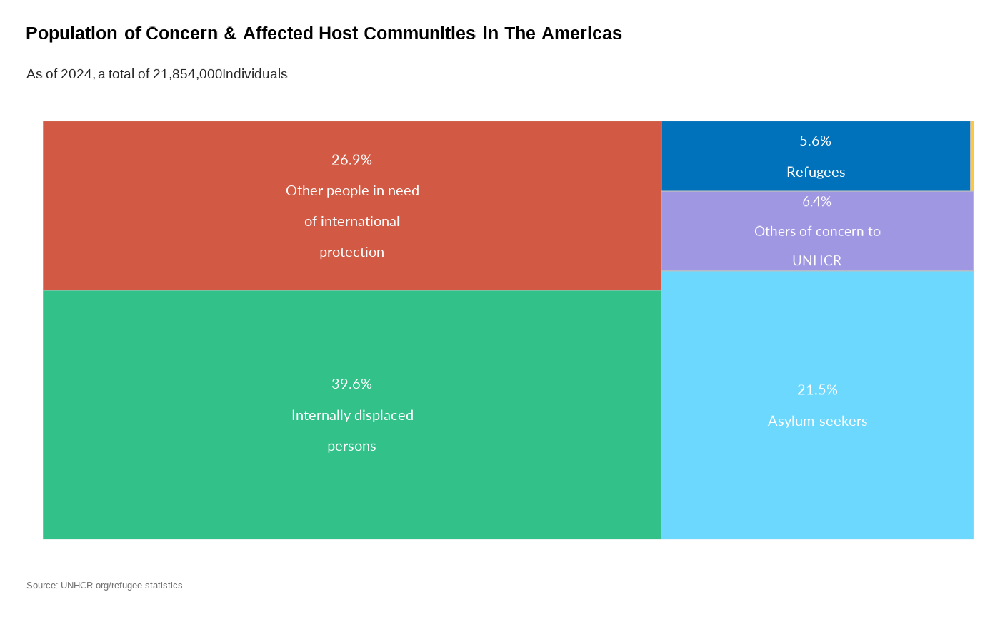

## 2. Plot World Comparison - Refactored

``` r
plot_reg_share(
    year = 2024,
    region = "The Americas",
    label_font_size = 15
)
#> Warning: There was 1 warning in `dplyr::mutate()`.
#> ℹ In argument: `unhcr_region = countrycode::countrycode(coa_iso, "iso3c",
#>   "unhcr.region")`.
#> Caused by warning:
#> ! Some values were not matched unambiguously: UNK
```

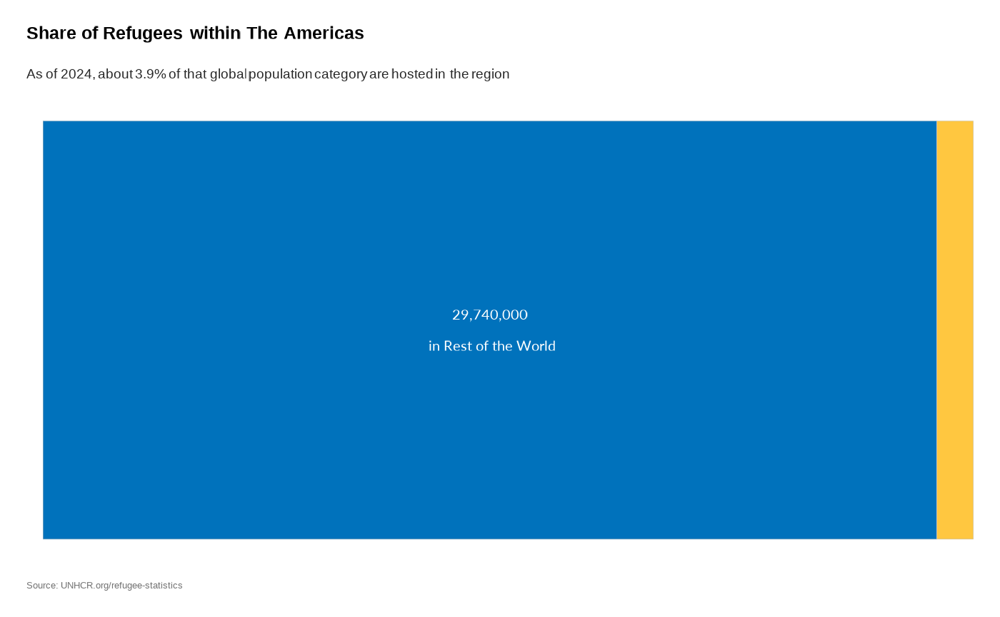

## 3. Evolution Over Time - Refactored

``` r
plot_reg_population_type_per_year(
    year = 2024,
    region = "The Americas",
    label_font_size = 4,
    category_font_size = 10,
    legend_font_size = 10
)
#> Warning: There was 1 warning in `dplyr::mutate()`.
#> ℹ In argument: `unhcr_region = countrycode::countrycode(coa_iso, "iso3c",
#>   "unhcr.region")`.
#> Caused by warning:
#> ! Some values were not matched unambiguously: UNK
```

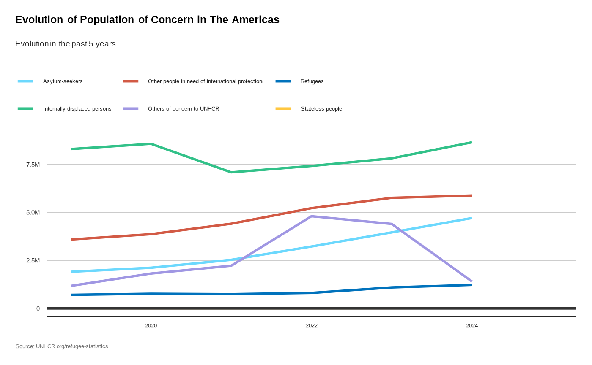

## 4. Plot Population Origin-Destination - Refactored

``` r
plot_reg_origin_dest(
    year = 2024,
    region = "The Americas"
)
#> Warning: There was 1 warning in `dplyr::mutate()`.
#> ℹ In argument: `unhcr_region = countrycode::countrycode(coa_iso, "iso3c",
#>   "unhcr.region")`.
#> Caused by warning:
#> ! Some values were not matched unambiguously: UNK
```

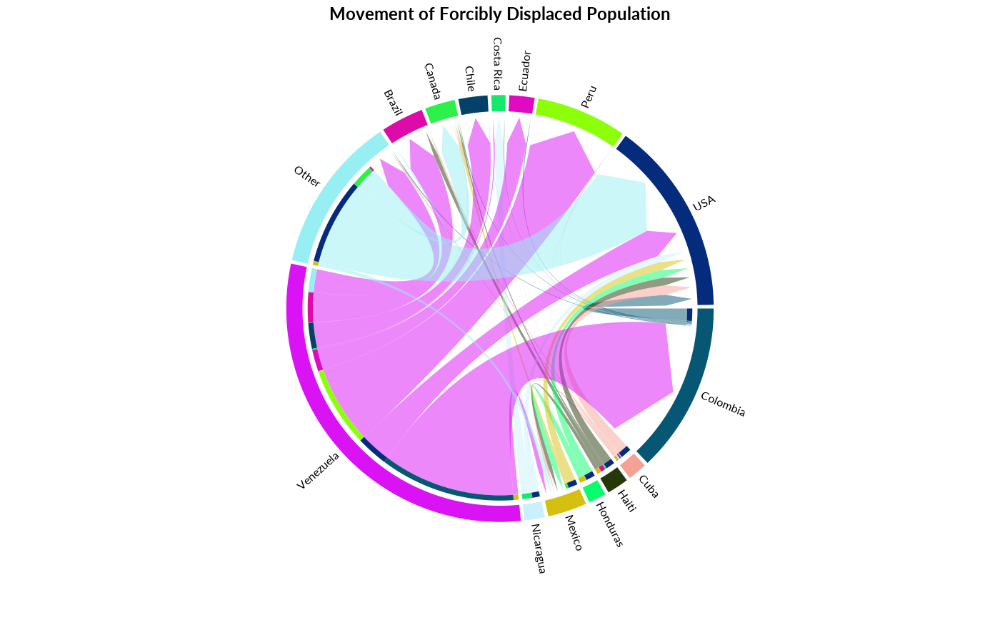

## 5. Plot Main country of Asylum - Refactored

``` r
plot_reg_population_type_abs(
    year = 2024,
    region = "The Americas",
    label_font_size = 6,
    category_font_size = 10
)
#> Warning: There was 1 warning in `dplyr::mutate()`.
#> ℹ In argument: `unhcr_region = countrycode::countrycode(coa_iso, "iso3c",
#>   "unhcr.region")`.
#> Caused by warning:
#> ! Some values were not matched unambiguously: UNK
```

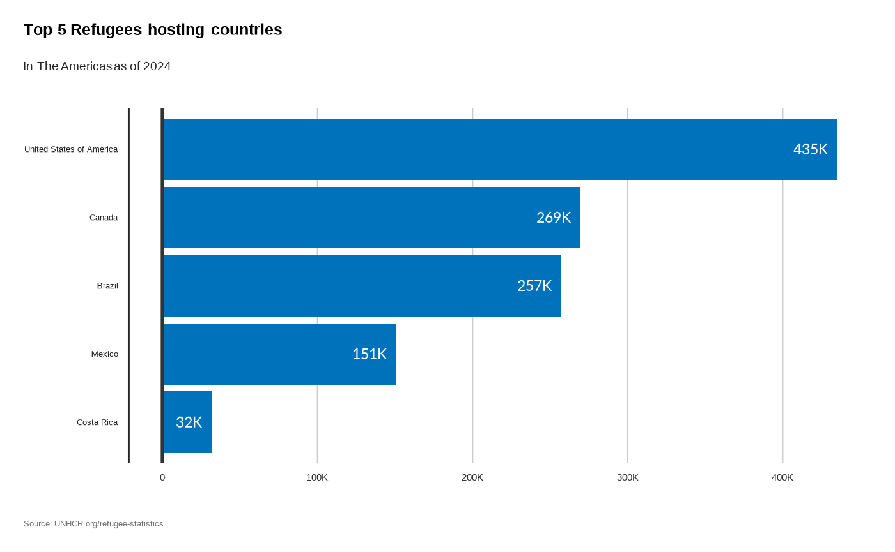

## 6. Plot Biggest Decrease - Refactored

``` r
plot_reg_decrease(
    year = 2024,
    region = "The Americas",
    category_font_size = 10
)
#> Warning: There was 1 warning in `dplyr::mutate()`.
#> ℹ In argument: `unhcr_region = countrycode::countrycode(coa_iso, "iso3c",
#>   "unhcr.region")`.
#> Caused by warning:
#> ! Some values were not matched unambiguously: UNK
```

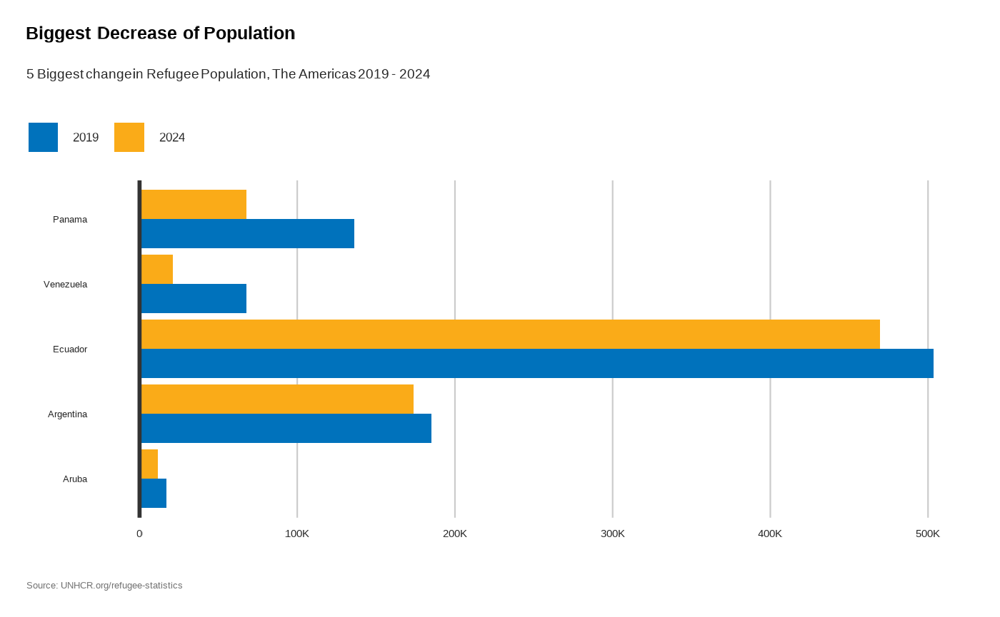

## 7. Plot Biggest Increase - Refactored

``` r
plot_reg_increase(
    year = 2024,
    region = "The Americas",
    category_font_size = 10
)
#> Warning: There was 1 warning in `dplyr::mutate()`.
#> ℹ In argument: `unhcr_region = countrycode::countrycode(coa_iso, "iso3c",
#>   "unhcr.region")`.
#> Caused by warning:
#> ! Some values were not matched unambiguously: UNK
```

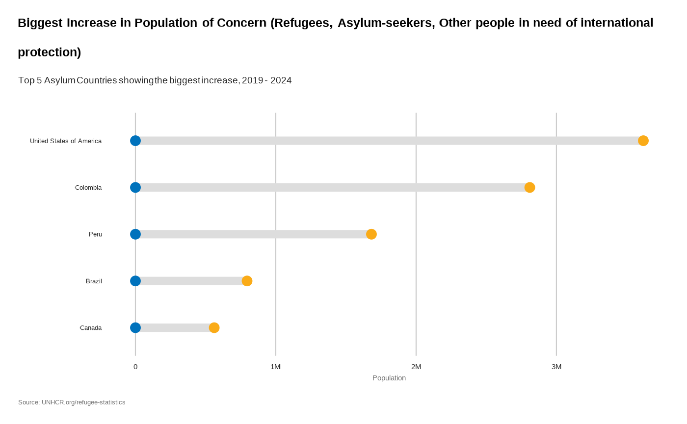

## 8. Proportion of the population who are refugees (origin) - Refactored

``` r
plot_reg_prop_origin(
    year = 2024,
    region = "The Americas",
    label_font_size = 6,
    category_font_size = 10
)
#> Warning: There was 1 warning in `dplyr::mutate()`.
#> ℹ In argument: `unhcr_region = countrycode::countrycode(coo_iso, "iso3c",
#>   "unhcr.region")`.
#> Caused by warning:
#> ! Some values were not matched unambiguously: TIB, UNK, XXA
```

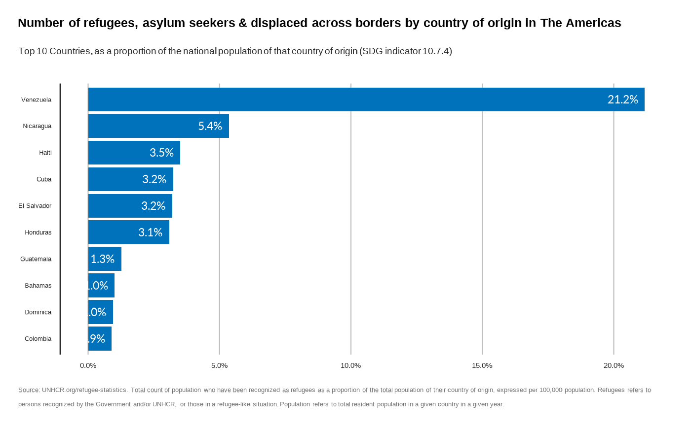

## 9. Refugee Status Determination - Refactored

``` r
plot_reg_rsd(
    year = 2024,
    region = "The Americas",
    measure = "Recognized",
    category_font_size = 10
)
```

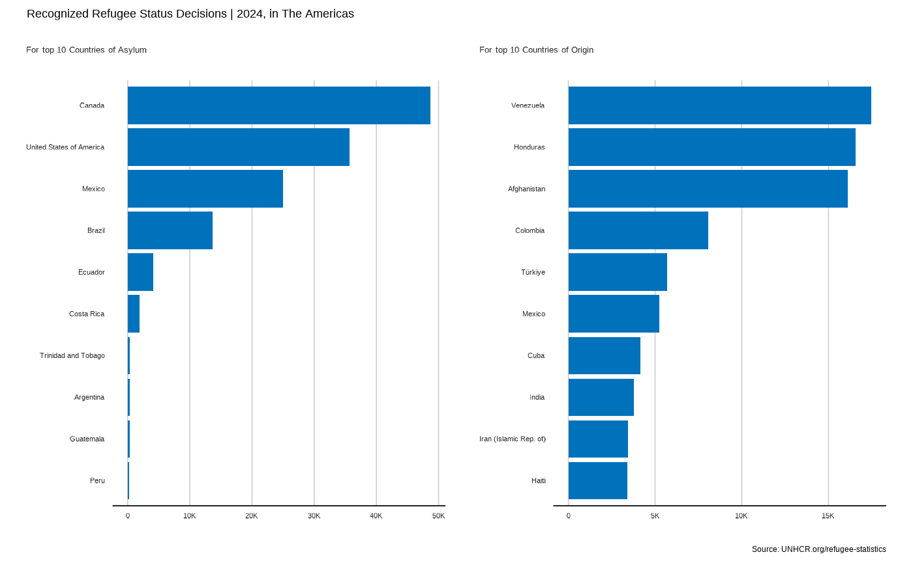

## 10. Evolution of Solutions - Refactored

``` r
plot_reg_solution(
    year = 2024,
    region = "The Americas",
    label_font_size = 4,
    category_font_size = 10
)
#> Warning: There was 1 warning in `dplyr::mutate()`.
#> ℹ In argument: `unhcr_region = countrycode::countrycode(coa_iso, "iso3c",
#>   "unhcr.region")`.
#> Caused by warning:
#> ! Some values were not matched unambiguously: UNK
```

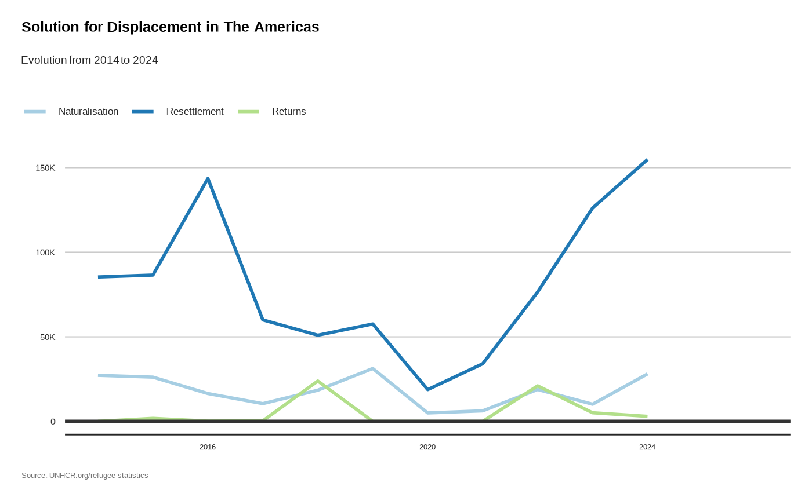

## 11. Plot Regional Map - Refactored

``` r
plot_reg_map(
    year = 2024,
    region = "The Americas"
)
#> Warning: There was 1 warning in `dplyr::mutate()`.
#> ℹ In argument: `unhcr_region = countrycode::countrycode(coa_iso, "iso3c",
#>   "unhcr.region")`.
#> Caused by warning:
#> ! Some values were not matched unambiguously: UNK
#> Warning: There was 1 warning in `stopifnot()`.
#> ℹ In argument: `unhcr_region = countrycode::countrycode(iso_a3, "iso3c",
#>   "unhcr.region")`.
#> Caused by warning:
#> ! Some values were not matched unambiguously: -99, ALA, ASM, ATF, BLM, FLK, GGY, HMD, IMN, IOT, JEY, NFK, PCN, SHN, TWN, VIR, WLF
```

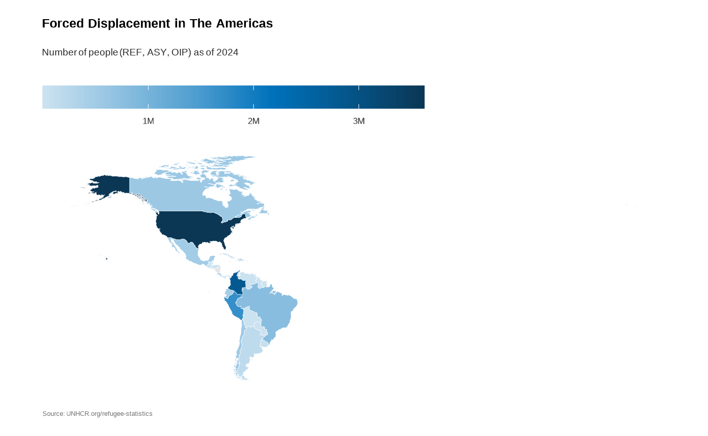
