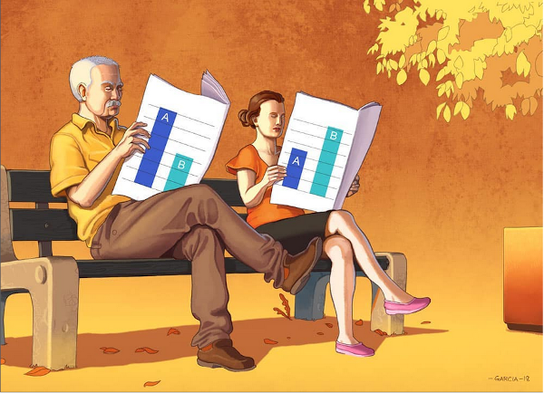
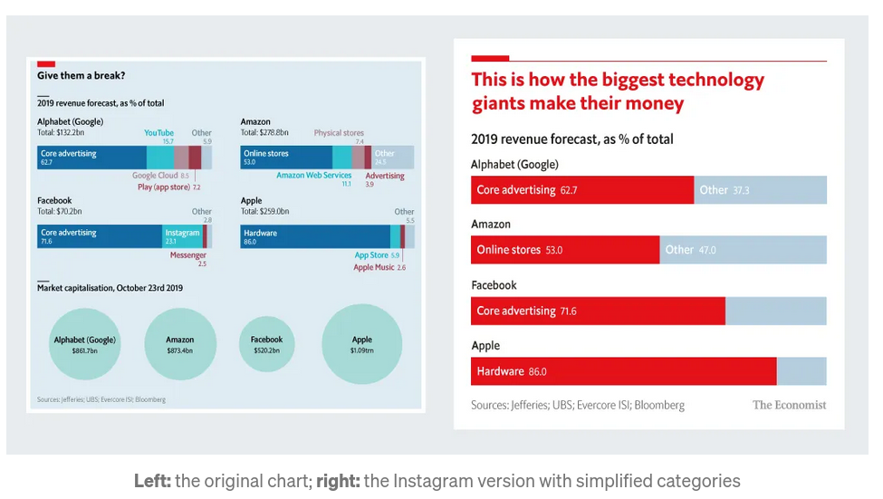

```{r setup, include=FALSE}
options(htmltools.dir.version = FALSE)
knitr::opts_chunk$set(
  warning = FALSE,
  message = FALSE,
  fig.showtext = TRUE
)
library(tidyverse)
library(unhcrthemes)
library(fontawesome)
library(unhcrdatapackage)
```

background-position: 50% 25%
class: center, bottom, inverse

#   “Numbers have an important story to tell. They rely on <span style='color:yellow;'>YOU</span> to give them a voice!”

-- Stephen Few

---

# What is data story telling?

.pull-left[

Data literacy describes the ability to read, analyze, and argue with data.

Data storytelling is the art of presenting data with a contextual narrative. 

An __understandable story line__ allows to put data insights into context in order to inspire action and to influence the targeted audience.

What makes a story is a "_cause and effect_" relationship!

]

.pull-right[



]

---

# Pairing assumptions with evidences

First start from an __assumption__ and then to identify a graph that can be associated to it.

This will give the foundation for potential data stories!

A story usually address a broad research question and matches one of the __narrative frames__ below: 

 1.  Shed light on a previously unexplored topic - _For instance an assumption on the main origin of refugees and asylum seekers in a specific country_

 2.  Introduce an interesting angle  - _For instance an assumption on existing refugee case processing capacity_

 3.  Provide useful suggestions to solve a problem  - _For instance an assumption on availability of Solutions available to refugee_

 4.  Disprove an hypothesis / debunk a widely held belief - _For instance an assumption on the reality of a  "Refugee Burden"_

---

# Do not start from scratch!

Rather than starting from raw data and excel, using  the chart library from [`{UnhcrDataPackage}`](https://edouard-legoupil.github.io/unhcrdatapackage) allows you to:

 * Benefit from an initial data exploration - for instance consult the [Factsheets for the Americas](https://edouard-legoupil.github.io/unhcrdatapackage/factsheet/factsheet.html), which means practically "_Save time to get a first version of your charts!_"
 
 * Ensure to use the correct style in line with [Brand Recommendations](https://dataviz.unhcr.org/tools/r/) using [`{unhcrthemes}`](https://vidonne.github.io/unhcrthemes), meaning using consistent color, font, elements...
 
 * Have you process documented and fully [reproducible](https://unhcr-americas.github.io/reproducibility) by using the [datajournalism lingua franca](https://learn.r-journalism.com/en/introduction/) 

---

# How to do that?

From a simple default chart, chart crafting can be done by:

 1.  adjusting the __message__ in the title,  
 
 2.  __highlighting__ specific parts of the data or  
 
 3.  adding __annotation__ to ease interpretation or provide more contextual background
 
 4. including additional __background__ information

---

# An example 

We will not demonstrate this through an example: The __history of refugee arrival in the United States__.

This story has been actually explored in this blog post: [Exploring U.S. Refugee Data](https://www.favstats.eu/post/exploring_us_refugee_data/), which came with another series of [Refugee Data Stories](https://www.favstats.eu/tags/refugees/)

The Example for inspiration is presented in the next slide. You will notice that the data source is not the UNHCR Global Population Statistic Database... This is probably because  [`{UnhcrDataPackage}`](https://edouard-legoupil.github.io/unhcrdatapackage)  was not yet available when the chart was created :) 

---
class: hide-logo
background-image: url(https://pbs.twimg.com/media/Ezqj6eRWUAcq63v?format=png&name=4096x4096)
background-size: cover
background-position: center 25%


```{r eval=FALSE, include=FALSE}
# admissions75 <- tidytemplate::load_it("data/admissions75.Rdata")
# # year_lab <- paste0("'", stringi::stri_sub(1975:2018, -2 , -1))
# year_lab <- seq(1977, 2017, 4)
# year_dat <- tibble(fiscal_year = c(seq(1976, 2016, 4)), 
#                    label = c("Carter I", "Reagan I", "Reagan II", 
#                              "H.W. Bush I", "Clinton I", "Clinton II", "Bush I", 
#                              "Bush II", "Obama I", "Obama II", "Trump I"))
# n_refugee_2018 <- admissions75 %>% 
#   filter(fiscal_year == 2018) %>% 
#   summarize(n = sum(n)) %>% 
#   .$n
# n_refugee_2002 <- admissions75 %>% 
#   filter(fiscal_year == 2002) %>% 
#   summarize(n = sum(n)) %>% 
#   .$n
# n_refugee_1992 <- admissions75 %>% 
#   filter(fiscal_year == 1992) %>% 
#   summarize(n = sum(n)) %>% 
#   .$n
# n_refugee_1980 <- admissions75 %>% 
#   filter(fiscal_year == 1980) %>% 
#   summarize(n = sum(n)) %>% 
#   .$n
# n_refugee_1975 <- admissions75 %>% 
#   filter(fiscal_year == 1975) %>% 
#   summarize(n = sum(n)) %>% 
#   .$n
# admissions75 %>% 
#   summarize(n = sum(n)) %>% 
#   .$n
# admissions75 %>% 
#   mutate(region = case_when(
#     region == "Former\rSoviet\rUnion" ~ "(Former) Soviet Union",
#     region == "Latin America\rCaribbean" ~ "Latin America/Caribbean",
#     region == "Near East\rSouth Asia" ~ "Near East/South Asia",    
#     region == "PSI" ~ "Private Sector Initiative",   
#     T ~ region
#   )) %>% 
#   ggplot(aes(fiscal_year, n))  +
#   geom_vline(data = year_dat, aes(xintercept = fiscal_year + 1), alpha = 0.35) +
#   geom_label(data = year_dat, aes(x = fiscal_year + 1, y = 220000, label = label),
#             angle = 0, color = "black") +
#   geom_area(aes(fill = region), alpha = 0.9) +
#   geom_hline(yintercept = n_refugee_2018, 
#              linetype = "dashed", color = "black", alpha = 0.85) +
#   annotate("label", x = 1978, y = 115000, 
#            fill = "lightgrey", alpha = 0.85, label.size = NA,
#            label = "End of\n Vietnam War") +
#   annotate("label", x = 1984, y = 185000, 
#            fill = "lightgrey", alpha = 0.85, label.size = NA,
#            label = "Refugee Act of 1980") +
#   annotate("label", x = 1997, y = 150000, 
#            fill = "lightgrey", alpha = 0.85, label.size = NA,
#            label = "Fall of Soviet Union") +
#   annotate("label", x = 2000, y = 105000, 
#            fill = "lightgrey", alpha = 0.85, label.size = NA,
#            label = "Drop after 9/11") +
#   annotate("label", x = 2015, y = 110000, 
#            fill = "lightgrey", alpha = 0.85, label.size = NA,
#            label = "Number of Refugees in 2018\n lowest since 1977") +
#   theme_minimal() +
#   scale_y_continuous(labels = scales::comma) +
#   scale_fill_manual("Region", values = qualitative) +
#   geom_curve(aes(x = 1977, y = 125000, xend = 1975, yend = n_refugee_1975),
#   arrow = arrow(length = unit(0.03, "npc")), curvature = 0.2) +
#   geom_curve(aes(x = 1982, y = 190000, xend = 1980, yend = n_refugee_1980),
#   arrow = arrow(length = unit(0.03, "npc")), curvature = 0.2) +
#   geom_curve(aes(x = 1994, y = 150000, xend = 1992, yend = n_refugee_1992),
#   arrow = arrow(length = unit(0.03, "npc")), curvature = 0.2) +
#   geom_curve(aes(x = 2000, y = 100000, xend = 2002, yend = n_refugee_2002),
#   arrow = arrow(length = unit(0.03, "npc")), curvature = -0.3) +
#   geom_curve(aes(x = 2016, y = 100000, xend = 2018, yend = n_refugee_2018),
#   arrow = arrow(length = unit(0.03, "npc")), curvature = -0.2) +
#   theme(plot.title = element_text(size = 13, face = "bold"),
#     # plot.subtitle = element_text(size = 11, face = "bold"), 
#     plot.caption = element_text(size = 10, face = "italic", hjust = 1),
#     legend.key.width = unit(3, "line"),
#     legend.position = "bottom") +
#   scale_x_continuous(breaks = year_lab, labels = year_lab,
#                      minor_breaks = seq(1975, 2018, 1)) +
#   labs(x = "", y = "Number of Refugees\n", 
#        title = "Refugees arriving in the United States of America by Year (1975 - 2018)\n", 
#        caption = "\nData: State Department, Office of Admissions - Refugee Processing Center. Total Number of Accepted Refugees since 1975: 3.340.709; Visualization: @favstats") 
# ggsave(filename = "images/refugee75.png", height = 7, width = 13) 
```

???
https://github.com/favstats/usa_refugee_data/blob/5c0c042784a7c3118f71294622660492b784e760/refugee_analysis.Rmd#L930:L1025

---

# 1. Adjust the message 

.pull-left[
First we identify what chart from the library could match that question.
The default chart from the library would then be [plot_ctr_origin_history](https://edouard-legoupil.github.io/unhcrdatapackage/reference/plot_ctr_origin_history.html) 

``` 
p <- unhcrdatapackkage::plot_ctr_origin_history(
     year = 2022,
     lag = 30,
     country_asylum_iso3c = "USA",
     pop_type = c("ASY"),
     otherprop = .024)

p
```

]

.pull-right[
```{r echo=FALSE, fig.width=9}
p <- plot_ctr_origin_history(year = 2022,
                        lag = 30,
                        country_asylum_iso3c = "USA",
                          pop_type = c("ASY"),
                        otherprop = .024)
p
```
]

 

 

---
 
# 1. Adjust the message 

.pull-left[

Now we can start getting an idea of a key story to tell..

For instance, we can see that quite a number of refugees are actually not coming from countries affected by a conflict. This match the narrative frame around a widely held belief: "_all refugees are fleeing war_"

and change both the title and the subtitle

``` 
p <- p +
labs(title = "Not only Conflicts fuels
              demand for Asylum",
              
     subtitle = "Arrival in the US
                 since 2000")
```

]

.pull-right[
```{r echo=FALSE, fig.width=9}
p <- p +
    labs(title = "Not only Conflicts fuel demand for Asylum",
         subtitle = "Arrival in the US since 2000")

p
```
]


---


# 2. Highlight specific parts 

We need to focus the audience attention on a specific part of the chart

To do that we can highlight the specific part of the chart that match our message

See [tutorial here](https://rstudio-conf-2022.github.io/ggplot2-graphic-design/materials/05_annotations.html#/annotations-with-geom)_
 
---

# 3. Add  annotations

.pull-left[
 
To ease interpretation or provide more contextual background through annotation 

See [tutorial here](https://rstudio-conf-2022.github.io/ggplot2-graphic-design/materials/05_annotations.html#/annotations-with-annotate)

``` 
p <- p +
  annotate("label", x = 2000, y = 105000, 
           fill = "lightgrey", alpha = 0.85, 
           label.size = NA,
           label = "Drop after 9/11") +
  annotate("label", x = 2015, y = 110000, 
           fill = "lightgrey", alpha = 0.85, 
           label.size = NA,
     label = "Number of Refugees in 2018\n
              lowest since 1977") 
```

]

.pull-right[

```{r echo=FALSE, fig.width=9}
p <- p +  
  annotate("label", x = 2000, y = 105000, 
           fill = "lightgrey", alpha = 0.85, label.size = NA,
           label = "Drop after 9/11") +
  annotate("label", x = 2015, y = 110000, 
           fill = "lightgrey", alpha = 0.85, label.size = NA,
           label = "Number of Refugees in 2018\n lowest since 1977") 
p
```
] 


---

#  4. Include Background information

.pull-left[

For instance an additional layers to include the political context

``` 
year_lab <- seq(1977, 2022, 4)
year_dat <- tibble(
 fiscal_year = c(seq(2000, 2022, 4)), 
 label = c("Bush I", "Bush II", "Obama I",
        "Obama II", "Trump", "Biden"))
p <- p +  
  geom_vline(data = year_dat, 
             aes(xintercept = fiscal_year ), 
             alpha = 0.35) + 
  geom_label(data = year_dat,
             aes(x = fiscal_year + 1,
                  y = 1000000,
                 label = label),
            angle = 0, color = "black")
```

]

.pull-right[
 
```{r echo=FALSE, fig.width=9}
year_lab <- seq(1977, 2022, 4)
year_dat <- tibble(fiscal_year = c(seq(2000, 2022, 4)), 
                   label = c( "Bush I", 
                             "Bush II", "Obama I", "Obama II", "Trump", "Biden"))
p <- p +  
  geom_vline(data = year_dat, 
             aes(xintercept = fiscal_year ), 
             alpha = 0.35) + 
  geom_label(data = year_dat,
             aes(x = fiscal_year + 1,
                  y = 1000000,
                 label = label),
            angle = 0, color = "black")
p
```

] 

---

# Design for the web

.pull-left[

__Less is more__:

 * Only retain content in relation with your message! Fewer numbers can give greater insight if they are the right numbers. Less precision can lead to more confidence. The percentage values can almost appear to be too precise, while "_two-thirds of…_" shows the focus on what the majority did or didn’t do.
 
 * Peer Review the chart legibility -  the 10 seconds test - display your charts to someone for 10 seconds and then ask the person to share back what he understood
 
 * Output based on screen - mobile or desktop - change frame to square - increase size font if you want to share on social media
 

Check the recommendation from the [Economist Data Journalism team](https://medium.economist.com/charting-new-territory-7f5afb293270)
]

.pull-right[





]


 


---

# Use Divisible Content Strategy 

.pull-left[
An approach to content creation where you use a single asset to create multiple pieces. For example, you might break an a long report into a few articles, an infographic, social __microcontent__, or even a video. 

Check the [blog post from Column Five Media](https://www.columnfivemedia.com/divisible-content-strategy-gives-brand-less/)
]

.pull-right[


]


???

Nowadays, the average consumer attention span is less than 10 sec. Long reports are therefore less likely to draw large audience. “Divisible Content Strategy” consists in breaking  a traditional report into a few articles, an infographic, social microcontent, or even a motion graphic video. For instance, if an article includes 5 different charts, each chart can be posted it as a visual tweet implying that the same content can be promoted through different angles.  

---

# Generate More Content With Less Work

.pull-left[

The chart library is therefore designed to speed up the creation of __microcontent__ that can be then re-embedded wherever needed:

 * Social Media
 
 * Donor Presentation
 
 * Talking points
 
 * Situation Analysis or Protection Monitoring Reports
 
With this approach, the effort spent on polishing content can benefit a series of product  
 ]

.pull-right[
[](https://www.columnfivemedia.com/divisible-content-strategy-gives-brand-less/)
]


---


# Product Template

When packing up your story - you can not only use the chart as a single image but also embed it into products

You can install the `unhcrdown` package from [Github](https://github.com/vidonne/unhcrdown) to benefit from a series of template:

```{r eval=FALSE, tidy=FALSE}
# install.packages("remotes")
remotes::install_github("vidonne/unhcrdown")
```


.pull-left[

For the Web - can be convert to PDF - 

 * [`unhcrdown::html_slides`](https://vidonne.github.io/unhcrdown/articles/create_html_slides.html) is a simple online presentation template, actually demonstrated through this document.

 * [`unhcrdown::html_page`](https://vidonne.github.io/unhcrdown/reference/html_page.html)   Convert to UNHCR branded HTML website

 * [`unhcrdown::paged_report`](https://vidonne.github.io/unhcrdown/reference/paged_report.html)  Function for UNHCR paged report template

 * [`unhcrdown::paged_simple`](https://vidonne.github.io/unhcrdown/reference/docx_simple.html)   Function for UNHCR paged simple template
 ]

.pull-right[
For Office

 * [`unhcrdown::pptx_slides`](https://vidonne.github.io/unhcrdown/reference/pptx_slides.html)   Convert to UNHCR branded Powerpoint presentation 
 
 
 * [`unhcrdown::docx_simple`](https://vidonne.github.io/unhcrdown/reference/docx_simple.html) Convert to UNHCR branded Word document

]

???
**Main resources:**
- [R Markdown](https://rmarkdown.rstudio.com/lesson-1.html) documentation
- [`unhcrthemes`](https://vidonne.github.io/unhcrthemes/index.html) package
- [UNHCR Data Visualization Platform](https://dataviz.unhcr.org/)


---
class: inverse, center, middle

# Summary take away


 1. Read the graphs to identify patterns or insights
 
 2. Analyse them by linking them to broader question and to the specific context
 
 3. Develop an argument that can be illustrated with the data
 
 4. Put that argument into a narrative frame
 
 5. Design for the web with re-usability in mind