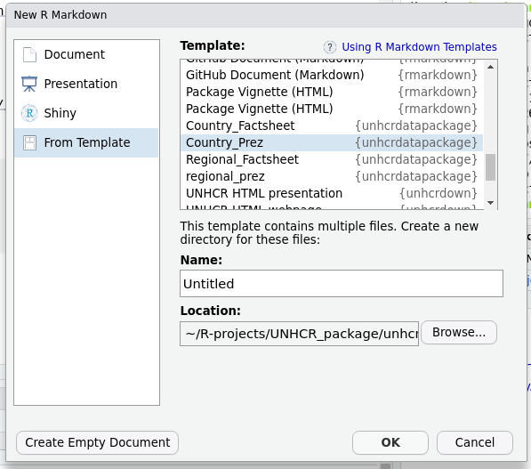

```{r setup, include = FALSE}
knitr::opts_chunk$set(
  collapse = TRUE,
  comment = "#>"
)
```


# Divisible Content Strategy Gives You More Content With Less Work

As explained in this [blog post](https://www.columnfivemedia.com/divisible-content-strategy-gives-brand-less/), a divisible content strategy is an approach to content creation where you use a single asset to create multiple pieces. For example, you might break an e-book into a few articles, an infographic, social __microcontent__, or even a brand video. 


The chart library is therefore designed to speed up the creation of __microcontent__ that can be then re-embedded wherever needed:

 * Social Media
 
 * Donor Presentation
 
 * Talking points
 
 * Situation Analysis or Protection Monitoring Reports
 
 
 

# Do not waste time with charts creation, focus on the message and on the story

Impactful charts with are characterized by their [story telling](https://medium.economist.com/charting-new-territory-7f5afb293270) ability. Using the default plots from the package, the chart effectiveness can be improved done by: 

 1.  changing charts existing default __title and subtitle__ to replace it with a key message or call to Action  

 2.  __Annotating__ the chart to provide interpretration hint around the context: See [tutorial here](https://rstudio-conf-2022.github.io/ggplot2-graphic-design/materials/05_annotations.html#/annotations-with-annotate)
 
 3. __Highlighting__ specific parts in the chart to re-inforce the main message and ease legibility: See [tutorial here](https://rstudio-conf-2022.github.io/ggplot2-graphic-design/materials/05_annotations.html#/annotations-with-geom)_
 
 
# How to get started: Start building your country or regional/situational factsheet now 


If you just want to explore the package, you can for instance create an account on [Rstudio Cloud](https://posit.cloud)

First install the package

```{r}
remotes::install_github("vidonne/unhcrdesign")
remotes::install_github("vidonne/unhcrthemes")
remotes::install_github("vidonne/unhcrdown")
remotes::install_github("edouard-legoupil/unhcrdatapackage")
```


Then just create a new markdown file using on of the package template




